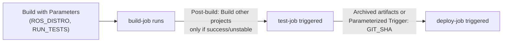

# Jenkins Basics for Robotics — Unit 4: Jenkins Jobs (Part 2)

A single hardcoded job is rarely enough. This unit covers parameterizing jobs so they're reusable, and chaining multiple jobs together so a robotics pipeline can be split into composable stages.

The diagram below shows a parameterized build triggering a chain of downstream jobs, passing data forward at each step.



## Parameterized builds
A parameterized job asks for input at trigger time instead of hardcoding values. Enable it via **This project is parameterized** in the job configuration, then add parameters of various types:

- **String Parameter** — free text, e.g. a Git branch name or ROS distro name.
- **Choice Parameter** — a fixed dropdown, e.g. `[humble, jazzy, rolling]` for which ROS distro to build against.
- **Boolean Parameter** — a checkbox, e.g. "run integration tests too".

Parameters become environment variables available to build steps:

```bash
# Build step, with parameters ROS_DISTRO (Choice) and RUN_TESTS (Boolean)
echo "Building against ROS ${ROS_DISTRO}"
if [ "${RUN_TESTS}" = "true" ]; then
  echo "Tests will run after the build"
fi
```

Triggering "Build with Parameters" now presents a form instead of a plain "Build Now" button. This is the same mechanism you'd use to let a teammate re-run a build against a different branch or distro without editing the job configuration itself.

## Why chain jobs
Splitting one long pipeline into separate jobs — `build-job`, `test-job`, `deploy-job` — gives you independently re-runnable stages: if only the test stage fails, you can re-run just that job against the same build artifacts instead of rebuilding everything. It also gives you a clear place to look when something breaks, and lets different stages run on different agents (e.g. build on a fast generic machine, integration test on an agent with a simulator license).

## Triggering downstream jobs
The simplest chaining mechanism is **Build other projects** under Post-build Actions:

1. In `build-job`'s configuration, under Post-build Actions, add **Build other projects**, enter `test-job`, and choose "Trigger only if build succeeds stable or unstable" (so a broken build never triggers testing against nothing).
2. `test-job` now runs automatically every time `build-job` finishes successfully.

For passing data between chained jobs (e.g. an artifact path, a build number, or a computed version string), two common approaches:

- **Archive the Artifacts** in the upstream job (Post-build Actions → Archive the artifacts, e.g. `build/**`), then **Copy Artifacts from another project** (a plugin) in the downstream job.
- **Pass parameters to the downstream build** using the "Parameterized Trigger" plugin, which lets `build-job` pass values like the Git commit SHA it built into `test-job`'s parameters.

```groovy
// Example of what the Parameterized Trigger plugin config effectively does,
// shown here as the equivalent pipeline syntax for intuition:
build job: 'test-job', parameters: [
    string(name: 'GIT_SHA', value: env.GIT_COMMIT)
]
```

(You'll see this expressed properly as pipeline code in Unit 6 — for now it's configured entirely through the UI.)

## Try it yourself
Extend your `hello-jenkins` job from Unit 3 with a Choice parameter `TARGET` (values `simulation`, `hardware`) and a Boolean parameter `VERBOSE`. Have the shell step echo different messages depending on both. Then create a second job, `hello-jenkins-downstream`, that `hello-jenkins` triggers automatically on success, and have the downstream job print "Upstream build succeeded" — confirm triggering `hello-jenkins` with parameters causes `hello-jenkins-downstream` to run automatically afterward.
