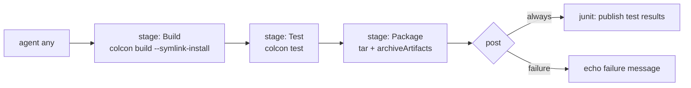

# Jenkins Basics for Robotics — Unit 6: Pipelines

Freestyle jobs configured through clicks don't scale and don't version-control well. Pipelines fix both problems by expressing your whole build-test-deploy flow as code, checked in alongside the robot software it builds.

The diagram below traces the example `Jenkinsfile` from this unit: its sequential stages, and the `post` conditions that run once they finish.



## Why pipeline-as-code
A `Jenkinsfile` is a text file, usually committed at the root of your repository, that fully defines what Jenkins should do. This gets you: code review on changes to the CI process itself, a history of *why* a build step changed (via `git log`/`git blame`), and the ability to reproduce the exact same pipeline for any branch, since the pipeline definition travels with the code it's testing.

## Declarative vs. scripted syntax
Jenkins Pipeline supports two syntaxes:

- **Declarative** — a structured, opinionated format (`pipeline { ... }`) that's easier to read and lint, and is the recommended starting point.
- **Scripted** — raw Groovy code (`node { ... }`), more flexible but harder to maintain. Worth knowing exists, not where you should start.

This course uses Declarative syntax throughout.

## Anatomy of a Jenkinsfile
```groovy
pipeline {
    agent any

    environment {
        ROS_DISTRO = 'jazzy'
    }

    stages {
        stage('Build') {
            steps {
                sh 'colcon build --symlink-install'
            }
        }
        stage('Test') {
            steps {
                sh 'colcon test'
                sh 'colcon test-result --verbose'
            }
        }
        stage('Package') {
            steps {
                sh 'tar czf workspace-build.tar.gz install/'
                archiveArtifacts artifacts: 'workspace-build.tar.gz'
            }
        }
    }

    post {
        always {
            junit 'build/**/test_results/**/*.xml'
        }
        failure {
            echo 'Build failed — check the console output above.'
        }
    }
}
```

Key pieces: `agent` says where the pipeline runs (`any` = any available executor; you can pin to a labeled agent). `stages`/`stage` define the named phases that show up as the visual pipeline graph in the UI. `steps` are the actual commands, same `sh` step you used in Freestyle jobs. `post` defines actions that run after the pipeline finishes, regardless of (or conditional on) outcome — `always`, `success`, `failure`, `unstable` are the common conditions.

## Creating a Pipeline job
**New Item → Pipeline**. Under the "Pipeline" section, choose **Pipeline script from SCM**, point it at your Git repository (Unit 7 covers this connection in depth) and set the script path (default `Jenkinsfile`). Jenkins will check out the repo and execute whatever `Jenkinsfile` it finds at the tip of the branch being built — meaning different branches can legitimately run different pipelines.

## Stages, steps, and parallelism
Stages run sequentially by default, but independent stages can run in parallel to save wall-clock time — useful when, say, linting and unit tests don't depend on each other:

```groovy
stage('Checks') {
    parallel {
        stage('Lint') {
            steps { sh 'ament_lint_cmake .' }
        }
        stage('Unit Tests') {
            steps { sh 'colcon test --packages-select my_robot_pkg' }
        }
    }
}
```

## Try it yourself
Write a `Jenkinsfile` with three sequential stages — `Checkout` (just `sh 'pwd && ls'` for now), `Build` (`sh 'echo building...'`), `Test` (`sh 'echo testing...'`) — and a `post { always { echo "pipeline finished" } }` block. Create a Pipeline job that runs it directly from the "Pipeline script" text box (no SCM yet), run it, and inspect the visual stage graph Jenkins renders for the build.
