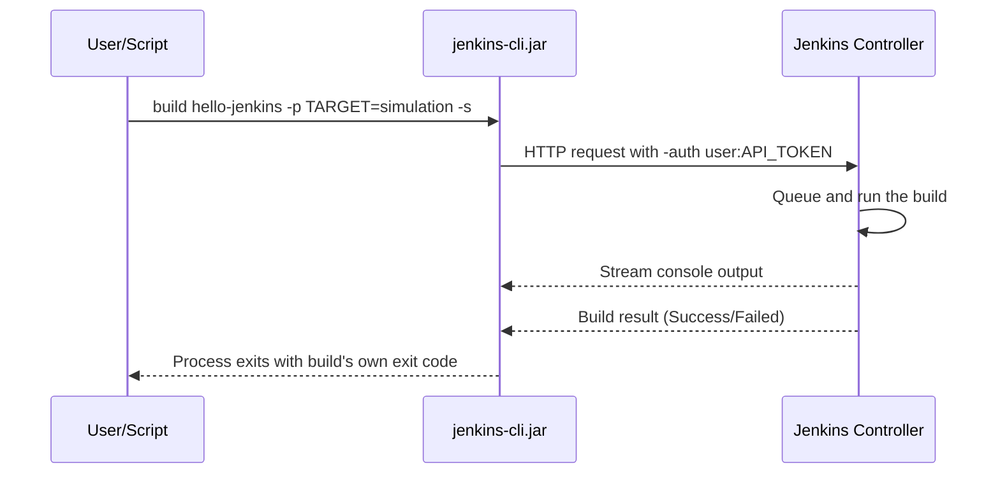

# Jenkins Basics for Robotics — Unit 9: Jenkins CLI

Clicking through the web UI works for learning, but scripting Jenkins itself — triggering builds from a terminal, checking status from another automation tool, managing jobs in bulk — needs the command-line interface. This unit covers `jenkins-cli.jar` and the equivalent REST API.

The sequence below shows why the `-s` flag matters: it makes the CLI block until the build finishes and hand back the build's own result as its exit code.



## Getting the CLI client
Jenkins ships its own CLI as a jar file, downloadable directly from your running instance:

```bash
curl -O http://localhost:8080/jnlpJars/jenkins-cli.jar
java -jar jenkins-cli.jar -s http://localhost:8080/ help
```

`-s` (or `JENKINS_URL`) points the CLI at your controller. Every command after that talks to that instance over HTTP.

## Authenticating
Never authenticate with your real password. Generate a personal **API Token** from your user account page (**you → Configure → API Token → Add new Token**), which you covered creating in Unit 5, and use it instead:

```bash
java -jar jenkins-cli.jar -s http://localhost:8080/ \
  -auth yourusername:YOUR_API_TOKEN \
  list-jobs
```

A cleaner pattern for scripts is exporting it once as an environment variable and never echoing it:

```bash
export JENKINS_AUTH="yourusername:${JENKINS_API_TOKEN}"
java -jar jenkins-cli.jar -s "$JENKINS_URL" -auth "$JENKINS_AUTH" list-jobs
```

## Common CLI commands
```bash
# List all jobs
java -jar jenkins-cli.jar -s $JENKINS_URL -auth $JENKINS_AUTH list-jobs

# Trigger a build and wait for it to finish, streaming console output
java -jar jenkins-cli.jar -s $JENKINS_URL -auth $JENKINS_AUTH build hello-jenkins -s -v

# Trigger a parameterized build (Unit 4)
java -jar jenkins-cli.jar -s $JENKINS_URL -auth $JENKINS_AUTH \
  build hello-jenkins -p TARGET=simulation -p VERBOSE=true -s

# Fetch a job's current XML configuration (useful for backup / diffing)
java -jar jenkins-cli.jar -s $JENKINS_URL -auth $JENKINS_AUTH get-job hello-jenkins > hello-jenkins.xml

# Create a new job from an XML definition (config-as-code, without the UI)
java -jar jenkins-cli.jar -s $JENKINS_URL -auth $JENKINS_AUTH create-job new-job < job-config.xml
```

The `-s` flag on `build` makes the CLI block until the build finishes and returns the build's exit code as its own exit code — exactly what you want when calling Jenkins from another script or a Makefile and needing to know if it succeeded.

## The REST API as an alternative
Everything the CLI does is also reachable over plain HTTP, useful from any language without a JVM dependency:

```bash
# Trigger a build via REST
curl -X POST -u yourusername:${JENKINS_API_TOKEN} \
  "http://localhost:8080/job/hello-jenkins/build"

# Query a job's last build status as JSON
curl -s -u yourusername:${JENKINS_API_TOKEN} \
  "http://localhost:8080/job/hello-jenkins/lastBuild/api/json" | python3 -m json.tool
```

Appending `/api/json` (or `/api/xml`) to almost any Jenkins URL returns a structured view of that page's data — a handy trick for building your own lightweight tooling around Jenkins.

## Try it yourself
Download `jenkins-cli.jar`, generate an API token for your user, and from a terminal: list all jobs, trigger `hello-jenkins` from Unit 3/4 with parameters via the CLI, and confirm the command's own exit code matches the build's result (make the build fail on purpose and check `echo $?` afterward).
