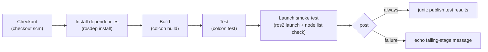

# Jenkins Basics for Robotics — Unit 10: Continuous Integration with ROS

This unit is where the course pays off: combining everything so far — pipelines, source control triggers, and test integration — into one realistic Jenkins pipeline for a ROS package, matching the sketch you drafted back in Unit 1.

The diagram below traces the full ROS pipeline this unit builds, from checkout inside a `osrf/ros` container through to the launch-file smoke test and result reporting.



## The shape of a ROS CI pipeline
The core challenge specific to ROS is environment setup: build steps need the ROS environment sourced, and dependencies resolved, before `colcon` commands mean anything. The cleanest way to get a reproducible environment on any Jenkins agent is to run the actual build inside a container, rather than relying on whatever happens to be installed on the agent host.

```groovy
pipeline {
    agent {
        docker { image 'osrf/ros:jazzy-desktop' }
    }

    stages {
        stage('Checkout') {
            steps {
                checkout scm
            }
        }

        stage('Install dependencies') {
            steps {
                sh '''
                  . /opt/ros/jazzy/setup.sh
                  rosdep update
                  rosdep install --from-paths src --ignore-src -r -y
                '''
            }
        }

        stage('Build') {
            steps {
                sh '''
                  . /opt/ros/jazzy/setup.sh
                  colcon build --symlink-install
                '''
            }
        }

        stage('Test') {
            steps {
                sh '''
                  . /opt/ros/jazzy/setup.sh
                  . install/setup.sh
                  colcon test --event-handlers console_direct+
                  colcon test-result --verbose
                '''
            }
        }
    }

    post {
        always {
            junit 'build/**/test_results/**/*.xml'
        }
        failure {
            echo 'ROS pipeline failed — see console output above for the failing stage.'
        }
    }
}
```

Using `agent { docker { image ... } }` gives every build the exact same OS and ROS install, regardless of what's on the underlying Jenkins agent machine — the same reproducibility argument from the Docker course, applied to CI specifically.

## Layering in a launch-file smoke test
Unit tests alone don't catch integration problems like a bad topic remap or a node that fails to start. A cheap addition is a timed smoke test that launches the system and checks it comes up cleanly:

```groovy
stage('Launch smoke test') {
    steps {
        sh '''
          . /opt/ros/jazzy/setup.sh
          . install/setup.sh
          timeout 15s ros2 launch my_robot_pkg my_robot.launch.py &
          sleep 5
          ros2 node list | grep -q my_robot_node
        '''
    }
}
```

The `timeout` bounds the launch, and `sleep 5` gives nodes time to come up before checking that the expected node is present — a minimal, fast integration check that runs on every build without needing real hardware or a full simulator.

## Caching to speed up rebuilds
Reinstalling `rosdep` dependencies and rebuilding an entire workspace from scratch on every single build is slow. Two common speedups: persist a `ccache` directory across builds via a mounted volume on the Docker agent, and skip `rosdep install` when the package manifests (`package.xml`) haven't changed since the last successful build (a conditional stage checking `git diff` against the last build's commit).

## Try it yourself
Take a small ROS package (or create a minimal one with a single publisher node and one unit test), add the pipeline above as its `Jenkinsfile`, and get it running as a Pipeline job connected to your Git repository (Unit 7). Confirm: a passing unit test produces a green build with visible results under **Test Result**, and a package with a syntax error in a source file produces a clearly Failed build at the **Build** stage rather than silently continuing.
