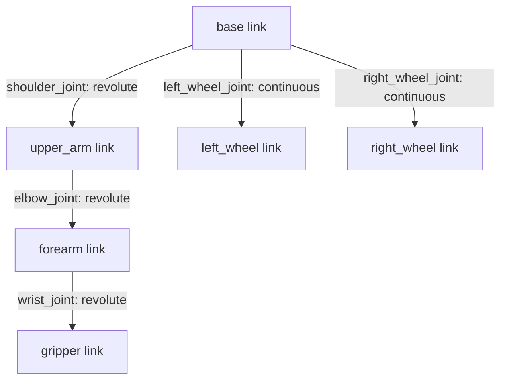

# Building Gazebo Simulations with Blender — Unit 4: Building a custom Robot with Blender and Gazebo

This is where modeling meets robotics: taking Blender-authored meshes and turning them into an articulated robot that Gazebo can simulate with real joints, controllable in both a fixed arm and a mobile base configuration.

The diagram below shows the robot as a tree of links connected by joints, combining the arm chain and mobile-base examples covered later in this unit.



## Designing for articulation

An articulated robot is a tree of rigid links connected by joints. The critical modeling discipline is: **model and export each link as a separate mesh**, with its origin placed exactly at the joint axis that connects it to its parent — not at the mesh's geometric center. Get this wrong and every joint will rotate around the wrong point.

Practical steps in Blender:

1. Build each link (base, upper arm, forearm, gripper, etc.) as its own object.
2. For each link, use `Shift+Right-click` to place the 3D cursor exactly at the joint location, then `Object > Set Origin > Origin to 3D Cursor`.
3. Export each link as its own mesh file (`link_base.dae`, `link_upper_arm.dae`, ...).

## Assembling the arm in SDF/URDF

Each Blender-exported mesh becomes the `<visual>` (and often a simplified primitive as `<collision>`, for performance) of one `<link>`. Joints connect links with an axis and limits:

```xml
<link name="upper_arm">
  <visual>
    <geometry><mesh><uri>meshes/upper_arm.dae</uri></mesh></geometry>
  </visual>
  <collision>
    <geometry><cylinder><radius>0.05</radius><length>0.3</length></cylinder></geometry>
  </collision>
</link>

<joint name="shoulder_joint" type="revolute">
  <parent>base</parent>
  <child>upper_arm</child>
  <axis><xyz>0 0 1</xyz></axis>
  <limit><lower>-1.57</lower><upper>1.57</upper><effort>10</effort><velocity>1</velocity></limit>
</joint>
```

Note the collision geometry is a simple cylinder, not the detailed mesh — using simplified primitives for collision is standard practice; it's far cheaper for the physics engine and avoids concave-mesh collision instability.

## Mobile base with moving joints

A differential-drive mobile base needs a chassis link plus wheel links connected by continuous (unlimited rotation) joints:

```xml
<joint name="left_wheel_joint" type="continuous">
  <parent>chassis</parent>
  <child>left_wheel</child>
  <axis><xyz>0 1 0</xyz></axis>
</joint>
```

Model the wheels in Blender with their origin at the wheel's rotation axis (the center of the cylinder, on the axle line) — the same origin-placement discipline as the arm joints above.

## Making it controllable

A joint definition alone doesn't move — you need a controller. In Gazebo Sim this typically means a `<plugin>` such as the joint controller or diff-drive plugin referencing your joint names; in ROS 2-integrated setups, `ros2_control` hardware interfaces map joints to controllers you command via topics or actions. Either way, verify the plumbing with the simplest possible test before layering on complexity:

```bash
# Gazebo Sim: list topics the simulation is publishing/subscribing to
gz topic -l

# Publish a test velocity command to a diff-drive-controlled base
gz topic -t /model/my_robot/cmd_vel -m gz.msgs.Twist -p 'linear: {x: 0.3}'
```

## Try it yourself

Build a two-link arm (base + one rotating link) in Blender with correctly placed joint origins, export both meshes, and wire them into an SDF with one revolute joint. Load it in Gazebo and drive the joint via the command line (a joint position/velocity command or the GUI's joint control panel) to confirm the mesh rotates around the axis you intended, not around some offset point.
