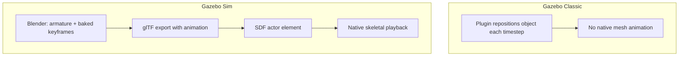

# Building Gazebo Simulations with Blender — Unit 5: Adding Animations to Gazebo Sim

Gazebo Classic has no support for pre-authored mesh animation — anything that moves does so because a joint or plugin drives it, frame by frame, through the physics engine. Gazebo Sim changed that: it can play back skeletal animations baked into a glTF file directly, which opens up effects (background characters, conveyor contents, decorative moving parts) that would be painful to build with joints alone. This unit covers that gap and how to author animations in Blender that Gazebo Sim will play correctly.

The diagram below contrasts Classic's plugin-driven faking of motion with Sim's native actor pipeline that this unit teaches.



## Classic vs. Sim: what changed

In Gazebo Classic, "animation" of anything other than a rigid-body joint essentially doesn't exist as a first-class feature — you fake motion with plugins that reposition objects each timestep. Gazebo Sim added an `<actor>` element to SDF that references an animated mesh (typically glTF or COLLADA with embedded skeletal animation) and plays it back, either on a fixed loop or driven by a trajectory/plugin. This matters for simulation realism: a warehouse scene with a walking human actor, or a robot arm with a decorative pre-baked idle animation, becomes achievable without hand-rolling joint-by-joint control.

## Authoring an animation in Blender

Skeletal (armature-based) animation is the standard route:

1. Add an Armature (`Shift+A > Armature`) and build a simple bone hierarchy matching the parts of your mesh that should move.
2. Parent your mesh to the armature with automatic weights: select mesh, then armature (last), `Ctrl+P > With Automatic Weights`. Check the weight paint result — automatic weighting is a starting point, not a guarantee.
3. Switch to Pose Mode, move to a frame in the Timeline, pose the bones, and insert keyframes (`I > Location/Rotation/Scale` or `I > LocRotScale`).
4. Repeat across frames to build the action; the Dope Sheet/Action Editor lets you review and clean up keyframes.

For simple, non-skeletal motion (a rotating fan blade, a sliding door), you can keyframe the object's transform directly without an armature — simpler to author and simpler to export.

## Exporting animation for Gazebo Sim

glTF is the format with the most reliable animation support in Gazebo Sim's actor system:

```
File > Export > glTF 2.0
  Animation: enabled
  Sampling Animations: on (bakes procedural/constraint-driven motion into keyframes)
```

Reference it from SDF with an `<actor>`:

```xml
<actor name="animated_prop">
  <skin>
    <filename>meshes/prop_animated.gltf</filename>
  </skin>
  <animation name="idle">
    <filename>meshes/prop_animated.gltf</filename>
    <interpolate_x>true</interpolate_x>
  </animation>
</actor>
```

## Verifying playback

Load the world and confirm the animation is actually driving the actor rather than sitting frozen at frame zero — a common symptom of an export that didn't bake the action, or an SDF `<animation>` filename that doesn't match the skin. Use the GUI's entity tree to select the actor and watch its pose over time, or step the simulation frame by frame while watching the mesh.

## Try it yourself

Animate a simple swinging pendulum (a box mesh on a keyframed rotation, no armature needed) across a 2-second loop in Blender, export it as glTF with animation baking enabled, and reference it as an `<actor>` in a Gazebo Sim world. Confirm it loops continuously once the simulation starts.
