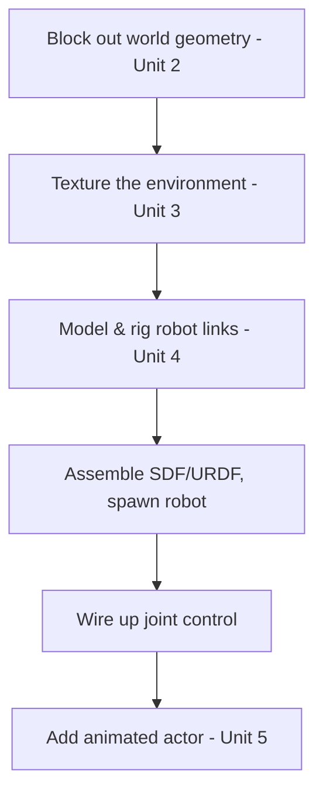

# Building Gazebo Simulations with Blender — Unit 6: Final Project

This unit is the capstone: pulling modeling, texturing, robot assembly, and animation into a single working simulation, built end-to-end the way a real project would demand it.

The diagram below shows the recommended build order that ties together every prior unit into one reproducible simulation.



## Scoping the project

Pick either Gazebo Classic or Gazebo Sim as your target (Sim if you want animated actors from Unit 5; Classic is a perfectly valid choice if you're prioritizing joint-driven robot behavior over decorative animation). Define three things before opening Blender:

1. **The world** — a small, bounded environment (a room, a yard, a station) with at least walls/floor and two or three distinguishing props.
2. **The robot** — reuse the arm or mobile base pattern from Unit 4; keep the link count modest (4-6 links) so you can finish rather than over-scope.
3. **The dynamic element** — either a joint the robot actually drives, or (Gazebo Sim only) a Blender-animated actor from Unit 5, or both.

## Build order

A sensible sequence that avoids rework:

1. Block out the world's static geometry in Blender using primitives (Unit 2), get scale right first.
2. Texture the environment (Unit 3) — enough to be legible, not necessarily photorealistic.
3. Model and rig the robot's links with correctly placed joint origins (Unit 4).
4. Export everything, assemble the SDF/URDF world file, and get the robot spawning correctly with no joints yet driven.
5. Wire up joint control (a controller plugin or `ros2_control`) and confirm you can command motion.
6. If using Gazebo Sim, add your animated actor last, since it's independent of the physics/robot pipeline and easiest to debug in isolation.

## Integration checklist

Before calling it done, verify each of these explicitly rather than assuming they're fine:

- All meshes load without pink/missing textures (relative paths correct).
- The robot spawns at the intended pose and doesn't visibly jitter or sink on contact with the ground (a collision-geometry or mass/inertia problem if it does).
- Every joint you intend to be controllable actually responds to a command — test each one individually with a CLI command or teleop tool before assuming the whole robot works.
- If applicable, the animated actor loops without popping or freezing.
- The world runs in real time (or a documented, deliberate real-time factor) without the physics engine falling badly behind — check with:

```bash
gz stats     # Gazebo Sim: shows real-time factor, sim time vs. wall time
```

## Presenting the result

Record a short screen capture of the running simulation, or at minimum take a few screenshots from different angles showing the world, the robot mid-motion, and (if present) the animated element. Keep the SDF/URDF, Blender source files (`.blend`), and exported meshes together in a project folder so the whole thing is reproducible later — this is also good practice for any simulation project beyond this course.

## Try it yourself

Assemble your final project as a single self-contained folder (`worlds/`, `models/`, `meshes/` as needed) and do a clean-room test: close Gazebo entirely, reopen it, and launch your world from scratch using only the files in that folder — no leftover state from earlier experiments. Fix anything that only worked because of an artifact left over from development (a texture path that happened to still resolve, a model cached from a previous run).
