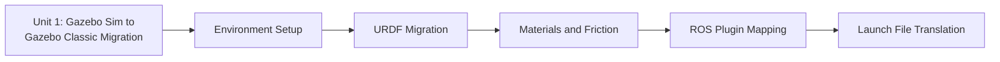

# Gazebo Sim - Gazebo Classic Migration

This short course is a focused, hands-on migration guide for porting a robot project built on modern Gazebo Sim + ROS 2 back to Gazebo Classic + ROS 1 — useful when a lab, employer, or downstream dependency still requires the Classic stack. It walks through preparing a parallel workspace, translating the robot's URDF and its simulator-specific extensions, matching materials and friction behavior, swapping ROS plugin packages, and rewriting launch files, so the ported robot behaves the same as the original.

The diagram below shows the course's single unit and the ordered phases it walks through internally, since each phase depends on the one before it.

1. [Gazebo Sim - Gazebo Classic Migration](01-gazebo-sim-gazebo-classic-migration.md) — A practical, single-unit walkthrough of migrating a Gazebo Sim + ROS 2 project to Gazebo Classic + ROS 1, covering setup, URDF, materials/friction, ROS plugins, and launch files.
