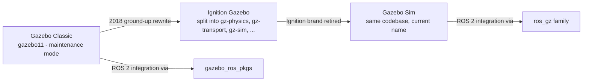

# Introduction to Gazebo Sim with ROS2 — Unit 1: Introduction to the Course

Before touching URDF or plugins, you need to know what "Gazebo" even means today and be able to find your way around its GUI without hunting for buttons — this unit gets you oriented so every later unit can jump straight to content.

The diagram below traces the codebase's naming history and shows which ROS 2 integration package pairs with which name.



## Gazebo Sim, Ignition Gazebo, and Gazebo Classic: Sorting Out the Names
The name "Gazebo" refers to two different codebases, and the naming history trips up a lot of newcomers searching for tutorials. **Gazebo Classic** (versions up to `gazebo11`) is the original, monolithic simulator that has shipped with ROS for over a decade. Around 2018, Open Robotics began a ground-up rewrite under the "Ignition" brand, splitting the simulator into independent libraries (`gz-physics`, `gz-rendering`, `gz-transport`, `gz-sensors`, `gz-msgs`, `sdformat`, and the simulation runtime itself, `gz-sim`). That rewrite was called **Ignition Gazebo**, and after Open Robotics retired the "Ignition" brand it was renamed **Gazebo Sim** — same codebase, new name.

The practical consequences for you:
- Gazebo Classic is in maintenance mode; Gazebo Sim is where active development and new features land.
- Gazebo Classic integrates with ROS 2 via `gazebo_ros_pkgs`; Gazebo Sim integrates via the separate `ros_gz` family of packages (this course uses the latter).
- The command-line tool changed from `gazebo` to `gz sim`. Try it once a Gazebo Sim install is available:

```bash
gz sim shapes.sdf        # loads a bundled demo world with a box, sphere, and cylinder
gz sim -v 4 my_world.sdf # -v 4 raises log verbosity, useful when something silently fails to load
```

Because both codebases are still in circulation, always check which one a tutorial or Stack Overflow answer targets before copying commands.

## A Tour of the GUI: Menu Bar, Toolbars, Right Panel, and Scene
When `gz sim` launches with its GUI, four regions matter immediately. The **menu bar** sits along the top; the hamburger icon on its far right opens the list of available GUI plugins (panels) you can add to the layout. Below it, a row of **toolbars** holds world controls (play/pause/step) on one side and transform tools (translate/rotate/scale) on the other. The **right panel** hosts two tabs you'll use constantly: the *Entity Tree*, a hierarchical list of every model, link, and light in the world, and the *Component Inspector*, which shows and lets you edit the selected entity's pose, physics properties, and other components. The center is the **Scene** — the rendered 3D viewport where the actual simulation plays out.

## Navigating and Manipulating the Scene
Camera controls are mouse-driven: left-click-drag orbits the camera, the scroll wheel zooms, and right-click-drag (or shift+left-drag) pans. Select an entity by clicking it in the Scene or in the Entity Tree — the same object highlights in both places, which is the fastest way to find something buried behind other geometry.

Once something is selected, **model manipulation** uses the Translate, Rotate, and Scale tools from the toolbar (or their `T`, `R`, `S` keyboard shortcuts): each draws a gizmo of arrows or rings on the selected entity that you drag to move, spin, or resize it. **Model insertion** happens through the *Resource Spawner* panel, which lists local models (found via the `GZ_SIM_RESOURCE_PATH` environment variable) and models fetched from the Fuel online library — drag one from the list into the Scene to spawn it at that point.

## Server and GUI (Client) Architecture
Gazebo Sim is deliberately split into a **server**, which owns physics, sensors, and the actual simulation state, and a **GUI client**, which only renders and sends commands. Running `gz sim my_world.sdf` starts both together, but you can run them separately:

```bash
gz sim -s my_world.sdf   # server only, headless — no rendering window at all
gz sim -g                # GUI only, attaches to an already-running server
```

This split is what makes headless simulation possible on a robot's onboard compute or in a CI pipeline (server only, no GPU/display needed), and it lets you attach a GUI for debugging without restarting the simulation itself.

## Try it yourself
Start a demo world headless with `gz sim -s shapes.sdf`, then in a second terminal attach a GUI to it with `gz sim -g`. Use the Resource Spawner to drag in one extra model from Fuel, select it, and use the Translate tool to move it so it rests on the ground plane — then check its final pose in the Component Inspector.
