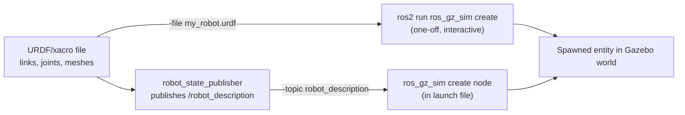

# Introduction to Gazebo Sim with ROS2 — Unit 2: Build a Robot

This unit moves from touring Gazebo Sim to authoring your own robot description in URDF, and getting that description to appear as a spawned entity inside a simulated world.

The diagram below shows how a URDF file reaches a spawned entity through either the one-off service-call path or the repeatable launch-file path.



## Why URDF Instead of SDF?
URDF (Unified Robot Description Format) is the description language used across the rest of ROS 2 tooling — `robot_state_publisher`, `tf2`, `rviz2`, `MoveIt` all expect a robot's links and joints as URDF (or its templated superset, xacro, covered in Unit 3). SDF (Simulation Description Format) is Gazebo's own, more expressive format, capable of describing an entire simulation — worlds, physics, lighting, multiple models — not just one robot.

Gazebo Sim can load SDF directly, and it can also load a URDF file, because the underlying `sdformat` library silently converts URDF to SDF when it's parsed. The practical upshot: you write your robot once, in URDF/xacro, and reuse the exact same file for visualization, motion planning, and simulation, rather than hand-maintaining a second SDF copy just for Gazebo. You can inspect that conversion yourself:

```bash
gz sdf -p my_robot.urdf   # prints the SDF that Gazebo Sim will actually load
```

## Links, Joints, and Meshes: The Anatomy of a URDF Robot
A `<link>` is a rigid body with up to three sub-elements: `<visual>` (what's rendered), `<collision>` (what physics uses), and `<inertial>` (mass and inertia matrix). A `<joint>` connects exactly two links and declares a `type` — `fixed`, `continuous`, `revolute`, or `prismatic` — plus an `<origin>`, an `<axis>`, and, for bounded joints, `<limit>`.

```xml
<link name="base_link">
  <visual><geometry><box size="0.4 0.3 0.1"/></geometry></visual>
  <collision><geometry><box size="0.4 0.3 0.1"/></geometry></collision>
  <inertial><mass value="5.0"/><inertia ixx="0.05" iyy="0.08" izz="0.1" ixy="0" ixz="0" iyz="0"/></inertial>
</link>

<link name="left_wheel"><!-- visual/collision/inertial omitted for brevity --></link>

<joint name="left_wheel_joint" type="continuous">
  <parent link="base_link"/>
  <child link="left_wheel"/>
  <origin xyz="0 0.2 0" rpy="1.5708 0 0"/>
  <axis xyz="0 0 1"/>
</joint>
```

For anything more detailed than primitive boxes, cylinders, and spheres, reference a **mesh** instead: `<geometry><mesh filename="package://my_robot_description/meshes/wheel.stl" scale="0.001 0.001 0.001"/></geometry>`. Keep the collision mesh a simplified (lower-poly, often convex-hull) version of the visual mesh — physics engines are far slower and less stable against a dense visual-quality mesh.

## Spawning Your Robot: Service Call vs. Launch File
To get a URDF into a running world, Gazebo Sim exposes a `/world/<world_name>/create` service. `ros_gz_sim` wraps that call in a convenient executable for one-off, iterative testing:

```bash
ros2 run ros_gz_sim create -world default -file my_robot.urdf -name my_robot -x 0 -y 0 -z 0.1
```

That's fine while you're tweaking a URDF file interactively, but for a repeatable startup you want a ROS 2 launch file that does the whole chain: publish the description, then spawn it. The description usually comes from `robot_state_publisher`, fed by running xacro (or just `cat`, for plain URDF) as a substitution:

```python
robot_description = Command(['xacro ', PathJoinSubstitution([pkg_share, 'urdf', 'my_robot.urdf.xacro'])])

nodes = [
    Node(package='robot_state_publisher', executable='robot_state_publisher',
         parameters=[{'robot_description': robot_description}]),
    Node(package='ros_gz_sim', executable='create',
         arguments=['-topic', 'robot_description', '-name', 'my_robot', '-z', '0.1']),
]
```

Note the `-topic robot_description` form here (instead of `-file`) — it spawns directly from whatever `robot_state_publisher` is currently publishing, so the spawned model always matches your live description.

## Try it yourself
Write a small URDF with a `base_link` and one wheel joined by a `continuous` joint, confirm it converts cleanly with `gz sdf -p`, spawn it into a running default world with `ros2 run ros_gz_sim create`, then convert that single spawn step into a two-node launch file (`robot_state_publisher` + `create`) so `ros2 launch` does the whole thing in one command.
