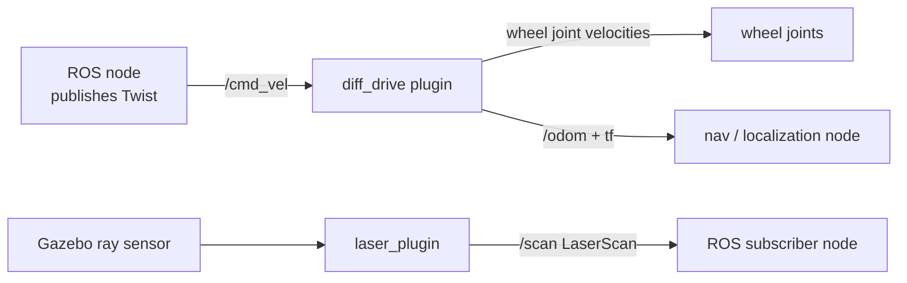

# Mastering Gazebo Classic — Unit 3: Connect to ROS

A robot standing motionless in an empty world isn't very useful. This unit wires your URDF into the ROS graph — topics, services, and the `<gazebo>` extension tags that turn a purely kinematic description into something you can drive and sense with.

The diagram below traces how a velocity command reaches the wheels through the diff-drive plugin, and how a laser sensor's readings reach a ROS subscriber through the laser plugin.



## Gazebo Topics and Services

Once `gazebo_ros_pkgs` is loaded (it's pulled in automatically by most ROS plugins you attach to a model), Gazebo exposes the simulation itself as part of the ROS graph, not just your robot. Useful entry points:

```bash
ros2 topic list | grep gazebo        # /performance_metrics, plugin topics, etc.
ros2 service list | grep gazebo      # /spawn_entity, /delete_entity, /reset_simulation
ros2 service call /pause_physics std_srvs/srv/Empty
```

Services like `/pause_physics`, `/unpause_physics`, and `/reset_world` let a test harness control the simulation clock the same way a human would via the GUI's play/pause button — this is what makes automated, repeatable Gazebo-based tests possible.

## Gazebo Tags: Material and Friction

URDF alone can't express everything a physics engine needs. The `<gazebo>` tag, referencing a link or joint by name, is where you add Gazebo-specific properties without polluting the portable URDF elements:

```xml
<gazebo reference="base_link">
  <material>Gazebo/Blue</material>
</gazebo>

<gazebo reference="left_wheel">
  <mu1>1.0</mu1>
  <mu2>1.0</mu2>
</gazebo>
```

`<material>` picks from Gazebo's built-in Ogre material library (a different, simpler color system than URDF's `<material>` visual color). `<mu1>`/`<mu2>` set ODE's two friction coefficients along the two principal directions of the contact surface — this is exactly the friction tuning wheels need to grip the ground instead of sliding, referenced back to Unit 2.

## ROS Plugin: Robot Differential Driver

Plugins are how a robot actually *moves* in response to ROS messages. The differential-drive plugin subscribes to `cmd_vel` and turns linear/angular velocity commands into wheel joint velocities:

```xml
<gazebo>
  <plugin name="diff_drive" filename="libgazebo_ros_diff_drive.so">
    <left_joint>left_wheel_joint</left_joint>
    <right_joint>right_wheel_joint</right_joint>
    <wheel_separation>0.4</wheel_separation>
    <wheel_diameter>0.2</wheel_diameter>
    <odom_publish_frequency>30</odom_publish_frequency>
  </plugin>
</gazebo>
```

Publish a `geometry_msgs/Twist` to `cmd_vel` and the robot rolls; the plugin also publishes `/odom` and broadcasts the `odom -> base_link` transform, so your robot is immediately compatible with navigation stacks expecting standard odometry.

## ROS Plugin: Robot Laser Sensor

Sensors follow the same pattern — a `<sensor>` block describes the physical device, and a nested `<plugin>` publishes its data as a ROS message:

```xml
<gazebo reference="laser_link">
  <sensor type="ray" name="lidar">
    <ray>
      <scan><horizontal><samples>360</samples><min_angle>-3.14</min_angle><max_angle>3.14</max_angle></horizontal></scan>
      <range><min>0.1</min><max>10.0</max></range>
    </ray>
    <plugin name="laser_plugin" filename="libgazebo_ros_ray_sensor.so">
      <ros><remapping>~/out:=scan</remapping></ros>
      <output_type>sensor_msgs/LaserScan</output_type>
    </plugin>
  </sensor>
</gazebo>
```

`ros2 topic echo /scan` should now show live `sensor_msgs/LaserScan` messages as obstacles enter the simulated beam's range.

## XACRO = XML + Macro

Hand-writing four nearly identical wheel `<link>`/`<joint>` blocks is exactly the kind of repetition XACRO exists to eliminate. XACRO adds macros, properties, and math to plain XML, and is preprocessed into ordinary URDF before anything else touches it:

```xml
<xacro:macro name="wheel" params="prefix x_off y_off">
  <link name="${prefix}_wheel">
    <visual><geometry><cylinder radius="0.1" length="0.05"/></geometry></visual>
  </link>
  <joint name="${prefix}_wheel_joint" type="continuous">
    <parent link="base_link"/>
    <child link="${prefix}_wheel"/>
    <origin xyz="${x_off} ${y_off} 0" rpy="-1.5708 0 0"/>
  </joint>
</xacro:macro>

<xacro:wheel prefix="left" x_off="0" y_off="0.2"/>
<xacro:wheel prefix="right" x_off="0" y_off="-0.2"/>
```

`ros2 launch` files typically run `xacro` on the `.urdf.xacro` file and pass the resulting XML string straight to `robot_state_publisher` as the `robot_description` parameter — no separate build step required.

## ROS Plugin: Joint Control

For joints you want to command directly (an arm, a pan-tilt head) rather than drive through a differential-drive abstraction, `gazebo_ros_control` (or `gazebo_ros2_control`) bridges Gazebo's joints to the standard `ros2_control` controller framework, letting you load position, velocity, or effort controllers exactly as you would on real hardware — the same controller configuration works in simulation and on the physical robot.

## Try it yourself

Attach the laser plugin from this unit to your Unit 2 robot, drive it toward a wall with `cmd_vel`, and confirm with `ros2 topic echo /scan` that the minimum range reading decreases as the robot approaches — your first closed-loop sensor-in-the-simulation check.
