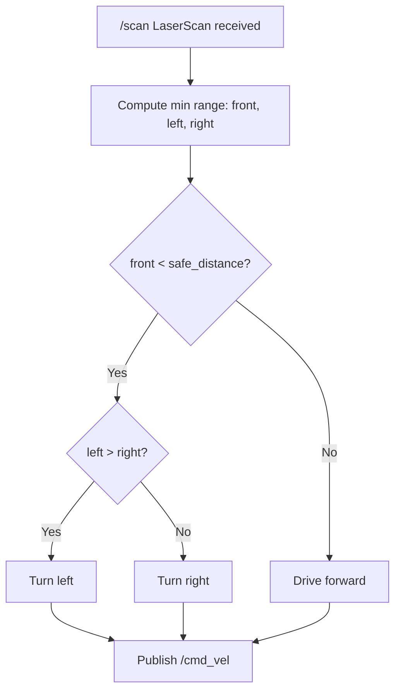

# Mastering Gazebo Classic — Unit 6: Final Project

This unit has no new Gazebo concepts — it's where everything from Units 1 through 5 (URDF robots, ROS plugins, custom worlds, and hand-written model plugins) gets combined into one working scenario: a mobile robot that must avoid moving obstacles in a world you built yourself.

The diagram below traces the decision logic of the starting `scan_callback` you're given, which you'll improve into a smoother avoidance controller.



## Preparing the Environment: A New ROS Package

Start from a clean package rather than bolting the project onto earlier exercises — it keeps the deliverable self-contained and easy to grade against:

```bash
ros2 pkg create final_project --build-type ament_cmake \
  --dependencies gazebo_ros gazebo_ros_pkgs xacro
mkdir -p final_project/{worlds,urdf,launch,plugins/src}
```

Keep the same layout conventions you used in earlier units (`urdf/` for XACRO, `worlds/` for SDF) so a single launch file can find everything by package-relative path instead of hardcoded absolute paths.

## Create a New World

Build a modest arena — a bounded rectangular area with a few static walls is enough — following Unit 4's pattern: start from `worlds/empty.world`, add walls as simple box models, and keep the physics tags at their defaults unless you have a specific reason to change them. This is also the natural place to add any static clutter with a `<population>` block if you want a denser test environment.

## Write a Model Plugin: Dynamic Obstacles

Reuse the `ModelPlugin` skeleton from Unit 5, but instead of a fixed watchdog, drive the obstacle back and forth (or in a loop) so the robot has something non-trivial to avoid:

```cpp
void MyObstaclePlugin::OnUpdate() {
  double t = this->model->GetWorld()->SimTime().Double();
  double x = this->startPose.Pos().X() + this->amplitude * std::sin(this->speed * t);
  auto pose = this->startPose;
  pose.Pos().X() = x;
  this->model->SetWorldPose(pose);
}
```

Expose `amplitude` and `speed` as SDF parameters (read them out of the `sdf::ElementPtr` passed into `Load()`) rather than hardcoding them, so the same plugin binary can drive several obstacles at different speeds just by changing their `<plugin>` block in the world file.

## Create a New Robot: Four Wheels

Extend Unit 2's two-wheel differential-drive robot into a four-wheeled layout — either true four-wheel-drive (all four driven, which needs a skid-steer style controller) or two driven wheels plus two passive casters front and back for stability. Reuse the XACRO wheel macro from Unit 3 so adding wheels is a one-line change rather than four copy-pasted link/joint blocks, and re-tune `<mu1>`/`<mu2>` friction so the extra wheels don't fight each other during turns.

## Obstacle Avoidance

You're given a starting script that subscribes to `/scan` and publishes `/cmd_vel` but only stops on obstacle detection rather than steering around it. The gap to close is turning a stop into an avoid:

```python
def scan_callback(self, msg):
    front = min(msg.ranges[len(msg.ranges)//2 - 15 : len(msg.ranges)//2 + 15])
    left = min(msg.ranges[:len(msg.ranges)//4])
    right = min(msg.ranges[3*len(msg.ranges)//4:])
    cmd = Twist()
    if front < self.safe_distance:
        cmd.angular.z = self.turn_speed if left > right else -self.turn_speed
    else:
        cmd.linear.x = self.forward_speed
    self.cmd_pub.publish(cmd)
```

Improve on this baseline: consider a smoother proportional turn rate instead of a fixed one, or widen the front sector check so the robot reacts before an obstacle is dead ahead. Test against both the static walls and your moving obstacle plugin — a controller tuned only against a stationary obstacle often fails once the obstacle is moving toward the robot.

## Try it yourself

Run the full stack — world, four-wheeled robot, and at least one moving obstacle — and record how many full laps of your arena the robot completes before a collision. Tune exactly one parameter (safe distance, turn speed, or obstacle speed) and re-run to see whether your change measurably improves the lap count; that before/after comparison is the final project's real deliverable, not just "it moves."
