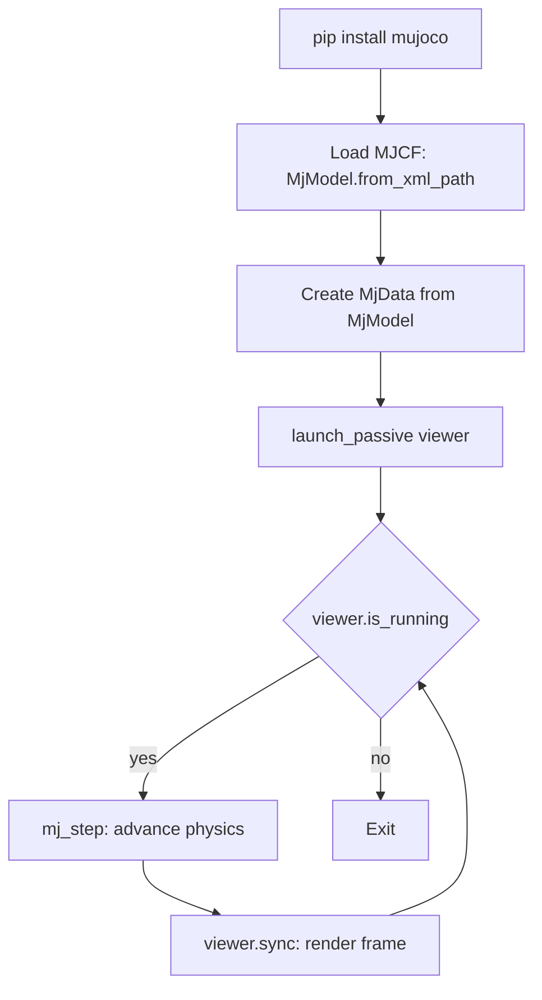

# MuJoCo Simulator Basics for Robotics — Unit 1: Introduction to MuJoCo Simulator

This unit gets MuJoCo installed and running on your machine, explains why it has become a default choice for physics-based robot simulation, and previews the arc of the course so you know where each later unit fits.

The flow below traces the path from installing the package to a running simulation loop, showing how `MjModel` and `MjData` feed the `mj_step`/`viewer.sync` cycle introduced in this unit.



## What MuJoCo Is and Why It Matters
MuJoCo ("Multi-Joint dynamics with Contact") is a physics engine purpose-built for fast, accurate simulation of articulated bodies — robots, in other words. It solves rigid-body dynamics with a soft-constraint contact model that is both stable at large timesteps and cheap enough to run thousands of simulation steps per second, which is why it dominates in robot learning (reinforcement learning, trajectory optimization) as well as classic model-based control. It was developed at the University of Washington, later maintained by Roboti LLC and DeepMind, and has been free and open source (Apache 2.0) since 2022. Compared to general-purpose game engines, MuJoCo trades visual polish for numerical accuracy and speed — you will notice this the first time you see its default renderer.

Where MuJoCo fits relative to other simulators you may encounter in this repo (Gazebo, Isaac Sim): Gazebo emphasizes sensor realism and ROS integration out of the box; MuJoCo emphasizes contact-rich dynamics and control research, with ROS support added on top (Unit 7 covers this).

## Installing MuJoCo
The modern MuJoCo distribution ships as a self-contained Python package with the native engine bundled in — no separate SDK install is required.

```bash
python3 -m venv ~/mujoco-env
source ~/mujoco-env/bin/activate
pip install mujoco
python3 -c "import mujoco; print(mujoco.__version__)"
```

If you prefer C++ directly, the same repository provides prebuilt binaries and CMake support — but for this course we work through the Python bindings, since that is how most robotics pipelines drive MuJoCo day to day.

## Running Your First Simulation
MuJoCo ships example models you can load immediately, either through the interactive viewer binary or a short Python script.

```bash
python -m mujoco.viewer
```

This opens the GUI (covered in depth in Unit 2) with an empty scene; drag in one of the example `.xml` models from the `mujoco` package's `model/` samples, or load one directly:

```python
import mujoco
import mujoco.viewer

model = mujoco.MjModel.from_xml_path("humanoid.xml")
data = mujoco.MjData(model)

with mujoco.viewer.launch_passive(model, data) as viewer:
    while viewer.is_running():
        mujoco.mj_step(model, data)
        viewer.sync()
```

Every MuJoCo simulation revolves around two objects: `MjModel` (the static description — bodies, joints, masses, everything you author in XML) and `MjData` (the mutable simulation state — positions, velocities, forces — that changes every step). You will use this `model`/`data` pair in nearly every Python snippet for the rest of the course.

## Course Roadmap
From here, the units build in a straight line toward a working simulated robot: the GUI (Unit 2) so you can inspect what you build, scenes (Unit 3) as the environment a robot lives in, models (Unit 4) as the building blocks of any body, robots (Unit 5) as an assembled articulated model, sensors and Python control (Unit 6), a ROS2 bridge (Unit 7), and a mini-project that ties it all together (Unit 8).

## Try it yourself
Install `mujoco` in a virtual environment, then write a 10-line script that loads any bundled example model, steps the simulation 1000 times without rendering, and prints `data.time` at the end to confirm the simulated clock advanced as expected (it should equal `1000 * model.opt.timestep`).
