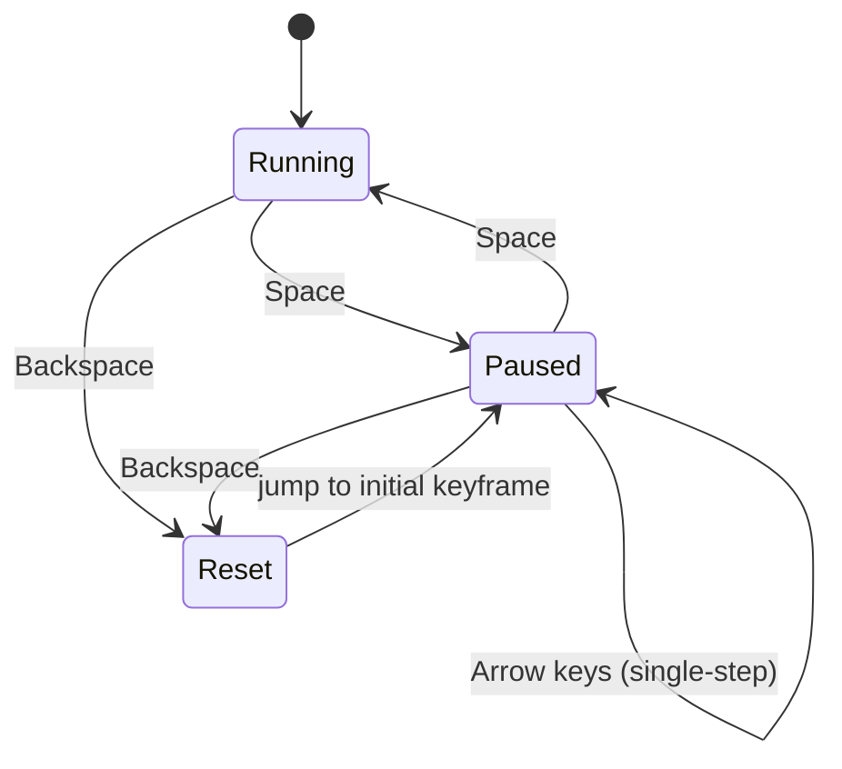

# MuJoCo Simulator Basics for Robotics — Unit 2: User Interface

Before authoring any XML, you need to be fluent in MuJoCo's interactive viewer — it is how you will debug every scene, model, and robot you build for the rest of this course.

The state diagram below captures how the viewer's playback controls — covered later in this unit — move the simulation between running, paused, and reset states.



## Launching the Viewer
There are two common ways to open the GUI. The standalone `simulate` app (built from source or bundled with some installs) is the fastest way to drag-and-drop `.xml` files:

```bash
simulate path/to/model.xml
```

The Python-native route uses the `mujoco.viewer` module, which is what you will script against once you start writing control code:

```python
import mujoco, mujoco.viewer
model = mujoco.MjModel.from_xml_path("model.xml")
data = mujoco.MjData(model)
mujoco.viewer.launch(model, data)   # blocking, interactive
```

`launch()` blocks and hands control to the GUI; `launch_passive()` (used in Unit 1) returns immediately so your own Python loop drives stepping while the window stays in sync.

## Navigating the 3D Scene
Camera control is mouse-driven and consistent across both viewer flavors:
- Left-drag: rotate the camera around the look-at point
- Right-drag: pan
- Scroll wheel: zoom
- Double-click a body: select it (its name and info appear in the sidebar, and the camera can be centered on it with the appropriate menu toggle)

Keyboard shortcuts worth memorizing early: `Space` pauses/resumes the simulation, `Backspace` resets to the initial keyframe, and the arrow keys single-step when paused — indispensable when you are trying to see exactly what happens at the instant two geoms make contact.

## Simulation Controls and Perturbation
The right-hand panel exposes simulation controls: timestep, solver iterations, and toggles for gravity, contact, and constraint forces — useful for isolating whether a weird result is a modeling bug or a physics setting.

The single most useful debugging feature is perturbation: `Ctrl` + right-click-drag on a body applies a spring force pulling it toward your cursor, and `Ctrl` + left-click-drag applies a torque. This lets you "poke" a robot model interactively to sanity-check that joints move the way you expect and that nothing is unexpectedly welded together, without writing a single line of control code.

## Inspecting State via Overlays
Press the on-screen help toggle (usually `F1`) to see the full keybinding list, and enable overlays for real-time diagnostics: simulation time, render/physics FPS, and a live profiler showing where time is spent per step (collision detection, constraint solving, integration). The "Watch" panel lets you type an arbitrary expression against `data` (e.g. `data.qpos[0]`) and see it update live — this is often faster than adding `print()` statements to a script when you are just trying to understand a model's behavior.

## Try it yourself
Load any example model in the viewer, pause it with `Space`, and use `Ctrl`+right-click-drag to displace one body. Step frame-by-frame with the arrow keys and watch the Watch panel value for that body's `qpos` entries to see exactly how the perturbation propagates through connected joints once you resume.
