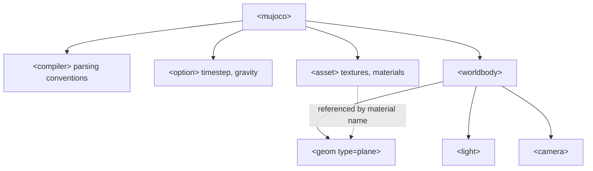

# MuJoCo Simulator Basics for Robotics — Unit 3: Scene Creation

A scene is the environment a robot will later be dropped into — ground, lighting, cameras, and any static or dynamic props. This unit teaches MJCF (MuJoCo's XML modeling format) at the level needed to build one from scratch.

The diagram below shows how the top-level MJCF elements this unit introduces nest inside a scene file, and how `<asset>` entries are referenced by name from `<worldbody>`.



## MJCF Basics
Every MuJoCo model is described by an XML document, conventionally with the extension `.xml` and referred to as MJCF. The skeleton of any file looks like this:

```xml
<mujoco model="my_scene">
  <compiler angle="degree" coordinate="local"/>
  <option timestep="0.002" gravity="0 0 -9.81"/>

  <worldbody>
    <!-- bodies, lights, cameras go here -->
  </worldbody>
</mujoco>
```

`<compiler>` sets global parsing conventions (e.g. whether angles in the file are degrees or radians), `<option>` sets solver and physics parameters, and `<worldbody>` is the root of the kinematic tree — everything in the scene is nested inside it, directly or as a descendant.

## Building a Ground Plane and Lighting
A minimal but complete scene needs a ground plane and at least one light so anything you add later is actually visible:

```xml
<worldbody>
  <light name="top" pos="0 0 3" diffuse="1 1 1"/>
  <geom name="floor" type="plane" size="5 5 0.1" rgba="0.8 0.8 0.8 1"/>
</worldbody>
```

`type="plane"` gives an infinite collidable ground geom (the `size` only affects rendering bounds, not collision extent). Add a `<camera>` element with a `pos`/`xyaxes` or `mode="track"` if you want a saved viewpoint you can jump to in the viewer instead of always relying on the default free camera.

## Assets — Textures and Materials
Anything reusable — textures, materials, meshes — is declared once in `<asset>` and referenced by name elsewhere, keeping the file DRY:

```xml
<asset>
  <texture name="grid" type="2d" builtin="checker" rgb1=".2 .3 .4" rgb2=".3 .4 .5" width="300" height="300"/>
  <material name="grid_mat" texture="grid" texrepeat="5 5" reflectance="0.2"/>
</asset>

<worldbody>
  <geom name="floor" type="plane" size="5 5 0.1" material="grid_mat"/>
</worldbody>
```

For larger scenes, MJCF supports `<include file="other.xml"/>` so you can split a scene, a robot, and shared assets into separate files and compose them — this is the pattern you will reuse in Unit 5 when a robot model gets dropped into a scene file.

## Compiling and Testing the Scene
MJCF is "compiled" into an `MjModel` the moment you load it — any structural error (bad reference, missing asset, invalid attribute) fails loudly at load time rather than silently at runtime, which makes iteration fast:

```bash
python -c "import mujoco; mujoco.MjModel.from_xml_path('scene.xml'); print('OK')"
```

Load it in the viewer after every non-trivial edit rather than batching many changes — MJCF errors are usually one-line typos, and it is much faster to catch them immediately than to debug a large diff later.

## Try it yourself
Build a `scene.xml` with a checkered ground plane, one overhead light, and three simple static props (a box, a sphere, and a cylinder) scattered at different positions using `<geom>` elements directly in `<worldbody>`. Confirm it loads cleanly and looks right in the viewer before moving to Unit 4.
