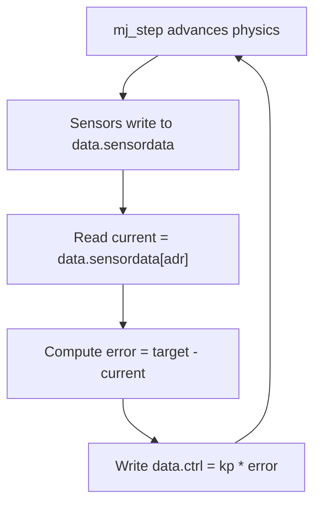

# MuJoCo Simulator Basics for Robotics — Unit 6: Sensor Integration and Simulation Programming

A robot that can only be actuated but not sensed is only half useful. This unit adds sensors to the MJCF model and shows how to drive the whole simulation loop from Python, closing the loop between sensing and control.

The flowchart below traces the read-compute-apply cycle this unit builds: reading `data.sensordata`, computing an error against a target, writing `data.ctrl`, and stepping physics before repeating.



## MuJoCo Sensors Overview
MuJoCo ships a broad library of built-in sensor types you attach to specific joints, bodies, or sites (a "site" is a massless reference frame you place anywhere on a body, often used purely as a sensor or attachment point). Common ones for robotics:
- `jointpos` / `jointvel` — encoder-style joint angle and angular velocity
- `accelerometer` / `gyro` — IMU-style linear acceleration and angular velocity at a site
- `force` / `torque` — reaction force/torque at a site, useful for a wrist force-torque sensor
- `touch` — contact force magnitude over a geom, for simple tactile sensing
- `rangefinder` — single-ray distance sensor, a cheap stand-in for a proximity sensor

All sensor readings are written into one flat array, `data.sensordata`, at every simulation step — no polling or callback registration required.

## Adding Sensors in MJCF
Sensors are declared in a top-level `<sensor>` block, each referencing an existing joint, site, or body by name:

```xml
<worldbody>
  <body name="arm" ...>
    <joint name="shoulder" type="hinge" axis="0 1 0"/>
    <site name="imu_site" pos="0 0 0.1"/>
  </body>
</worldbody>

<sensor>
  <jointpos name="shoulder_pos" joint="shoulder"/>
  <jointvel name="shoulder_vel" joint="shoulder"/>
  <accelerometer name="imu_accel" site="imu_site"/>
  <gyro name="imu_gyro" site="imu_site"/>
</sensor>
```

Each sensor writes a fixed number of values into `data.sensordata` in declaration order (1 for `jointpos`, 3 for `accelerometer`, and so on). You can look up each sensor's offset into that array with `model.sensor(name).adr` rather than hardcoding indices, which keeps your Python code correct even if you reorder or add sensors later.

## The Python API (MjModel / MjData)
You already met `MjModel` (static structure) and `MjData` (mutable state) in Unit 1. The functions you will call every step are small in number:

```python
import mujoco

model = mujoco.MjModel.from_xml_path("scene.xml")
data = mujoco.MjData(model)

mujoco.mj_step(model, data)          # advance physics by one timestep
mujoco.mj_forward(model, data)       # recompute derived quantities without integrating time
```

`mj_step` is what you call in a real control loop; `mj_forward` is useful when you have manually set `data.qpos` (e.g. to a specific pose for testing) and want sensor/derived values recomputed without actually advancing simulated time.

## Writing a Simulation Control Loop
A minimal but complete "read sensor, compute control, apply control" loop:

```python
shoulder_pos_adr = model.sensor("shoulder_pos").adr[0]

target = 0.5  # radians
kp = 5.0

for _ in range(2000):
    current = data.sensordata[shoulder_pos_adr]
    error = target - current
    data.ctrl[0] = kp * error          # simple proportional controller
    mujoco.mj_step(model, data)
```

This is a real, if minimal, feedback controller — the same pattern (read sensors, compute an error, write actuator commands) scales up to PID controllers, inverse-kinematics-driven controllers, or a learned policy; only the "compute control" line changes.

## Try it yourself
Add a `jointvel` sensor alongside the `jointpos` sensor on your Unit 5 arm, then extend the P-controller above into a PD controller (`ctrl = kp * error - kd * velocity`) and confirm it settles at the target angle with noticeably less overshoot than the pure-P version.
