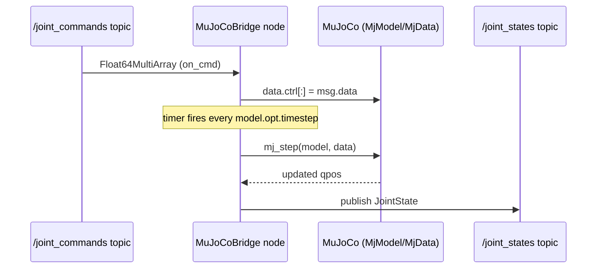

# MuJoCo Simulator Basics for Robotics — Unit 7: ROS2 Integration and Simulation Programming

MuJoCo has no native ROS2 support — it is a physics library, not a robotics middleware. This unit builds the bridge yourself so the rest of a ROS2-based stack (navigation, MoveIt, RViz) can talk to a MuJoCo simulation exactly as it would to a real robot.

The sequence diagram below shows the timing of one bridge cycle from the minimal node built later in this unit: a command arriving on one topic, the timer-driven physics step, and the resulting state publish on another topic.



## Why Bridge MuJoCo and ROS2
The value of the bridge is that everything downstream — controllers, planners, visualization — stays identical whether it is talking to real hardware or to MuJoCo. Concretely, a bridge node needs to do two things every cycle: publish the simulation's state (joint positions/velocities, sensor readings) as ROS2 topics, and consume ROS2 command topics to set `data.ctrl` before stepping. This mirrors how a real robot driver publishes `sensor_msgs/JointState` and subscribes to a command topic.

## Bridging Architecture Options
There are two common approaches, and which one fits depends on how much of the existing ROS2 control stack you want to reuse:
- **A `ros2_control` hardware interface plugin.** You implement MuJoCo as a `SystemInterface` backend for `ros2_control`, so standard controllers (`joint_trajectory_controller`, `diff_drive_controller`, etc.) work against the simulation unmodified — this is the closest analog to Gazebo's `ros2_control` integration and the better choice once you already have ROS2 controllers you rely on.
- **A standalone bridge node.** A plain `rclpy` node owns the `MjModel`/`MjData`, steps the simulation in a timer callback, and manually publishes/subscribes. This is more code but far more transparent for learning — it is what the exercise below builds — and is a reasonable permanent choice for smaller projects that do not need the full `ros2_control` ecosystem.

## Building a Minimal ROS2-MuJoCo Node
A stripped-down bridge node, publishing joint state and consuming a simple command topic:

```python
import rclpy
from rclpy.node import Node
from sensor_msgs.msg import JointState
from std_msgs.msg import Float64MultiArray
import mujoco

class MuJoCoBridge(Node):
    def __init__(self):
        super().__init__('mujoco_bridge')
        self.model = mujoco.MjModel.from_xml_path('scene.xml')
        self.data = mujoco.MjData(self.model)
        self.joint_pub = self.create_publisher(JointState, 'joint_states', 10)
        self.create_subscription(Float64MultiArray, 'joint_commands', self.on_cmd, 10)
        self.create_timer(self.model.opt.timestep, self.step)

    def on_cmd(self, msg):
        self.data.ctrl[:len(msg.data)] = msg.data

    def step(self):
        mujoco.mj_step(self.model, self.data)
        js = JointState()
        js.header.stamp = self.get_clock().now().to_msg()
        js.name = [self.model.joint(i).name for i in range(self.model.njnt)]
        js.position = self.data.qpos[:self.model.njnt].tolist()
        self.joint_pub.publish(js)

def main():
    rclpy.init()
    rclpy.spin(MuJoCoBridge())

if __name__ == '__main__':
    main()
```

Note the timer period is tied to `model.opt.timestep` — driving simulation stepping off a ROS2 timer keeps simulated time and ROS2's clock reasonably aligned, which matters once you add anything time-sensitive downstream (TF lookups, synchronized sensor fusion).

## Publishing State and Subscribing to Commands
Once `joint_states` is publishing, standard ROS2 tooling works immediately: `ros2 topic echo /joint_states` to sanity-check the data live, and RViz's `RobotModel` display (fed a URDF via `robot_state_publisher`) to visualize the simulated robot alongside anything else on the TF tree. If you also need TF frames (not just joint angles), publish `tf2_ros.TransformBroadcaster` messages from body poses in `data.xpos`/`data.xquat` inside the same `step()` callback.

```bash
ros2 topic echo /joint_states
ros2 topic pub /joint_commands std_msgs/msg/Float64MultiArray "{data: [0.5]}"
```

## Try it yourself
Run the bridge node above against the arm model from Unit 5, then use `ros2 topic pub` to send a step command to `/joint_commands` and confirm via `ros2 topic echo /joint_states` that the reported joint position moves toward the commanded value over the next few messages.
