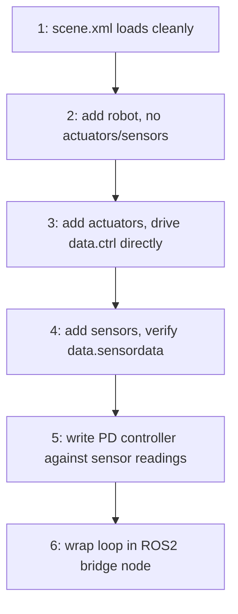

# MuJoCo Simulator Basics for Robotics — Unit 8: Course Mini-Project and Conclusion

This closing unit ties every previous unit into a single project you build end-to-end, then points you toward where to take MuJoCo next once this course is done.

The flowchart below lays out the six suggested milestones in order, the same incremental sequence described later in this unit for building and verifying the mini-project.

## Mini-Project Brief
Build a small simulated robot arm, from scratch, that can be commanded to reach a target joint configuration and report when it gets there. Concretely, the deliverable is a small project directory containing:
- `scene.xml` — a ground plane, lighting, and an `<include>` of your robot file (Unit 3)
- `robot.xml` — a 2-3 link articulated arm with hinge joints, sensible joint limits, and `<default>` classes for shared damping/collision settings (Units 4 and 5)
- Actuators on every joint (`motor` or `position` type) so the arm is drivable (Unit 5)
- At least a `jointpos` and `jointvel` sensor per joint, plus one `accelerometer`/`gyro` pair on the end effector (Unit 6)
- A Python control script implementing a PD controller that drives the arm to a target pose and prints when the position error drops below a threshold (Unit 6)
- A ROS2 bridge node exposing `/joint_states` and accepting target poses over a command topic, so the arm can be driven with `ros2 topic pub` or a second node (Unit 7)

## Suggested Approach and Milestones
Work in the same order the course did, verifying each stage in the viewer before moving on — this matches how you would actually debug a simulation, and skipping straight to the ROS2 layer without confirming the physics model behaves sanely on its own is the most common way to get stuck chasing a bug in the wrong layer:
1. Get `scene.xml` loading cleanly with no robot in it yet.
2. Add the robot with no actuators or sensors; confirm it falls/hangs correctly under gravity and that perturbation moves joints the way you expect.
3. Add actuators; drive `data.ctrl` directly from a throwaway script to confirm each joint responds.
4. Add sensors; confirm `data.sensordata` values match what you see in the viewer's Watch panel.
5. Write the PD controller against sensor readings, not against ground-truth `qpos` directly — this is the more realistic pattern and it is what you will have to do once you swap in a bridge to real hardware.
6. Wrap the working Python control loop in the ROS2 bridge node from Unit 7.

## Where to Go Next
MuJoCo's own documentation (mujoco.readthedocs.io) is the authoritative reference for every XML element and Python API function touched on in this course, and is worth bookmarking rather than re-searching each time. Beyond this course, two natural next steps:
- **MuJoCo Menagerie** — Google DeepMind's collection of high-quality, ready-made MJCF robot models (arms, quadrupeds, humanoids). Loading and studying a professionally authored model is one of the fastest ways to pick up MJCF idioms you would not think of on your own.
- **MJX** — MuJoCo's JAX-based implementation, which runs the same physics on GPU/TPU and vectorizes thousands of parallel simulations, the workhorse behind most modern robot reinforcement-learning pipelines. Once you are comfortable authoring MJCF and driving `mj_step` by hand, MJX is a natural next stop if you want to explore learned controllers rather than only hand-written ones.

## Try it yourself
Complete the mini-project checklist above end-to-end for a simple 2-link arm, then write down (even just as comments in your script) one thing that surprised you about how MuJoCo's contact or joint dynamics behaved compared to what you expected — that habit of noting mismatches between intuition and simulated behavior is the single most useful debugging skill this course can leave you with.
