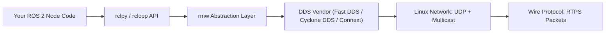

# DDS for Robotics — Unit 1: Introduction

This unit sets up why a robotics course needs a whole track on DDS, what you'll be able to diagnose by the end, and how the pieces (Linux networking, Wireshark, ROS 2, Zenoh, Vulcanexus) fit together across the following units.

The diagram below shows the layers a single ROS 2 API call passes through before it becomes traffic on the wire — the layers this course peels back one by one.



## Why DDS matters to a robotics engineer
ROS 2 replaced ROS 1's custom TCP-based transport with the Data Distribution Service (DDS) standard for all inter-process communication: topics, services, and actions all move as DDS messages under the hood. This is a deliberate architectural choice — DDS is an OMG (Object Management Group) standard originally built for defense and industrial systems that need reliable, low-latency, many-to-many data distribution without a central broker. When you call `ros2 topic pub` or write a publisher node, you are really configuring a DDS Data Writer; when a subscriber "can't see" a topic, the actual fault usually lives in DDS discovery, QoS mismatches, or network configuration — not in your Python or C++ callback code. This course exists because those failures are extremely common in real deployments (multi-robot fleets, WiFi-connected robots, cloud bridges) and are almost impossible to debug without understanding the layer underneath ROS 2's API.

## What "middleware" means here
DDS is a *middleware*: software that sits between your application code and the raw network, providing publish-subscribe semantics, automatic peer discovery, and configurable delivery guarantees (Quality of Service, or QoS). ROS 2 does not implement DDS itself — it defines an abstraction layer called `rmw` (ROS middleware interface) and lets you plug in different DDS implementations (eProsima Fast DDS, Eclipse Cyclone DDS, RTI Connext) or DDS-alternatives that speak the same interface (Zenoh). You can check which one you're running:

```bash
echo $RMW_IMPLEMENTATION
ros2 doctor --report | grep -i middleware
```

Different implementations behave differently on the wire even though your application code is identical — this is exactly why later units teach you to inspect packets directly instead of trusting the API alone.

## How this course is structured
The units build up in layers, roughly bottom-to-top:
- **Units 2-3** ground you in the Linux networking concepts (interfaces, multicast, ports) and the packet-capture skills (Wireshark) you'll use to *see* DDS traffic directly, independent of ROS 2.
- **Units 4-7** connect that foundation to ROS 2 specifically: how DDS acts as the middleware, a real robot case study (TurtleBot 4), how discovery traffic works and where it breaks down, and how to hand-tune behavior via XML configuration.
- **Units 8-9** cover two concrete tools that address DDS's weak points: Zenoh (an alternative middleware with better WAN/constrained-network behavior) and Vulcanexus (a DDS-focused ROS 2 distribution with built-in tooling).
- **Units 10-12** are a three-part project where you apply everything to a realistic multi-node, multi-network scenario.

## Try it yourself
On any machine with ROS 2 installed, run `ros2 doctor --report` and find the line reporting the RMW implementation and DDS vendor. Then run `ros2 topic list -t` while a demo talker/listener pair is running (`ros2 run demo_nodes_cpp talker` / `demo_nodes_py listener`) and note how many DDS entities (writers/readers) get created for a single topic pair. Keep this output — you'll compare it against packet captures in Unit 3.
