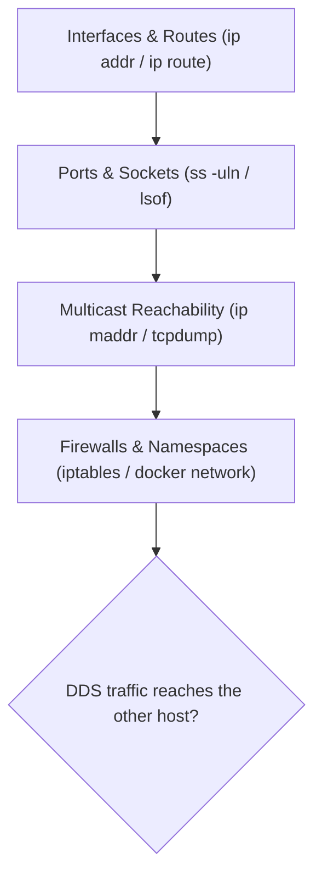

# DDS for Robotics — Unit 2: Linux Networking

Before DDS traffic makes any sense in a packet capture, you need working knowledge of how Linux names, addresses, and routes traffic at the interface level — this unit covers exactly the subset that matters for diagnosing robot networks.

The diagram below shows the order to check these layers in when DDS traffic isn't reaching another host, from interfaces down to firewalls.



## Interfaces, addresses, and routes
Every network path a DDS packet takes starts at a Linux network interface. On a robot you'll typically see a wired interface (`eth0`/`enp*`), WiFi (`wlan0`/`wlp*`), and a loopback (`lo`) used for same-host communication between nodes. Inspect and manipulate these with `ip`, the modern replacement for `ifconfig`/`route`:

```bash
ip addr show                 # list interfaces and their IPv4/IPv6 addresses
ip route show                 # routing table: which interface handles which subnet
ip link show                  # interface up/down state, MTU, MAC address
```

A robot with two NICs (e.g. an onboard Ethernet link to a sensor and WiFi to the operator laptop) can silently send DDS discovery traffic out the wrong interface, or bind to `127.0.0.1` only, causing nodes on other machines to never see each other. `ip addr` is the first command to run when "the topic exists on robot A but not robot B."

## Ports, sockets, and who's listening
DDS implementations pick UDP ports dynamically per-participant (more in Unit 6), so you need to know how to ask the kernel what's actually bound:

```bash
ss -uln                       # UDP sockets, listening, numeric ports
ss -uap | grep <pid>          # tie sockets back to a specific process
sudo lsof -i UDP -P -n        # alternative view, per-process
```

If two DDS domains collide on the same port range, or a firewall silently drops the range Fast DDS/Cyclone DDS wants to use, `ss -uln` will show you what's actually bound versus what you expect.

## Multicast: the piece unique to discovery
Unlike most application traffic you've debugged before, DDS discovery relies on UDP **multicast** — a single packet delivered to every listener in a multicast group, used so participants can find each other without knowing IPs in advance. This is the single biggest source of "works on one LAN, breaks on another" bugs, because multicast is frequently disabled or filtered on WiFi access points, cloud VPCs, and corporate networks.

```bash
ip maddr show                 # multicast group memberships per interface
ping -c3 239.255.0.1           # sanity-check multicast reachability (needs a listener)
sudo tcpdump -i any udp port 7400 -n   # DDS's default discovery port range starts near here
```

## Firewalls and namespaces
`iptables`/`nftables` rules and Docker's network namespacing are common causes of DDS packets silently vanishing. If robot software runs in containers, remember each container has its own network namespace by default — DDS multicast discovery often does not cross an unconfigured Docker bridge network, which is why containerized ROS 2 setups frequently use `--network host` during development.

```bash
sudo iptables -L -n -v | grep -i udp   # check for UDP-blocking rules
docker network inspect bridge          # see what a container's network actually looks like
```

## Try it yourself
On your own machine, run `ip addr show` and `ip route show`, and identify which interface would carry traffic to `192.168.1.1` and which would carry loopback ROS 2 traffic between two nodes on the same host. Then run `sudo tcpdump -i any udp portrange 7400-7500 -n` for 10 seconds while starting a ROS 2 talker/listener pair, and confirm you see UDP packets appear — even before you know how to interpret them, this proves discovery traffic is leaving the host.
