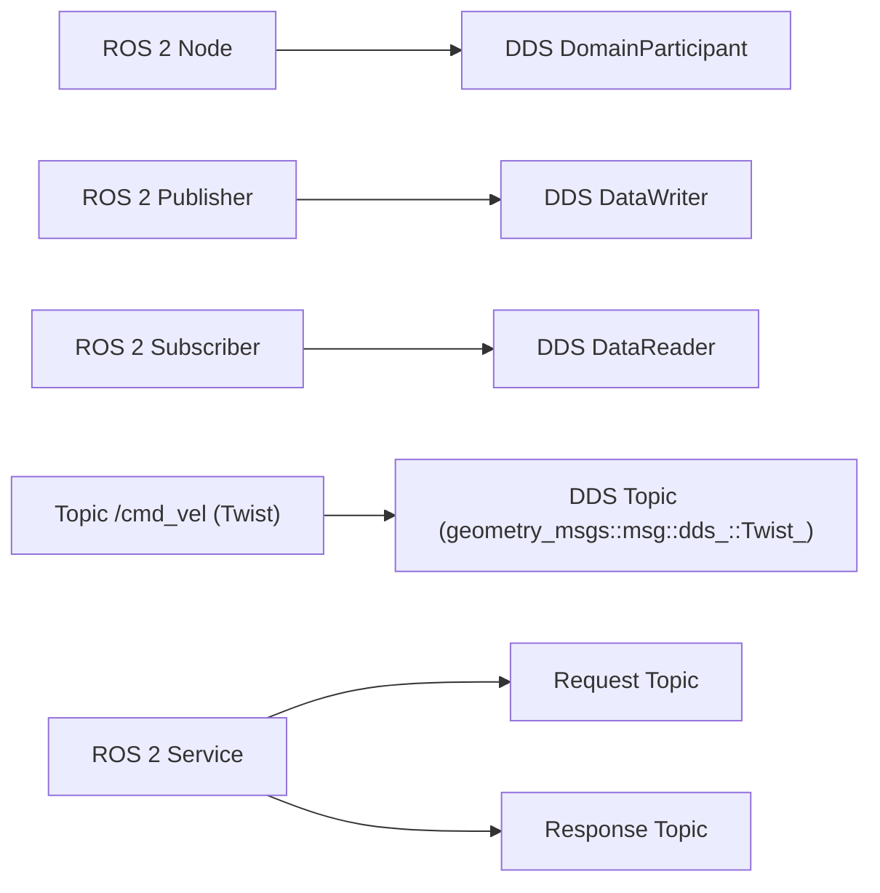

# DDS for Robotics — Unit 4: DDS as ROS 2 Middleware

With Linux networking and Wireshark in hand, this unit connects the wire protocol back to the ROS 2 API surface — showing exactly how a `Publisher` in your code becomes a DDS Data Writer on the network.

The diagram below maps each ROS 2 API concept onto the DDS entity it actually becomes underneath.



## The rmw abstraction layer
ROS 2 does not call any DDS vendor's API directly from `rclcpp`/`rclpy`. Instead it defines `rmw` (ROS middleware interface), a C API that any DDS (or DDS-like) implementation can satisfy via a shim package. This is why you can switch middleware without touching application code:

```bash
sudo apt list --installed | grep rmw     # see which rmw implementations are installed
export RMW_IMPLEMENTATION=rmw_cyclonedds_cpp
ros2 run demo_nodes_cpp talker
export RMW_IMPLEMENTATION=rmw_fastrtps_cpp
ros2 run demo_nodes_cpp talker            # identical code, different wire behavior
```

Common implementations: `rmw_fastrtps_cpp` (eProsima Fast DDS, the historical ROS 2 default), `rmw_cyclonedds_cpp` (Eclipse Cyclone DDS), and vendor RMWs for RTI Connext. Each maps ROS 2 concepts onto DDS concepts slightly differently, which occasionally causes cross-vendor interoperability issues even though both speak RTPS.

## Mapping ROS 2 concepts onto DDS
- A ROS 2 **node** does not map 1:1 onto a DDS concept — under the hood, a node typically corresponds to one DDS **DomainParticipant** (though this is implementation-dependent).
- A ROS 2 **topic** `/cmd_vel` of type `geometry_msgs/msg/Twist` becomes a DDS **Topic** with a mangled type name (something like `geometry_msgs::msg::dds_::Twist_`) — this is why you see odd-looking type strings in raw DDS discovery tools.
- A **publisher** becomes a DDS **DataWriter**; a **subscriber** becomes a DDS **DataReader**.
- ROS 2 **services** are implemented as a *pair* of topics (request and response) under the hood — this is why a single service call generates two sets of DDS entities, visible if you `ros2 topic list -t` while a service server is running (services don't show up there, but the underlying DDS entities do in tools like `rtiddsspy` or Cyclone's `ddsls`).

## QoS: the ROS 2 API for DDS behavior
Quality of Service settings — reliability, durability, history depth, deadline — are DDS concepts exposed almost directly through the ROS 2 API:

```python
from rclpy.qos import QoSProfile, ReliabilityPolicy, DurabilityPolicy

qos = QoSProfile(depth=10)
qos.reliability = ReliabilityPolicy.RELIABLE       # vs. BEST_EFFORT
qos.durability = DurabilityPolicy.TRANSIENT_LOCAL  # late-joining subscribers get last sample
self.pub = self.create_publisher(String, 'status', qos)
```

A publisher and subscriber with *incompatible* QoS (e.g. a `BEST_EFFORT` publisher and a `RELIABLE`-only subscriber) will discover each other at the DDS level but never exchange data — `ros2 topic info -v` shows you the QoS each endpoint is actually using, which is the first thing to check before ever opening Wireshark:

```bash
ros2 topic info /cmd_vel --verbose
```

## Try it yourself
Write (or reuse) a minimal publisher and subscriber where the publisher uses `ReliabilityPolicy.BEST_EFFORT` and the subscriber requests `ReliabilityPolicy.RELIABLE`. Run both and confirm no messages arrive despite `ros2 topic list` showing both endpoints. Then run `ros2 topic info /your_topic --verbose` and identify the QoS mismatch in the output before fixing it.
