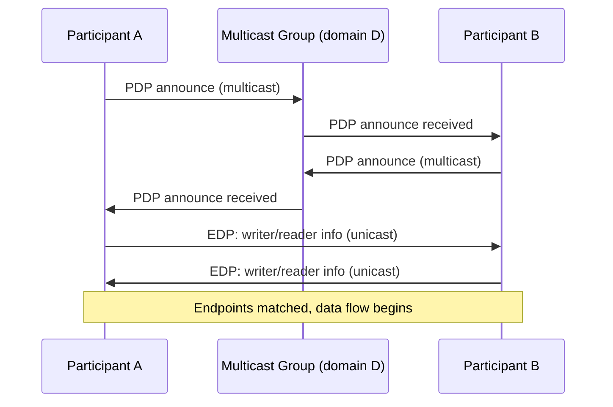

# DDS for Robotics — Unit 6: DDS Discovery

Discovery is the process by which DDS participants find each other without any central broker or configuration file — and it's the single most common source of "it just doesn't connect" bugs on wireless robot networks, which is why it gets its own dedicated unit.

The sequence below shows the two discovery phases — multicast PDP for finding participants, then unicast EDP for matching their writers and readers.



## Simple Discovery Protocol (SDP), in outline
By default, most DDS implementations use the RTPS Simple Discovery Protocol: every DomainParticipant periodically multicasts an announcement of itself (Participant Discovery Protocol, PDP) to a well-known multicast group derived from the DDS *domain ID*. Once two participants discover each other, they exchange their writers and readers directly (Endpoint Discovery Protocol, EDP) over unicast. This is why the domain ID matters so much — it's baked directly into the multicast address/port math:

```
multicast port for domain D  ≈  7400 + 250 * D    (exact offsets are vendor-specific)
```

Two participants with different `ROS_DOMAIN_ID` values are, from DDS's perspective, on entirely separate networks — they never even attempt to discover each other, which is different from (and easier to fix than) a discovery packet that's sent but lost.

## Why discovery traffic scales badly
Every participant announces itself to every other participant, and every pair of matching endpoints exchanges liveliness/heartbeat traffic continuously. This is O(N²) in the number of participants, not topics — a fleet of 20 robots each running 15 nodes can generate discovery traffic that saturates a constrained WiFi link before any application data moves at all. This is the concrete, load-bearing reason later units introduce alternatives: Zenoh (Unit 8) and tools like Vulcanexus (Unit 9) both exist substantially to address this scaling problem.

## Wireless-specific failure modes
- **Multicast unsupported or rate-limited by the AP** — many consumer and enterprise access points throttle or drop multicast to protect airtime, which silently breaks PDP.
- **AP/client isolation** — blocks peer-to-peer unicast too, breaking EDP even if PDP somehow succeeds.
- **High latency/packet loss** — SDP's periodic re-announcement can partially recover from loss, but a very lossy link produces "flickering" discovery where nodes appear and disappear from `ros2 topic list`.
- **Roaming** — a robot moving between APs on the same SSID can get a new IP or drop multicast group membership, causing discovery to silently stall until participants happen to re-announce.

## Diagnosing with the tools you already have
```bash
ros2 daemon stop && ros2 daemon start     # ROS 2's own discovery cache — restart if stale
ros2 topic list                            # relies entirely on discovery having succeeded
sudo tcpdump -i wlan0 -n udp portrange 7400-7500   # confirm PDP/EDP packets are actually sent
```
If `tcpdump` shows announcements leaving the robot but `ros2 topic list` on the laptop never sees them, the fault is downstream of the robot (AP, laptop firewall) — not in your ROS 2 code.

## Try it yourself
Set two terminals to different `ROS_DOMAIN_ID` values (e.g. 0 and 1), start a talker on one and a listener on the other, and confirm via `ros2 topic list` on the listener's side that nothing appears. Then set both to the same domain ID and watch discovery succeed — capture the multicast traffic with `tcpdump` in both cases and compare.
