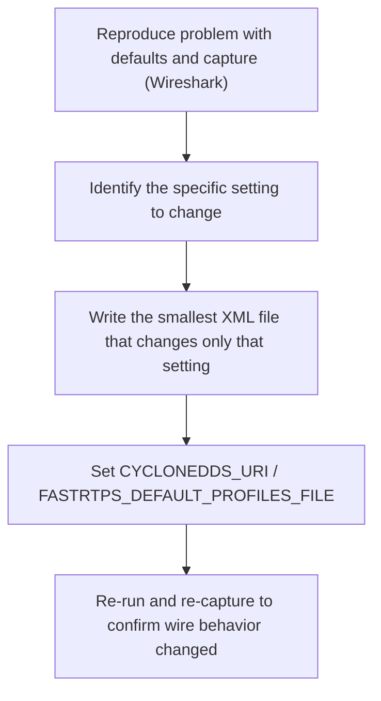

# DDS for Robotics — Unit 7: DDS XML Configuration Files

Once you understand what discovery and QoS are doing (Units 4 and 6), this unit teaches you to actually change that behavior via each vendor's XML configuration format, rather than relying on ROS 2 defaults.

The diagram below shows the practical workflow this unit teaches for changing DDS behavior safely via XML rather than by guesswork.



## Why XML config instead of code
DDS QoS and transport settings *can* be set per-publisher in application code (Unit 4 showed this), but that only covers what `rclpy`/`rclcpp` expose, and it has to be recompiled/redeployed per change. Vendor XML configuration files instead let you tune the underlying DDS implementation's behavior — transport selection, discovery peers, buffer sizes, thread priorities — without touching application code at all, and they're loaded via an environment variable at process startup:

```bash
# Cyclone DDS
export CYCLONEDDS_URI=file:///home/user/cyclonedds.xml
# Fast DDS
export FASTRTPS_DEFAULT_PROFILES_FILE=/home/user/fastdds.xml
```

Because the file is read once, at participant creation, this also means the same compiled node binary can behave differently on the lab bench versus on the deployed robot — a huge advantage when you don't want a "debug build" and a "field build" of the same code.

## Where each vendor looks for the file
The two vendors differ slightly in how they locate the config:
- **Cyclone DDS** is flexible about what `CYCLONEDDS_URI` contains: a `file://` URI (as above), a bare filesystem path, or the literal XML text itself — handy for a one-line override baked directly into a launch script without a separate file on disk.
- **Fast DDS** reads `FASTRTPS_DEFAULT_PROFILES_FILE` if it's set, but even with nothing set it still auto-loads a file named exactly `DEFAULT_FASTRTPS_PROFILES.xml` from the process's current working directory — a classic source of "why is my XML being ignored" bugs when a stale copy shadows the one you meant to use.

Either way, the variable must be exported (or set in the launch file's environment) **before** the node process starts — it's read once during participant creation, so setting it in another terminal after `ros2 run` is already running has no effect.

## A minimal Cyclone DDS profile
```xml
<?xml version="1.0" encoding="UTF-8" ?>
<CycloneDDS xmlns="https://cdds.io/config">
  <Domain id="any">
    <General>
      <Interfaces>
        <NetworkInterface name="wlan0" priority="default" multicast="default"/>
      </Interfaces>
    </General>
    <Discovery>
      <Peers>
        <Peer Address="192.168.1.50"/>   <!-- explicit unicast fallback -->
      </Peers>
      <ParticipantIndex>auto</ParticipantIndex>
    </Discovery>
  </Domain>
</CycloneDDS>
```
This pins Cyclone DDS to a specific interface (avoiding the "which NIC does discovery go out of" ambiguity from Unit 2) and adds an explicit peer so discovery works even if multicast is blocked.

## A minimal Fast DDS profile
```xml
<?xml version="1.0" encoding="UTF-8" ?>
<dds xmlns="http://www.eprosima.com">
  <profiles>
    <transport_descriptors>
      <transport_descriptor>
        <transport_id>udp_transport</transport_id>
        <type>UDPv4</type>
      </transport_descriptor>
    </transport_descriptors>
    <participant profile_name="robot_participant" is_default_profile="true">
      <rtps>
        <userTransports>
          <transport_id>udp_transport</transport_id>
        </userTransports>
        <useBuiltinTransports>false</useBuiltinTransports>
      </rtps>
    </participant>
  </profiles>
</dds>
```
Fast DDS's profile structure separates *transport descriptors* (how bytes move — UDP, shared memory, TCP) from *participant/publisher/subscriber profiles* (QoS and discovery behavior), and profiles are referenced by name, so one file can define multiple named configurations for different nodes.

## Setting QoS through XML, not just transport
The same profile mechanism also carries QoS, letting you set the reliability/durability behavior from Unit 4 without recompiling anything. A publisher profile marked as default applies to every publisher the process creates unless code explicitly overrides it:

```xml
<publisher profile_name="telemetry_pub" is_default_profile="true">
  <qos>
    <reliability><kind>RELIABLE</kind></reliability>
    <durability><kind>TRANSIENT_LOCAL</kind></durability>
  </qos>
</publisher>
```
This is useful for fleet-wide policy (e.g. "every publisher on this robot is RELIABLE by default"), but if `rclpy`/`rclcpp` explicitly sets a `QoSProfile` on a given publisher, that call wins over the XML default — treat XML QoS as a fallback layer, not a guaranteed override.

## Common gotchas
- **Silent fallback on bad XML.** Neither vendor typically crashes on a malformed config file — they log a parse warning to stderr and quietly fall back to defaults, defeating the point of the file. Check console output at startup, not just the exit code.
- **Interface name mismatches.** Cyclone's `NetworkInterface name` must exactly match what `ip addr show` reports (Unit 2) — `wlan0` vs `wlp2s0` vs `eth0` varies per machine and driver.
- **File shadowing.** An old `DEFAULT_FASTRTPS_PROFILES.xml` left over in `~/` or a package's install space can silently override the file you think is active, since Fast DDS auto-loads it from the working directory.

## Practical workflow
1. Reproduce the problem with defaults and capture it (Unit 3's Wireshark skills).
2. Identify the specific setting to change (peer list, interface binding, reliability, history depth).
3. Write the smallest XML file that changes only that setting — don't copy a huge example file wholesale, since unrelated settings can have side effects.
4. Re-run with the environment variable set and re-capture to confirm the wire behavior actually changed.

## Try it yourself
Write a Cyclone DDS XML file that restricts discovery to a single named network interface on your machine (use `ip addr show` from Unit 2 to get its name), set `CYCLONEDDS_URI` to point at it, and run a talker/listener pair. Use `tcpdump -i <other-interface>` to confirm no discovery traffic leaves through interfaces you didn't list. Then, for Fast DDS, rename your profiles file to `DEFAULT_FASTRTPS_PROFILES.xml`, `cd` into its directory, unset `FASTRTPS_DEFAULT_PROFILES_FILE`, and confirm the profile still loads automatically — a concrete demonstration of the default-file behavior above.
