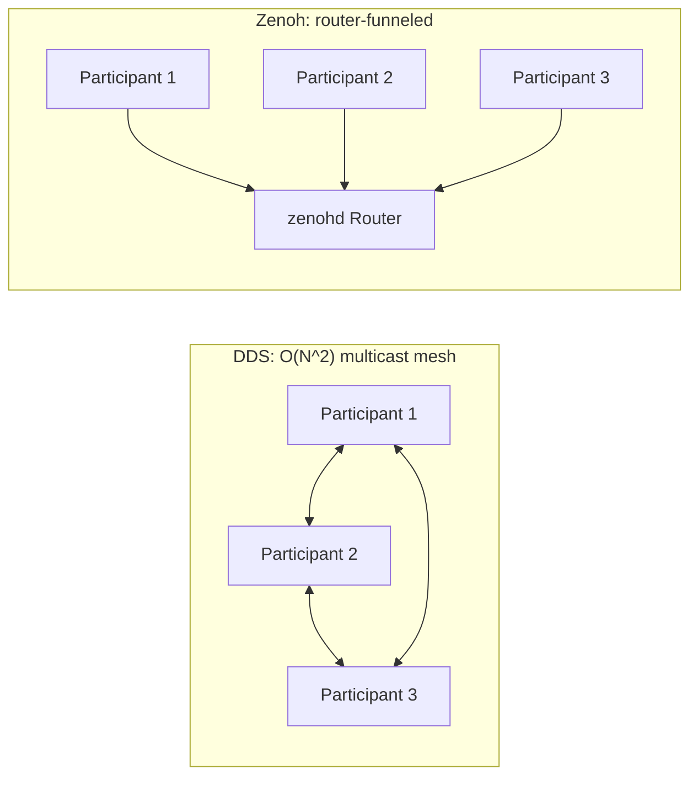
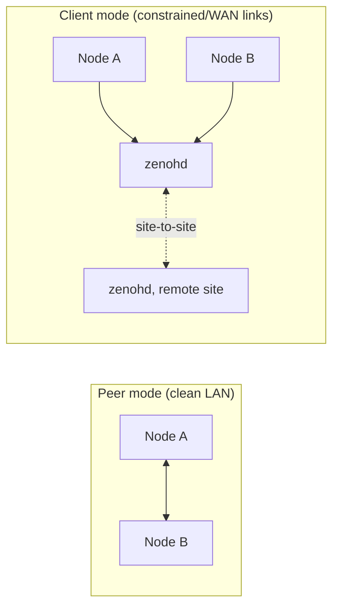

# DDS for Robotics — Unit 8: Zenoh

Having seen DDS discovery's scaling and multicast problems firsthand (Unit 6), this unit introduces Zenoh — a pub/sub/query protocol that ROS 2 can use as a drop-in alternative middleware specifically to sidestep those problems.

The diagram below contrasts DDS's every-participant-to-every-participant multicast mesh with Zenoh's router-funneled discovery model.



## What Zenoh is, and isn't
Zenoh ("Zero Overhead Network Protocol") is not a DDS implementation — it's a separate protocol designed from the start for constrained, wireless, and WAN networks, built around explicit routing and brokered discovery rather than DDS's default multicast-everywhere approach. It also has a broader data model than plain pub/sub: alongside `put`/`subscribe` (roughly equivalent to DDS write/read), Zenoh exposes `get`/`queryable` as first-class primitives, letting a node ask "what's the current value of this key right now?" instead of only reacting to the next publication. For robotics that maps naturally onto things like a costmap or a static map: a newly-launched node can `get` the latest snapshot on demand instead of waiting for the next periodic republish or configuring a DDS `TRANSIENT_LOCAL` durability QoS just to get a similar effect.

ROS 2 supports Zenoh via `rmw_zenoh_cpp`, an `rmw` implementation just like `rmw_cyclonedds_cpp`, meaning you switch to it the same way you switch DDS vendors:

```bash
sudo apt install ros-<distro>-rmw-zenoh-cpp
export RMW_IMPLEMENTATION=rmw_zenoh_cpp
```

Because Zenoh implements the same `rmw` interface, your publisher/subscriber code is unchanged — only the wire protocol and discovery mechanism underneath differ.

## Routing modes: peer, client, router
Zenoh sessions run in one of three modes, and which one you pick determines whether you need a router at all:
- **Peer mode** — nodes on the same local network connect directly, similar in spirit to DDS's default behavior, just without the O(N²) multicast announcement traffic (Unit 6).
- **Client mode** — a node connects only to a router, never directly to other nodes; use this on constrained, NAT'd, or multicast-hostile links.
- **Router mode** — `zenohd` itself, relaying between clients and, optionally, peering with other routers to bridge separate sites.



A single robot on a clean local network can often stay in peer mode and skip the router entirely; the router earns its keep once you're crossing a link that doesn't do multicast well, or bridging two physically separate sites.

## Why Zenoh addresses the problems from Unit 6
Zenoh's key architectural difference is a *router* (`zenohd`) that participants connect to, rather than every participant multicasting to every other participant. This turns discovery from O(N²) mesh announcements into connections funneled through a known router, which:
- Works over networks that block multicast entirely (cloud VPCs, most WiFi APs, cross-subnet WAN links) since routers can be reached by plain unicast/TCP.
- Scales far better for large fleets, since discovery load stays roughly constant per participant rather than growing with fleet size.
- Supports bridging separate physical sites over the internet, which plain DDS multicast discovery cannot do without VPN-level tricks.

```bash
zenohd                                    # start a router, defaults to listening on 7447/tcp
export ZENOH_ROUTER=tcp/<router-ip>:7447  # point ROS 2 nodes at it (name may vary by version)
```

Session behavior like this can also be captured in a config file instead of environment variables — conceptually the same idea as Unit 7's DDS XML profiles, just in Zenoh's JSON5 format:

```json5
// zenoh-session.json5
{
  mode: "client",
  connect: { endpoints: ["tcp/192.168.1.10:7447"] }
}
```

## Two ways to bring Zenoh into a ROS 2 graph
`rmw_zenoh_cpp` replaces DDS outright — every node speaks Zenoh natively, and there's no RTPS on the wire at all. A separate option, the `zenoh-bridge-ros2dds` project, takes the opposite approach: nodes keep running stock DDS locally (`rmw_fastrtps_cpp` or `rmw_cyclonedds_cpp` from Units 4-7), and a bridge process on each site republishes the local DDS graph's topics onto a Zenoh network to reach other sites. That's a useful middle ground when you don't want to requalify an entire DDS-based stack but do need to connect it to a remote operator station or a second robot across a WAN link.

## Trade-offs to understand before adopting it
Zenoh is not a strict superset of DDS behavior — QoS semantics, some discovery timing characteristics, and tooling maturity differ, and `rmw_zenoh_cpp` support/version compatibility with a given ROS 2 distribution should be checked against docs.ros.org before committing a production robot to it. For a single robot on a clean local network, plain DDS is often simpler; Zenoh earns its complexity specifically at fleet scale or across unreliable/WAN links — exactly the profile the TurtleBot 4 case study (Unit 5) started to hint at.

## Try it yourself
Install `rmw_zenoh_cpp`, start a local `zenohd` router, set `RMW_IMPLEMENTATION=rmw_zenoh_cpp` on two terminals, and run a talker/listener pair. Capture traffic with `tcpdump -i lo` and compare it against the RTPS multicast traffic you captured in Unit 3 — confirm packets now go point-to-point through the router's port instead of to a multicast address. Then stop the router and repeat the same pair without setting `ZENOH_ROUTER`: left in default peer mode, discovery should still succeed directly, which is a good way to feel the difference between peer and client/router mode for yourself.
