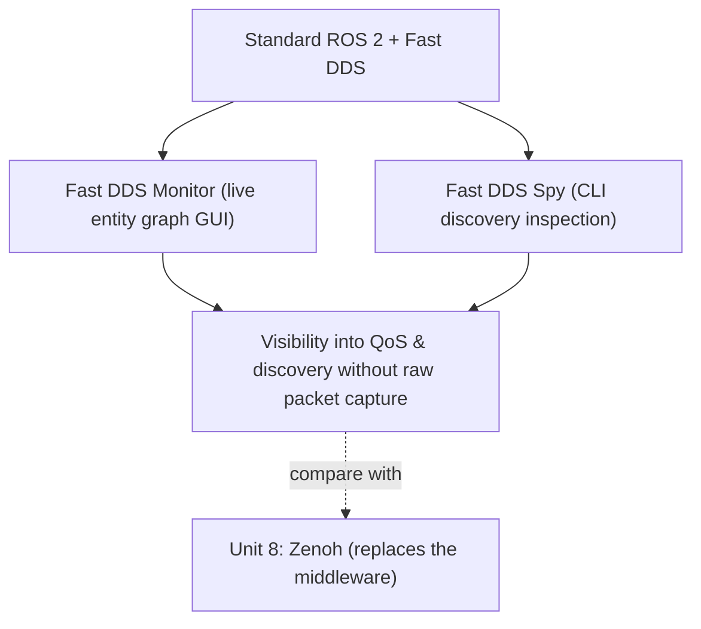

# DDS for Robotics — Unit 9: Vulcanexus

This unit covers Vulcanexus, eProsima's ROS 2 distribution built around Fast DDS tooling — a second, complementary answer to the DDS pain points from Units 6-7, distinct from Zenoh's approach of replacing the middleware outright. Where Zenoh answers "how do I make discovery and data flow work at all on a WAN or constrained link," Vulcanexus answers a narrower but more everyday question: "my DDS network technically works, so why can't I see what it's actually doing?" Units 3 and 6 showed that raw `tcpdump`/Wireshark capture answers that at the wire level, but decoding RTPS bytes by hand every session doesn't scale. Vulcanexus turns that same packet-level truth into a live, ROS-aware picture instead.

The diagram below shows how Vulcanexus adds observability tooling on top of stock Fast DDS, as a complementary approach to Zenoh's protocol swap.



## What Vulcanexus is
Vulcanexus is a ROS 2 distribution (produced by eProsima, the same organization behind Fast DDS) that bundles standard ROS 2 with a curated set of Fast DDS-specific tools for monitoring, tuning, and visualizing DDS behavior not present in a stock ROS 2 install. Rather than swapping the middleware, Vulcanexus keeps DDS/Fast DDS as the transport and focuses on making its behavior observable and configurable — same `rclpy`/`rclcpp` API and RTPS wire protocol as Unit 4's stock setup, just with more instrumentation. It ships as both a native install and Docker images, useful for trying it without disturbing an existing setup:

```bash
docker pull eprosima/vulcanexus:<distro>-desktop
docker run -it --net=host eprosima/vulcanexus:<distro>-desktop
```

The `--net=host` flag isn't cosmetic: DDS discovery relies on multicast (Unit 6), and Docker's default bridged networking isolates a container from the host's multicast domain, which would silently break discovery between a containerized Vulcanexus node and anything outside the container.

## Where the monitoring data comes from
Fast DDS Monitor doesn't sniff packets the way Wireshark does — it subscribes to built-in *statistics topics* that Fast DDS's statistics module publishes once enabled. The module is opt-in, since publishing statistics is itself DDS traffic with a small but real overhead cost; it's typically switched on via an environment variable (the exact name and the statistics "kinds" available vary by version, so check eProsima's docs rather than assume) or via the `<statistics>` block in a Fast DDS XML profile from Unit 7. Worth carrying forward: the Monitor's live graph is DDS data flowing over DDS, observed by an ordinary subscriber built from the same discovery/pub-sub primitives you've been debugging all course, not a separate side-channel.

## Tooling it adds over stock ROS 2
The headline addition is **Fast DDS Monitor**, a GUI that visualizes the live DDS entity graph (participants, writers, readers, and the discovery/matching relationships between them) — the Wireshark-level picture from Unit 3, but as a live, ROS-aware graph rather than raw packets. Critically, it flags QoS *incompatibilities* directly: a subscriber requesting `RELIABLE` against a `BEST_EFFORT` publisher never matches (the reader asks for a stronger guarantee than the writer offers), while the reverse pairing is fine. The Monitor renders that mismatch as a visual state instead of leaving you to infer it from a topic that silently never delivers data. It also bundles **Fast DDS Spy**, a CLI for inspecting DDS domain state without a GUI — useful over SSH on a headless robot:

```bash
fastdds discovery -i 0                    # inspect discovery server state for domain 0
```

## A worked example: chasing a silent QoS mismatch
Suppose a lidar node publishes scans as `BEST_EFFORT` (sensible for high-rate sensor data, per Unit 4) but a newly added mapping node subscribes expecting `RELIABLE`. `ros2 topic list` shows the topic on both sides, so discovery clearly succeeded, but no scan data ever reaches the mapping node — from the outside this looks identical to a discovery failure. Opening Fast DDS Monitor against the same domain shows both the DataWriter and DataReader as discovered entities, but the edge between them is marked incompatible rather than matched, pointing straight at the QoS policy responsible instead of sending you back to re-run Unit 3's Wireshark capture and cross-reference `DATA(w)`/`DATA(r)` payloads by hand.

## Where it fits relative to Zenoh
Zenoh (Unit 8) changes *what protocol* moves your data; Vulcanexus changes *how much visibility and control* you have over standard DDS/Fast DDS behavior without changing the protocol at all. They're not mutually exclusive — a team might use Vulcanexus's monitoring tools during development to understand and tune QoS and discovery (applying the XML techniques from Unit 7 based on what the Monitor shows), then decide whether Zenoh's WAN/scale properties are actually needed in production. Treat Unit 8 and this unit as two different tools aimed at the same underlying pain — DDS discovery and QoS being hard to observe and tune — not as competing final answers.

## Try it yourself
Pull the Vulcanexus Docker image for a distribution matching your ROS 2 version, run a talker/listener pair inside it, and open Fast DDS Monitor to watch the two DomainParticipants, their DataWriter/DataReader, and the discovery match happen live. Then deliberately mismatch their QoS — set one side to `RELIABLE` and the other to `BEST_EFFORT` using the code-level QoS profiles from Unit 4 — and confirm the Monitor flags the pair as incompatible, and that no data crosses despite discovery having succeeded. Finally, compare what the GUI shows against the `DATA(w)`/`DATA(r)` packets you identified manually in Unit 3's Wireshark exercise.
