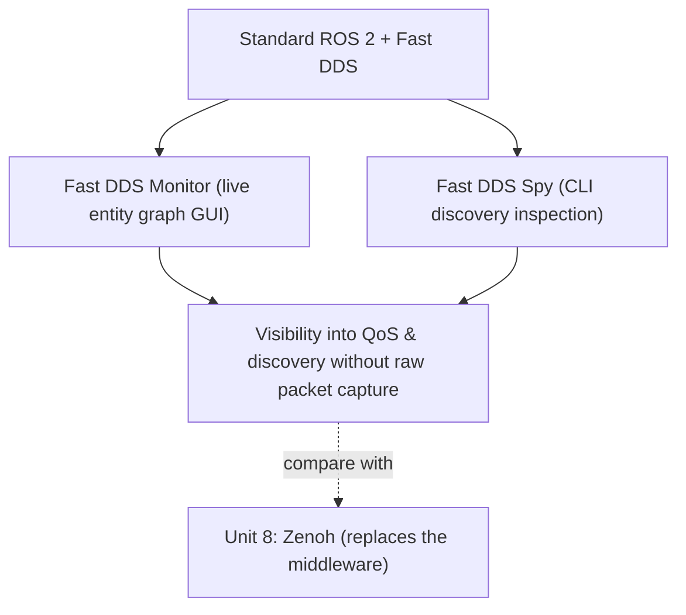

# DDS for Robotics — Unit 9: Vulcanexus

This unit covers Vulcanexus, eProsima's ROS 2 distribution built specifically around Fast DDS tooling — a second, complementary answer to the DDS pain points from Units 6-7, distinct from Zenoh's approach of replacing the middleware outright.

The diagram below shows how Vulcanexus adds observability tooling on top of stock Fast DDS, as a complementary approach to Zenoh's protocol swap.



## What Vulcanexus is
Vulcanexus is a ROS 2 distribution (produced by eProsima, the same organization behind Fast DDS) that bundles standard ROS 2 with a curated set of Fast DDS-specific tools for monitoring, tuning, and visualizing DDS behavior that aren't part of a stock ROS 2 install. Rather than swapping the middleware (as Zenoh does), Vulcanexus keeps DDS/Fast DDS as the transport and focuses on making its behavior observable and configurable. It's distributed as both a native install and Docker images, which matters if you want to try it without disturbing an existing ROS 2 setup:

```bash
docker pull eprosima/vulcanexus:<distro>-desktop
docker run -it --net=host eprosima/vulcanexus:<distro>-desktop
```

## Tooling it adds over stock ROS 2
The headline addition is **Fast DDS Monitor**, a GUI that visualizes the live DDS entity graph (participants, writers, readers, and the discovery/matching relationships between them) sourced from Fast DDS's built-in statistics module — effectively giving you the Wireshark-level picture from Unit 3, but as a live, ROS-aware graph rather than raw packets. It also bundles **Fast DDS Spy** (`fastdds discovery` / spy tooling), a CLI for inspecting DDS domain state without needing a full GUI session — useful over SSH on a headless robot:

```bash
fastdds discovery -i 0                    # inspect discovery server state for domain 0
```

## Where it fits relative to Zenoh
Zenoh (Unit 8) changes *what protocol* moves your data; Vulcanexus changes *how much visibility and control* you have over standard DDS/Fast DDS behavior without changing the protocol. They're not mutually exclusive goals — a team might use Vulcanexus's monitoring tools during development to understand and tune QoS/discovery, then decide based on what they learn whether Zenoh's WAN/scale properties are actually needed in production. Treat Unit 8 and this unit as two different tools aimed at the same underlying pain (DDS discovery and QoS being hard to observe and tune), not as competing final answers.

## Try it yourself
Pull the Vulcanexus Docker image for a distribution matching your ROS 2 version, run a talker/listener pair inside it, and open Fast DDS Monitor to watch the two DomainParticipants, their DataWriter/DataReader, and the discovery match happen live. Compare what the GUI shows against the `DATA(w)`/`DATA(r)` packets you identified manually in Unit 3's Wireshark exercise.
