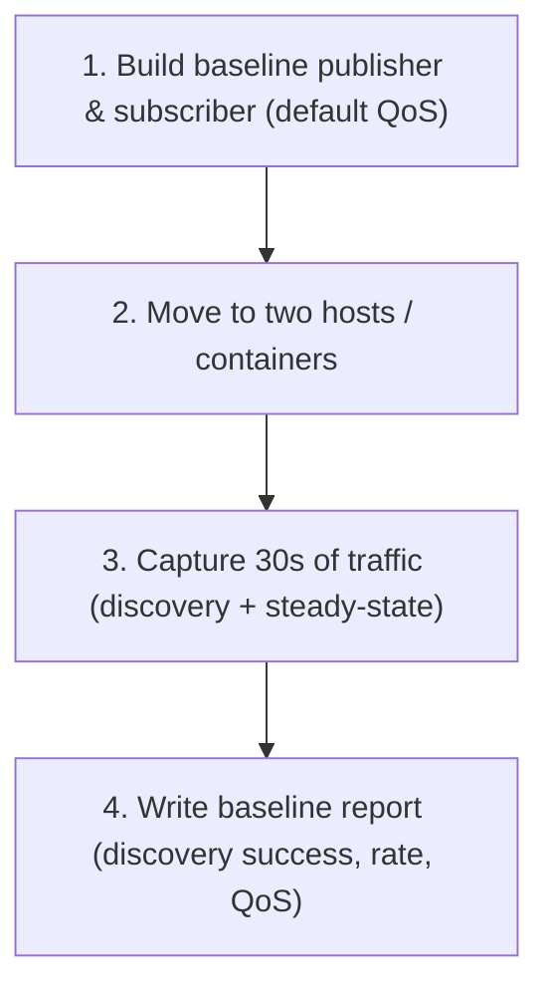

# DDS for Robotics — Unit 10: Project - Section 1

This unit opens the course's capstone project: a three-part exercise where you build, break, capture, and eventually fix a small multi-node DDS network — applying Units 1-9 as one connected workflow instead of isolated exercises. Section 1 is about building the baseline system and capturing evidence of its problems.

The diagram below shows the four-step sequence Section 1 walks through to build the baseline system and capture evidence of its behavior.



## Project scenario
You are standing up a two-machine (or two-network-namespace, if you only have one physical machine) ROS 2 system simulating a simple robot: one "robot-side" process publishing sensor-like data (e.g. a fake `sensor_msgs/msg/LaserScan` or just a `std_msgs/msg/String` heartbeat at 10 Hz) and one "operator-side" process subscribing to it and echoing round-trip latency. The goal across all three sections is to take this system from "works by luck on localhost" to "diagnosed, tuned, and validated across a realistic constrained network," documenting your evidence at each step.

If you don't have two physical machines, use two Docker containers on a user-defined bridge network (not `--network host`) — this reproduces real cross-host discovery behavior, including the parts that break by default.

## Section 1 deliverables
1. **Build the baseline nodes.** A minimal publisher and subscriber, default QoS, default RMW implementation. Confirm they work on localhost first (`ros2 topic echo`).
2. **Move to two hosts/containers.** Confirm whether discovery succeeds by default — record whether `ros2 topic list` on the subscriber side shows the publisher's topic, and how long it takes to appear.
3. **Capture the baseline network behavior.** Using the Wireshark/tcpdump skills from Unit 3, capture at least 30 seconds of traffic covering both discovery and steady-state data flow. Save the `.pcapng` file — you'll compare against it in Sections 2 and 3.
4. **Write a short baseline report** (a few bullet points is fine) covering: does discovery succeed by default across your two hosts? What is the observed message rate/loss on the subscriber side? What RMW/DDS vendor and QoS were in effect (`ros2 topic info -v`)?

## Suggested project layout
```
dds_project/
├── robot_node/          # publisher, simulating onboard sensor
├── operator_node/        # subscriber, simulating operator station
├── captures/
│   └── section1_baseline.pcapng
└── notes/
    └── section1_report.md
```

## Checkpoint before moving on
Before Section 2, you should be able to answer, with evidence (not guesses): does your baseline setup use multicast discovery successfully across your two-host network? If discovery *fails* by default in your environment (e.g. Docker bridge network without extra configuration), that's a valid and useful baseline finding — Section 2 will have you fix it deliberately rather than by accident.

## Try it yourself
Stand up the two nodes across two Docker containers on a bridge network (`docker network create dds_net`, `docker run --network dds_net ...`), and before doing anything else, run `docker network inspect dds_net` to note whether it's configured for multicast. Capture 30 seconds of traffic on each container's interface and confirm in Wireshark whether any `DATA(p)` participant-announcement packets successfully reach the other container.
