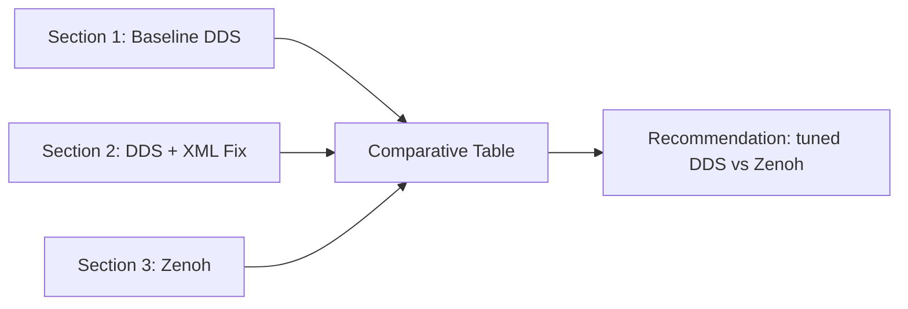
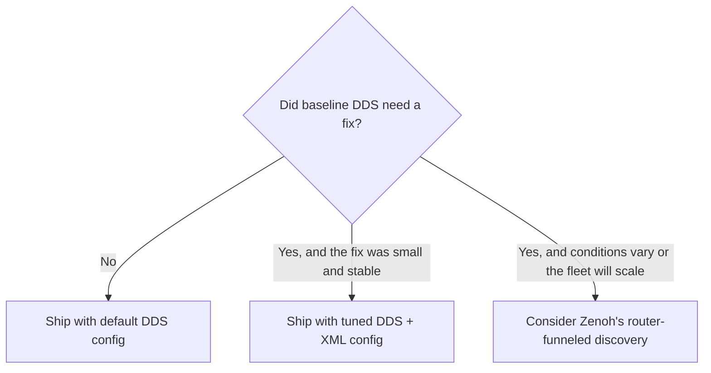

# DDS for Robotics — Unit 12: Project - Section 3

The final section evaluates whether an alternative middleware (Zenoh) or enhanced tooling (Vulcanexus) would have avoided the Section 1 problem entirely, and closes the project with a short comparative writeup.

Sections 1 and 2 held the middleware fixed and changed the configuration around it; Section 3 does the opposite — it holds the topology and workload fixed and swaps in a different middleware (or a different observability layer) to see whether the same class of problem disappears, or just becomes easier to see. That distinction matters for the recommendation: a middleware that avoids the problem by construction (Zenoh) is a fundamentally different kind of answer than tooling that just makes an existing problem more visible (Vulcanexus).

The diagram below shows how the three approaches tested across the project feed into the final comparative recommendation.



## Re-run the baseline scenario under Zenoh
Take your *original* Section 1 topology (same two hosts/containers, same publisher/subscriber code, same network conditions — do not carry over the Section 2 XML fix) and switch middleware instead of hand-tuning DDS. As covered in Unit 8, `rmw_zenoh_cpp` implements the same `rmw` interface as Cyclone/Fast DDS, so your publisher and subscriber code is unchanged — only the environment variable and the presence of a router change:

```bash
sudo apt install ros-<distro>-rmw-zenoh-cpp
export RMW_IMPLEMENTATION=rmw_zenoh_cpp
zenohd &
```

Start `zenohd` reachable from both hosts, re-run the publisher and subscriber, and capture traffic the same way as before. Record whether discovery and data flow succeed *without* the manual peer-list/QoS fix you had to apply in Section 2.

Capture the same 30-second window with the same filter you used in Sections 1 and 2, and save it as `section3_zenoh.pcapng`. Because Zenoh traffic funnels through the router's TCP port (7447 by default) rather than to a multicast address, expect the packet shapes in Wireshark to look noticeably different even when the *outcome* — data flowing reliably — is the same. That's expected, not a sign something is broken; it's the router-funneled discovery model from Unit 8 showing up in the packet trace instead of the multicast mesh from Section 1.

## Inspect with Vulcanexus tooling
If your environment used Fast DDS at any point, run the same scenario inside a Vulcanexus container and open Fast DDS Monitor while the nodes are running:

```bash
docker run -it --net=host eprosima/vulcanexus:<distro>-desktop
```

Use it to visually confirm participant/writer/reader matching, and compare what it shows against your manual Wireshark packet analysis from Section 1/2 — note anywhere the GUI made a fault obvious faster than raw packet inspection did. If you don't have a GUI session available (for example, over SSH into a headless robot), `fastdds discovery -i <domain>` gives the same discovery-state information from the command line.

This step isn't about finding a *new* fix — it's a separate question from Zenoh's. Zenoh asks "would a different protocol have avoided the problem entirely?" Vulcanexus asks "would better tooling have let me diagnose it faster?" Keep both questions distinct in your notes.

## Comparative writeup
Produce a short report (a table is fine) comparing, for your specific network environment:

| Approach | Discovery worked by default? | Manual config needed | Data flowed reliably | Notes |
|---|---|---|---|---|
| Baseline DDS (Section 1) | | | | |
| DDS + XML fix (Section 2) | | | | |
| Zenoh (Section 3) | | | | |

Alongside the table, answer in a few sentences: for *this* topology (two hosts, this network), would you recommend shipping with tuned DDS config or switching to Zenoh, and why? There's no single correct answer — the point is to justify the choice using the evidence you've gathered across all three sections, the same way you would when making this call for a real robot.

To structure that judgment call, it helps to think through it as a small decision tree rather than a gut call:



A one-off peer-list fix that reliably worked in Section 2 is a fine answer for a single robot on a network you control. If your notes instead show the fix was fragile, network-condition-dependent, or you're imagining this scaling past two hosts, that's evidence pointing toward Zenoh's design goals from Unit 8 rather than more manual DDS tuning.

## Final project deliverables (all three sections)
1. Baseline capture + report (Section 1).
2. Diagnosis, fix, and fixed-capture (Section 2).
3. Zenoh (and optionally Vulcanexus) comparison capture + comparative report (Section 3).
4. A one-paragraph course-level reflection: which unit's skill (Linux networking, Wireshark, QoS tuning, XML config, or middleware choice) mattered most for solving *your* specific network's problem, and why.

## Try it yourself
After completing the comparison table, pick whichever approach performed worse in your environment and write two sentences on what *additional* configuration (a different XML setting, a different Zenoh router placement) might close the gap — you don't need to implement it, just demonstrate you can reason about the next diagnostic step, which is the core skill this entire course has been building.
