# DDS for Robotics

ROS 2 moves every topic, service, and action over DDS (Data Distribution Service), and when a robot's networking gets non-trivial — multiple compute nodes, WiFi links, multi-robot fleets, cloud bridges — the failures you hit almost always live in DDS discovery, QoS configuration, or the underlying Linux network rather than in application code. This course builds that layer up from the ground: Linux networking fundamentals and packet capture with Wireshark, how DDS acts as ROS 2's middleware and how its discovery protocol works (and breaks) on real hardware like the TurtleBot 4, how to hand-tune vendor behavior via XML configuration, and two concrete tools — Zenoh and Vulcanexus — that address DDS's weak points from different angles. It closes with a three-part project that ties every skill together into one diagnose-fix-verify workflow.

The diagram below shows how the twelve units build on each other, from networking foundations through ROS 2/DDS integration and tooling to the capstone project.

```mermaid
flowchart LR
  subgraph Foundations
    U1[U1: Introduction] --> U2[U2: Linux Networking] --> U3[U3: Wireshark]
  end
  subgraph ROS2["ROS 2 Integration"]
    U4[U4: DDS Middleware] --> U5[U5: TurtleBot 4] --> U6[U6: Discovery] --> U7[U7: XML Config]
  end
  subgraph Tools
    U8[U8: Zenoh] --> U9[U9: Vulcanexus]
  end
  subgraph Project
    U10[U10: Build Baseline] --> U11[U11: Diagnose & Fix] --> U12[U12: Compare & Report]
  end
  U3 --> U4
  U7 --> U8
  U9 --> U10
```

1. [Introduction](01-introduction.md) — Introduction to DDS for Robotics course.
2. [Linux Networking](02-linux-networking.md) — Introduction to basics of Linux networking.
3. [Network Analysis with Wireshark](03-network-analysis-with-wireshark.md) — Use wireshark to analyze a network and understand how RTPS packets are travelling.
4. [DDS as ROS 2 Middleware](04-dds-as-ros-2-middleware.md) — Introduction to DDS as the middleware of ROS 2.
5. [DDS Use Case: TurtleBot 4](05-dds-use-case-turtlebot-4.md) — This unit studies the practical case of the DDS network in a popular open source robot: the TurtleBot 4.
6. [DDS Discovery](06-dds-discovery.md) — Introduction of discovery traffic and the limitations it imposes on wireless DDS networks.
7. [DDS XML Configuration Files](07-dds-xml-configuration-files.md) — Learn how to configure DDS settings in both CycloneDDS and Fast DDS using an XML configuration file.
8. [Zenoh](08-zenoh.md) — Introduction to Zenoh. Learn how to fix DDS issues with Zenoh.
9. [Vulcanexus](09-vulcanexus.md) — A look into Vulcanexus and the tools it provides to alleviate DDS issues.
10. [Project - Section 1](10-project-section-1.md) — Build the baseline multi-node system and capture evidence of its network behavior.
11. [Project - Section 2](11-project-section-2.md) — Diagnose and fix the baseline's discovery/QoS problems with XML configuration.
12. [Project - Section 3](12-project-section-3.md) — Compare the tuned DDS setup against Zenoh (and Vulcanexus tooling) and write up findings.
