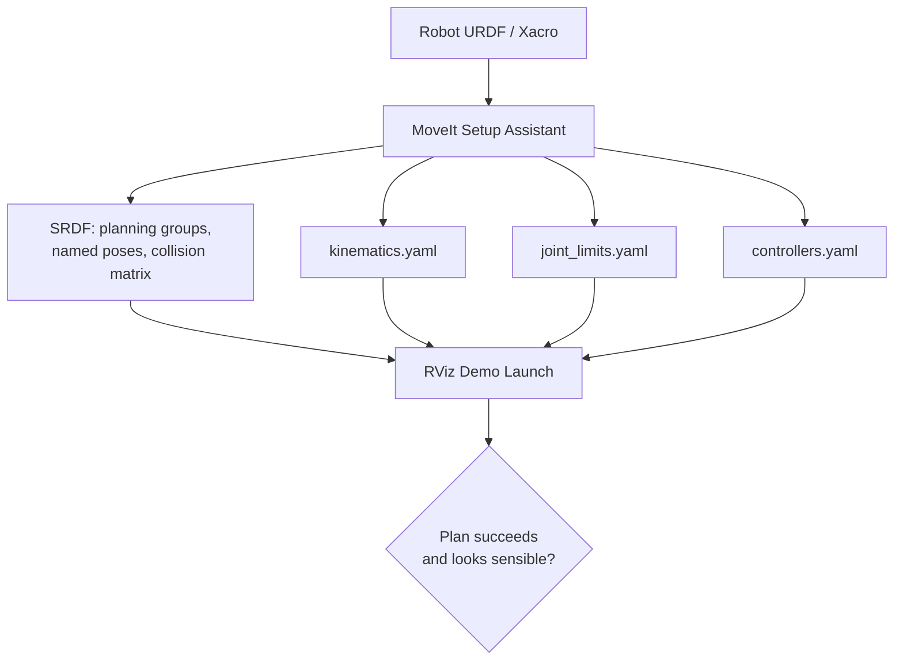

# Mastering Mobile Manipulators — Unit 2: Setting Up Manipulation (Part 1)

With the base able to drive itself around, this unit turns to the arm: getting a MoveIt configuration package built for your specific manipulator so that motion planning — computing collision-free joint trajectories — becomes available as a service other nodes can call. Part 2 will drive this from Python; this unit is about getting the config right first.

The diagram below shows how the Setup Assistant wizard turns your robot's URDF into the generated config files, which you then verify interactively before any code calls into them.



## What MoveIt actually does

MoveIt is a motion-planning framework, not a planner itself — it wraps pluggable planning libraries (commonly OMPL) behind a consistent interface, and adds the surrounding machinery a real arm needs:

- **Kinematics** — forward/inverse kinematics for your specific arm, so you can ask "what joint angles put the gripper at this pose?"
- **Collision checking** — using a geometric model of the robot (from its URDF) plus any objects you add to a "planning scene," so plans avoid hitting the robot itself, the table, or obstacles.
- **Trajectory execution** — handing a planned trajectory to your robot's controllers (via `FollowJointTrajectory` action interfaces) and monitoring completion.

The planning pipeline conceptually is: *scene + start state + goal → planner → collision-free joint trajectory → controller execution*.

## Generating the MoveIt configuration package

MoveIt needs to know your robot's kinematic structure and a handful of planning-relevant facts that aren't in a bare URDF. The setup wizard (MoveIt Setup Assistant in ROS 1, `moveit_setup_assistant` / `moveit_setup` tooling in ROS 2) walks you through generating these from your robot's URDF/Xacro:

```bash
ros2 launch moveit_setup_assistant setup_assistant.launch.py
```

Steps inside the wizard:

1. **Load your URDF** (or Xacro) — the wizard needs the full kinematic tree, including the gripper.
2. **Generate the self-collision matrix** — an automated check of which link pairs can never physically collide, so the collision checker doesn't waste time on them.
3. **Define planning groups** — e.g. an `arm` group (the manipulator joints) and a `gripper` group (the end effector), each tied to a kinematics solver.
4. **Define named poses** — `home`, `pre_grasp`, `tucked`, etc. — reusable joint-space targets you'll reference by name later.
5. **Configure controllers** — map each planning group to the ROS 2 controller/action interface that will actually execute trajectories on it.

## The files that come out, and why they matter

- **SRDF (Semantic Robot Description Format)** — the file the wizard is really building for you: planning groups, disabled collision pairs, named poses, and end-effector definitions. You'll hand-edit this occasionally once you understand it.
- **`kinematics.yaml`** — which IK solver each group uses (e.g. KDL, or a faster analytic/IKFast solver for a 6-DOF arm).
- **`joint_limits.yaml`** — velocity/acceleration limits per joint; tightening these is a cheap way to make execution slower-but-safer while you're debugging.
- **`*_controllers.yaml`** — the mapping from MoveIt planning groups to your robot's actual joint-trajectory controllers.

## Verifying the config in RViz

The generated package includes a demo launch file that brings up MoveIt with an interactive RViz plugin — use it before writing a single line of planning code:

```bash
ros2 launch my_arm_moveit_config demo.launch.py
```

In the MotionPlanning panel, drag the interactive marker on the end effector to a new pose, hit **Plan**, and confirm you get a sensible, collision-free path in the preview before hitting **Execute**. If planning fails or produces contorted paths, revisit the joint limits and self-collision matrix before assuming the planner is broken.

## Try it yourself

Using your arm's URDF (or a stock one like a Universal Robots or Panda model available in most ROS 2 distros' example repos), run the setup wizard end to end, define a `home` named pose with the arm tucked in, and confirm in the RViz demo that planning from an arbitrary pose back to `home` succeeds. This `home` pose will be your default "safe" state in later units.
