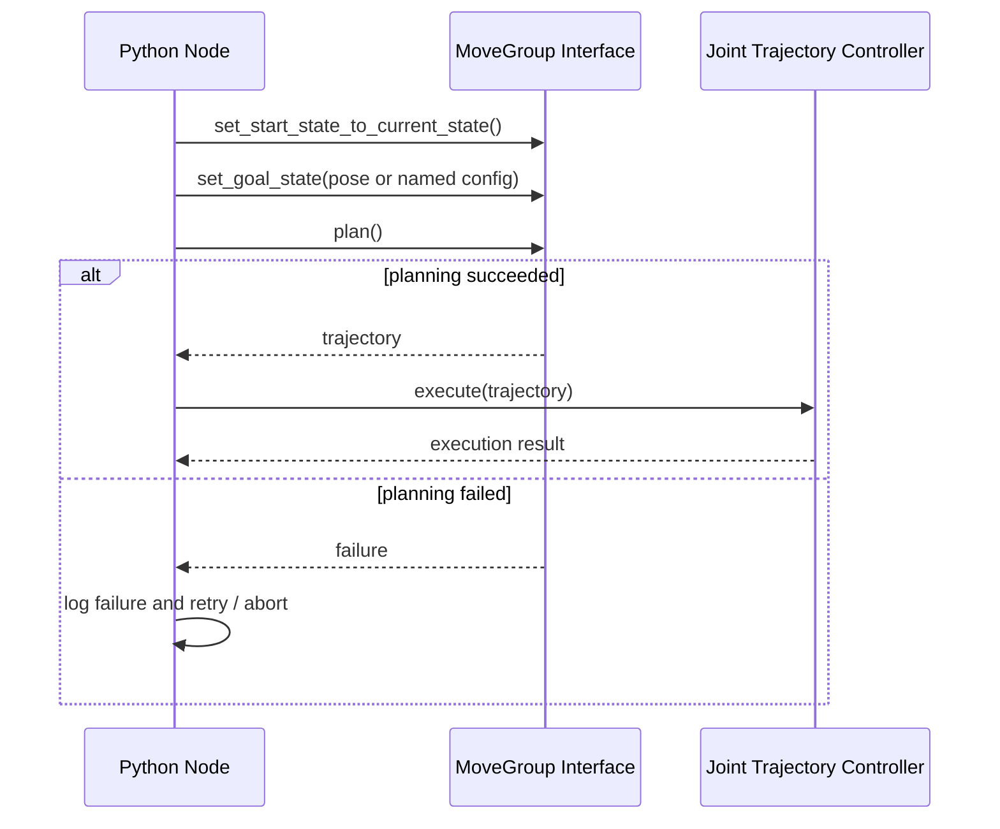

# Mastering Mobile Manipulators — Unit 3: Setting Up Manipulation (Part 2)

Unit 2 got you a MoveIt config you can drive by hand in RViz. A real application can't have a human dragging markers — this unit is about calling motion planning from Python so it can be triggered programmatically, which is what your eventual pick-and-place state machine will do.

The sequence below shows the request/response pattern behind every programmatic move: your node sets a goal, asks MoveIt to plan, checks the result, and only then hands the trajectory to the controller for execution.



## The MoveGroup interface

MoveIt exposes its planning pipeline as a ROS 2 action server (`move_group`, using the `MoveGroup` action) plus a set of services for scene management. Rather than talking to that action directly, you normally use a Python wrapper — `moveit_commander` in older MoveIt, or the `moveit_py`/`MoveGroupInterface` bindings in current MoveIt 2 — that hides the action/goal bookkeeping behind method calls:

```python
import rclpy
from rclpy.node import Node
from moveit.planning import MoveItPy

class ArmController(Node):
    def __init__(self):
        super().__init__('arm_controller')
        self.moveit = MoveItPy(node_name='moveit_py_planning')
        self.arm = self.moveit.get_planning_component('arm')

    def go_to_named_pose(self, name: str):
        self.arm.set_start_state_to_current_state()
        self.arm.set_goal_state(configuration_name=name)
        plan_result = self.arm.plan()
        if plan_result:
            self.moveit.execute(plan_result.trajectory, controllers=[])
        else:
            self.get_logger().warn(f'Planning to {name} failed')
```

(Exact class names shift between MoveIt versions — check `moveit.picknik.ai` for the API matching the distro you're on — but the shape of the workflow is stable: set a start state, set a goal, plan, then execute.)

## Joint-space vs. Cartesian (pose) targets

You'll plan against two kinds of goals:

- **Joint-space goals** — a specific angle for every joint (or a named pose from the SRDF). Fast to plan, deterministic, good for "go home" or "go to pre-grasp stance."
- **Pose (Cartesian) goals** — a target pose (position + orientation) for the end effector; MoveIt runs inverse kinematics internally to find joint angles that reach it. Necessary whenever the target comes from perception (e.g. "the object is at this pose in the camera frame"), which is exactly what Unit 4 needs.

```python
from geometry_msgs.msg import PoseStamped

target = PoseStamped()
target.header.frame_id = 'base_link'
target.pose.position.x = 0.45
target.pose.position.z = 0.30
target.pose.orientation.w = 1.0

self.arm.set_goal_state(pose_stamped_msg=target, pose_link='gripper_link')
```

For a straight-line end-effector path (useful for the final approach into a grasp), use Cartesian path planning instead of single-pose planning — it interpolates waypoints and reports what fraction of the path was actually achievable.

## Handling planning failures gracefully

Motion planning fails routinely — an unreachable pose, a cluttered scene, a bad IK seed — and your application code has to expect that, not treat it as exceptional:

- Always check the plan result before executing; never execute a `None`/failed plan.
- Retry with a different planner or a slightly perturbed goal pose before giving up — small pose errors (a few millimeters) are common from perception and a retry with tolerance often succeeds.
- Log the failure with enough context (goal pose, planning group, scene state) that you can debug it offline; you'll want this once planning is being triggered automatically from a state machine in Unit 5, where there's no human watching RViz.

## Try it yourself

Write a small Python node that, on a timer or a single call, plans and executes a move from the current pose to a pose 10 cm above it (keeping orientation fixed), then plans a Cartesian path back down to the original pose. Log the planning success/failure and the fraction of the Cartesian path achieved, and deliberately set an unreachable target once to confirm your failure-handling path actually triggers.
