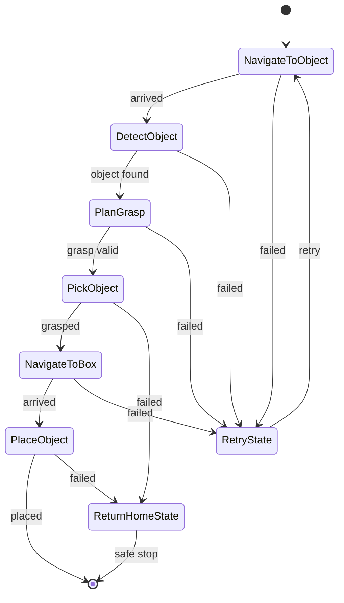

# Mastering Mobile Manipulators — Unit 5: Creating the Behavior of the Robot

You now have three working capabilities — navigate, plan/execute arm motion, grasp — each callable from Python. This unit ties them together into one coherent robot behavior using a state machine, so "go get the object and bring it to the box" becomes a single, restartable, inspectable process instead of a hand-run sequence of scripts.

The state diagram below shows the happy-path pick-and-place states alongside the shared recovery states that failure outcomes route into instead of each state handling its own recovery.



## Why a state machine, and not just a linear script

A plain top-to-bottom script for "navigate → detect → grasp → navigate → place" works right up until something fails partway — a grasp misses, navigation gets stuck, perception times out. A state machine makes failure a first-class part of the design instead of an afterthought:

- Every step is an explicit **state** with defined **outcomes** (`succeeded`, `failed`, `aborted`).
- Outcomes are wired to **transitions** to the next state — including recovery states, not just the happy path.
- The whole thing can be paused, resumed, or restarted from a known state, and its current state is always inspectable — valuable once this is running unattended in a warehouse rather than on your desk.

## FlexBe's architecture

FlexBe (Flexible Behavior Engine) is a state-machine framework built specifically for this kind of supervised robot behavior, with two halves:

- **The Behavior Engine** — the runtime that executes states and transitions, running as a ROS node.
- **The FlexBe App (UI)** — a browser-based editor and monitor: you build the state machine graphically (states as boxes, transitions as arrows), and at runtime you get a live view of which state is active, with buttons to pause, restart from a state, or manually force a transition.

Each **state** is a small Python class with an `execute()` method (called repeatedly until it returns an outcome) and, for shared setup, `on_enter()`/`on_exit()` hooks. States communicate through **userdata**, a key-value store that survives across transitions — this is how, e.g., the pose your perception state finds gets to the grasp state.

```python
from flexbe_core import EventState, Logger

class NavigateToPoseState(EventState):
    def __init__(self, target_pose):
        super().__init__(outcomes=['arrived', 'failed'])
        self._target_pose = target_pose

    def execute(self, userdata):
        if self._nav_result == 'success':
            return 'arrived'
        elif self._nav_result == 'failure':
            return 'failed'
        # otherwise stay in this state and keep waiting

    def on_enter(self, userdata):
        self._send_nav_goal(self._target_pose)
```

## Building the pick-and-place behavior

Compose it from states you've effectively already written the logic for in Units 1-4, each wrapped as a FlexBe state:

`NavigateToObject → DetectObject → PlanGrasp → PickObject → NavigateToBox → PlaceObject`

with failure outcomes from any state routed to a small number of shared recovery states (e.g. `RetryState`, `ReturnHomeState`) rather than each state inventing its own recovery logic. This is also where the "home" named pose from Unit 2 earns its keep — it's the safe state every recovery path converges back to.

## Testing and monitoring

Run the behavior through the FlexBe App and watch state transitions happen live rather than only reading logs — you can see at a glance whether the robot is stuck retrying `DetectObject` versus genuinely progressing. Force a failure deliberately (e.g. move the object out of the camera's view mid-run) and confirm the behavior recovers or fails safely rather than hanging or throwing the arm into an unplanned motion.

## Try it yourself

Model just the "recovery" portion of the behavior on paper first: for each of the six main states above, decide what `failed` should transition to — retry the same state, fall back to `home`, or abort the whole task — before writing a line of FlexBe code. This forces you to think through failure modes up front instead of discovering them at 2am with a real robot stuck mid-aisle.
