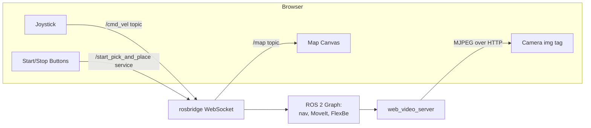

# Mastering Mobile Manipulators — Unit 6: Creating the Web Interface

The FlexBe app is great for you as the developer, but it assumes ROS knowledge. This final unit builds a plain web page — camera feed, live map, a joystick, and start/stop buttons — that lets someone with zero ROS background operate the robot you've built over the previous five units.

The diagram below shows every page element as a distinct data path through rosbridge, so it's clear no single connection type has to carry all of the traffic.



## Why a web interface, and how it talks to ROS

The standard bridge between a browser and a ROS 2 graph is **rosbridge** (`rosbridge_suite`), which exposes topics, services, and actions over a WebSocket using a JSON protocol. The browser side talks to it with the `roslibjs` JavaScript library, so your page never needs a native ROS install — it just opens a WebSocket connection.

```bash
ros2 launch rosbridge_server rosbridge_websocket_launch.xml
```

```javascript
const ros = new ROSLIB.Ros({ url: 'ws://<robot-host>:9090' });
ros.on('connection', () => console.log('Connected to rosbridge'));
ros.on('error', (err) => console.error('rosbridge error:', err));
```

Everything below is variations on the same pattern: subscribe to a topic, publish to a topic, or call a service/action, all through this one WebSocket connection.

## Streaming the map and the camera

- **Camera** — don't push raw `sensor_msgs/Image` over rosbridge for a live view; it's uncompressed and heavy. Use `web_video_server` (or republish as `CompressedImage` and decode client-side), which serves an MJPEG stream over plain HTTP that drops straight into an `` tag.

```html
:8080/stream?topic=/camera/image_raw" />
```

- **Map** — subscribe to `/map` (or the costmap topics) via `roslibjs` and render occupied/free/unknown cells to an HTML `<canvas>`, or use a ready-made ROS map-rendering widget if you don't want to write the grid-to-pixel code yourself.

```javascript
const mapTopic = new ROSLIB.Topic({ ros, name: '/map', messageType: 'nav_msgs/OccupancyGrid' });
mapTopic.subscribe((msg) => drawOccupancyGrid(msg, canvasCtx));
```

## The web joystick

A teleoperation joystick just needs to publish `geometry_msgs/Twist` messages on a timer while the user drags a virtual stick:

```javascript
const cmdVel = new ROSLIB.Topic({ ros, name: '/cmd_vel', messageType: 'geometry_msgs/Twist' });

function onJoystickMove(x, y) {
  cmdVel.publish(new ROSLIB.Message({
    linear: { x: y * MAX_LINEAR, y: 0, z: 0 },
    angular: { x: 0, y: 0, z: -x * MAX_ANGULAR }
  }));
}
```

Publish at a steady rate (e.g. 10 Hz) rather than only on drag events, and publish a zero `Twist` the moment the user releases the stick — a stuck nonzero command from a dropped connection is a real safety issue on hardware, less so in simulation but still worth building the habit.

## Start/stop control for the pick-and-place task

Rather than exposing FlexBe's full state-machine API to the browser, put one small ROS 2 service (e.g. `/start_pick_and_place`, `/stop_task`) in front of it — a thin node that translates the service call into the appropriate FlexBe behavior trigger. This keeps the web page's ROS surface area tiny and stable even if the state machine's internals change later.

```javascript
const startTask = new ROSLIB.Service({ ros, name: '/start_pick_and_place', serviceType: 'std_srvs/Trigger' });
document.getElementById('start-btn').onclick = () =>
  startTask.callService(new ROSLIB.ServiceRequest({}), (res) => updateStatus(res));
```

## Try it yourself

Build a single HTML page with four elements wired to a running rosbridge instance: the camera `` stream, a canvas rendering `/map`, a click-and-drag joystick publishing to `/cmd_vel`, and a start/stop button calling your trigger service. Test it from a phone on the same network as the robot (or simulation host) to confirm the interface really needs no ROS tooling on the client side.
