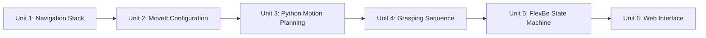

# Mastering Mobile Manipulators

Mobile manipulators combine a navigating base with one or more robotic arms and a gripper, letting a robot autonomously move through an environment, find an object worth grasping, and deliver it somewhere useful — the pattern behind warehouse picking, cleaning robots, and hazardous-area handling. This course builds one complete ROS application end to end: a mobile manipulator that navigates to an object, perceives and grasps it, carries it to a destination, and does all of that under a state machine that a plain web interface can start and stop.

The diagram below shows how each unit's output becomes the next unit's assumed-working foundation, from a driving base to a browser-operable robot.

1. [Setting Up the Navigation System for a Mobile Manipulator](01-setting-up-the-navigation-system-for-a-mobile-manipulator.md) — Configure the Navigation Stack (costmaps, planners, footprint) for a base that carries an arm.
2. [Setting Up Manipulation (Part 1)](02-setting-up-manipulation-part-1.md) — Generate and verify a MoveIt configuration package for your robotic arm.
3. [Setting Up Manipulation (Part 2)](03-setting-up-manipulation-part-2.md) — Drive motion planning programmatically from Python, in joint space and Cartesian space.
4. [Setting Up Grasping](04-setting-up-grasping.md) — Build the full pick-and-place sequence, including grasp poses and planning-scene attach/detach.
5. [Creating the Behavior of the Robot](05-creating-the-behavior-of-the-robot.md) — Compose navigation, manipulation, and grasping into a FlexBe state machine with recovery paths.
6. [Creating the Web Interface](06-creating-the-web-interface.md) — Expose camera, map, joystick, and task start/stop controls through a rosbridge-backed web page.
