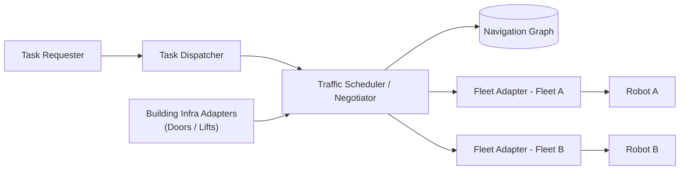

# Robot Fleet Management in ROS2 v2 — Unit 1: Introduction to fleet management

Before touching any code, it helps to understand the problem Open-RMF (Robotics Middleware Framework) exists to solve: coordinating many robots, from many vendors, sharing the same physical space and infrastructure. This unit sets the vocabulary and mental model you'll use for the rest of the course.

The diagram below maps how RMF's core actors relate: a task request flows through the dispatcher and traffic scheduler, which reasons against the shared navigation graph and building infrastructure before reaching each fleet's adapter and robots.

## Why fleet management is a distinct problem

Controlling one robot is a navigation and task-execution problem. Controlling twenty robots from three vendors sharing a corridor, an elevator, and a set of automatic doors is a *coordination* problem, and the two are not the same skillset. A single-robot stack cares about localization, planning, and control. A fleet layer sits above that and cares about:

- **Task allocation** — which robot (of possibly several idle, capable robots) should do this delivery, this cleaning pass, this patrol loop?
- **Traffic negotiation** — two robots from two different fleets, running two different navigation stacks, are about to enter the same corridor segment. Who waits?
- **Shared resource arbitration** — an elevator or door can only serve one robot (or one direction) at a time, and it may also need to be shared with humans.
- **Heterogeneity** — the robots underneath may speak entirely different native APIs (a vendor SDK, a proprietary REST API, a ROS 1 bridge, native ROS 2). The fleet layer needs a common abstraction over all of them.

Open-RMF is ROS 2's answer to this: a set of ROS 2 nodes, message/service definitions, and libraries that let heterogeneous robot fleets share a building's infrastructure safely and efficiently.

## The core actors in an RMF deployment

- **Fleet adapter** — a piece of software (one per fleet, sometimes one per robot) that translates between RMF's abstractions (go to this waypoint, dock here, your battery is low) and the robot's native control interface. This is the main integration point you will build in later units.
- **Traffic scheduler / negotiator** — the RMF core service that reserves time-space "itineraries" for each robot on a shared navigation graph, so two robots don't claim the same lane at the same time.
- **Task dispatcher** — accepts task requests (deliver this, clean that zone, patrol this loop) and assigns them to the fleet/robot that bids best for them.
- **Building infrastructure adapters** — doors, lifts, and other environment systems get their own lightweight adapters so RMF can request and observe "door open," "lift at floor 2," etc.
- **The navigation graph** — a lightweight graph of waypoints and lanes (distinct from a robot's own occupancy-grid map) that RMF uses to reason about traffic at a level above raw grid cells.

## How this maps onto what you already know

If you've worked with ROS 2 before, think of RMF as a specialized multi-agent coordination layer built entirely out of ordinary ROS 2 building blocks: nodes, topics, services, and (for hard real-time-ish traffic decisions) a scheduling algorithm. There is no new middleware to learn — RMF's traffic and task APIs are published as ROS 2 interfaces, so anything you already know about `ros2 topic echo`, `ros2 node info`, or writing a subscriber applies directly once RMF nodes are running.

## Try it yourself

Without installing anything yet, sketch (on paper or in a text file) a floor plan for a small office with two rooms, one corridor, one door, and one elevator. Mark where you'd place navigation waypoints and lanes, and identify the two or three "contention points" (places where two robots — or a robot and a human — might compete for the same space) that a fleet management layer would need to arbitrate. You'll build a real version of this graph starting in Unit 15.
