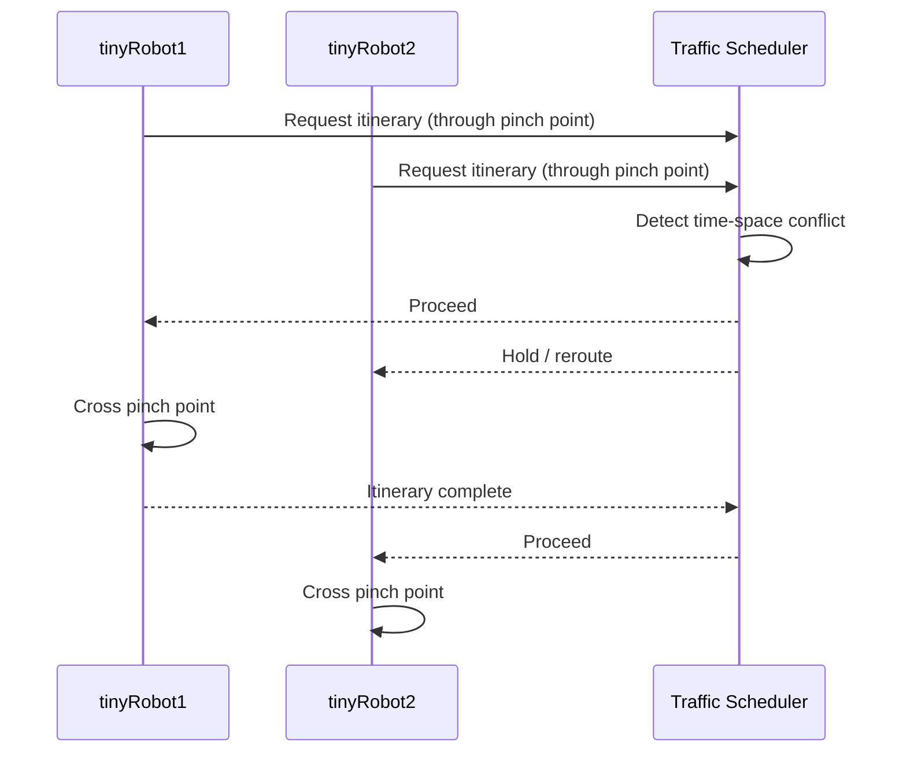

# Robot Fleet Management in ROS2 v2 — Unit 3: Simple RMF Setup - Part 2

With a single-robot RMF stack working from Unit 2, this unit extends the setup to two robots operating in the same fleet, which is where traffic negotiation actually starts to matter.

The sequence below shows how the traffic scheduler resolves two robots contending for the same pinch point rather than letting them collide.



## Why two robots changes everything

With one robot, the traffic scheduler has nothing to arbitrate — it always wins any negotiation it enters. As soon as a second robot from the same fleet is added, RMF has to actually reserve non-overlapping time-space windows on the navigation graph and resolve conflicts when both robots want the same lane or waypoint at similar times. This is the first place you'll actually see RMF's traffic negotiation do work.

## Configuring a fleet with multiple robots

A fleet adapter's configuration (typically a YAML file passed at launch) declares the fleet's name, its navigation graph, and a `robots` section. Adding a second robot is often just adding a second entry:

```yaml
rmf_fleet:
  name: "tinyRobot"
  limits:
    linear: [0.5, 0.75]
    angular: [0.6, 2.0]
  profile:
    footprint: 0.3
    vicinity: 0.5

robots:
  tinyRobot1:
    start:
      map_name: "L1"
      waypoint: "pantry"
  tinyRobot2:
    start:
      map_name: "L1"
      waypoint: "lounge"
```

Each robot needs its own starting waypoint on the shared navigation graph, and — in a real deployment — its own topic/service namespace so commands and state don't collide between the two.

## Launching two robots and watching them negotiate

```bash
ros2 launch rmf_demos_gz office.launch.xml robot_name:=tinyRobot1
```

For the bundled demos, spawning a second robot is usually a launch argument or a second included world entity rather than a second full launch invocation — check the demo's launch file for a `<let name="second_robot" .../>`-style toggle. Once both are up:

```bash
ros2 run rmf_demos_tasks dispatch_loop -s pantry -f lounge -n 3 --fleet tinyRobot
ros2 run rmf_demos_tasks dispatch_loop -s lounge -f pantry -n 3 --fleet tinyRobot
```

Dispatch two loop tasks that cross paths in the corridor and watch one robot pause or reroute while the other passes — that pause is the traffic scheduler doing its job, not a bug.

## Reading negotiation in the logs

The fleet adapter logs negotiation proposals and rejections at INFO level. Grep for them live:

```bash
ros2 launch rmf_demos_gz office.launch.xml 2>&1 | grep -i negotiat
```

Seeing repeated "negotiation failed, retrying" messages usually means the navigation graph has a pinch point (a single-lane segment) that both robots are contending for — that's expected occasional behavior, not a misconfiguration, as long as it eventually resolves.

## Try it yourself

With two robots in the same fleet running, dispatch loop tasks that force them to cross in a single-lane section of the office map. Use `ros2 topic echo /fleet_states` to record the timestamp at which each robot's `location` first reflects the contested waypoint, and confirm they are never reported there simultaneously.
