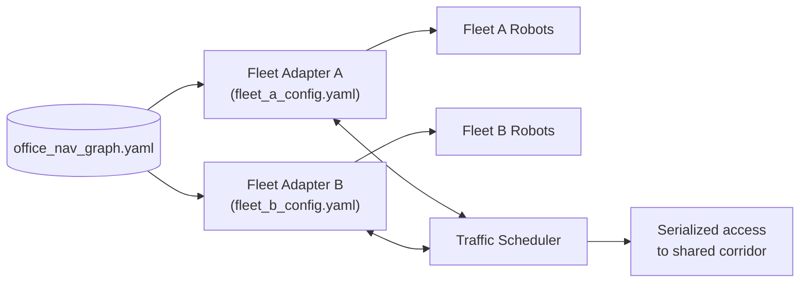

# Robot Fleet Management in ROS2 v2 — Unit 4: Simple RMF Setup - Part 3

This unit takes the two-robot, single-fleet setup from Unit 3 and splits it into two distinct fleets, sharing the same building. This is the configuration that most resembles a real deployment, where different robot models or vendors each get their own fleet.

The diagram below shows why the navigation graph must be identical shared infrastructure across both independent fleet adapters for the scheduler to serialize their access correctly.



## Fleet vs. robot: the distinction that matters now

A "fleet" in RMF is a set of robots that share one fleet adapter, one navigation profile (speed limits, footprint), and are managed as a homogeneous group. Two robots of the same physical model but running different software stacks are usually still two separate fleets in RMF's eyes, because each fleet adapter can only cleanly speak one robot API. Splitting into fleets is therefore mostly about "which adapter process manages this robot," not about robot brand alone.

## Running two independent fleet adapters

Each fleet gets its own adapter process and its own configuration file. Launch them side by side, each pointed at the same underlying navigation graph and map so RMF's traffic scheduler treats them as sharing the same physical space:

```bash
ros2 launch rmf_fleet_adapter fleet_adapter.launch.xml \
  config_file:=fleet_a_config.yaml nav_graph_file:=office_nav_graph.yaml

ros2 launch rmf_fleet_adapter fleet_adapter.launch.xml \
  config_file:=fleet_b_config.yaml nav_graph_file:=office_nav_graph.yaml
```

The critical point: **the navigation graph is shared infrastructure, not per-fleet**. Both fleet adapters must reference the identical graph file (same waypoint names and lane definitions) for the traffic scheduler to correctly reason about both fleets occupying the same corridors.

## Verifying cross-fleet traffic negotiation

```bash
ros2 topic echo /fleet_states
```

You should now see two distinct fleet names in the stream, each with its own robot list. Dispatch a task to each fleet that routes through a shared corridor and confirm — same as Unit 3 — that the scheduler serializes their access rather than letting them collide. The mechanism is identical to intra-fleet negotiation; RMF doesn't distinguish "same fleet" from "different fleet" when reserving time-space, it just resolves conflicting itineraries against the shared graph.

## Common misconfiguration: mismatched graphs

The most common failure when setting up two fleets is each fleet adapter loading a *slightly* different copy of the navigation graph (different waypoint IDs, or one stale copy after an edit). RMF will not error loudly on this — instead robots from one fleet may appear to ignore robots from the other fleet in negotiation, because the scheduler is reasoning about waypoints that don't actually correspond to the same physical location. Diff your graph files whenever you add a fleet:

```bash
diff fleet_a_nav_graph.yaml fleet_b_nav_graph.yaml
```

If this is not empty, you have two fleets that cannot properly negotiate traffic with each other.

## Try it yourself

Stand up two fleets, each with one robot, both referencing the same navigation graph. Deliberately point one fleet adapter at a slightly edited copy of the graph (rename one waypoint) and dispatch tasks that would cross paths. Observe how the traffic negotiation behaves differently (or fails silently) compared to Unit 3's shared-graph case, then fix the mismatch and confirm normal negotiation resumes.
