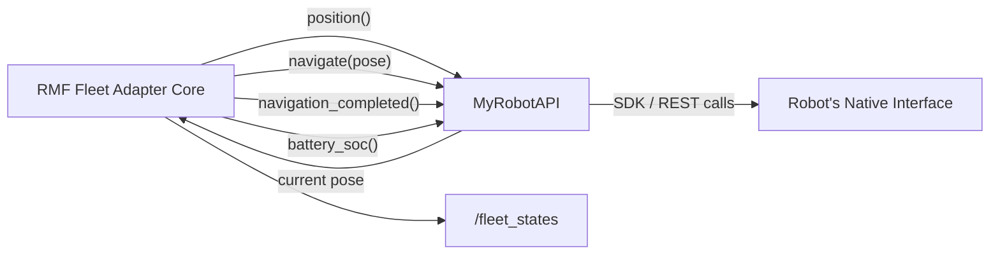

# Robot Fleet Management in ROS2 v2 — Unit 5: Custom Adapter step by step - Part 1

Every deployment beyond the bundled demos needs a fleet adapter tailored to your specific robot. This unit builds the skeleton of a custom fleet adapter and wires up the minimum callbacks RMF needs to consider a robot "integrated."

The diagram below shows the callback interface RMF's adapter core calls into your `RobotAPI` implementation, which is the only translation layer between RMF and your robot's native interface.



## What a fleet adapter actually is

Strip away the RMF-specific vocabulary and a fleet adapter is an ordinary ROS 2 node (or, for the Python API, a Python process using `rmf_fleet_adapter`'s bindings) that implements a small, well-defined interface:

- Report the robot's current state (position, battery, current task) when RMF asks for it.
- Accept a navigation command ("go to this waypoint") from RMF and translate it into whatever your robot's native interface expects.
- Report back when the command completes, fails, or is interrupted.

Everything else — traffic negotiation, task allocation — is handled by RMF core. Your adapter's only job is to be a faithful translator between RMF's abstractions and your robot's actual control surface.

## Choosing your integration point

The Python `EasyFullControl` adapter API is the fastest path for a new integration and is what this unit uses. It expects you to supply a handful of callback functions rather than manage ROS 2 plumbing yourself:

```python
from rmf_fleet_adapter.robot_adapter import RobotAPI, RobotUpdateData
from rmf_fleet_adapter.easy_full_control import EasyFullControl

class MyRobotAPI(RobotAPI):
    def __init__(self, config):
        self.config = config
        # set up whatever client your robot's SDK/REST API needs here

    def position(self, robot_name: str):
        # return [x, y, yaw] in the robot's native map frame
        ...

    def navigate(self, robot_name: str, pose, map_name: str):
        # send the navigation goal to your robot's native stack
        ...

    def navigation_completed(self, robot_name: str) -> bool:
        ...

    def battery_soc(self, robot_name: str) -> float:
        # state of charge, 0.0 to 1.0
        ...
```

## Wiring the adapter into a config file

The adapter reads a YAML config (fleet name, nav graph reference, robot list) at startup — the same shape you saw in Units 3 and 4 — and pairs it with your `RobotAPI` implementation:

```python
adapter = EasyFullControl(config_file="my_robot_config.yaml", robot_api=MyRobotAPI(config))
adapter.start()
```

## Running and sanity-checking the skeleton

Even with stub implementations (e.g., `position()` returning a hardcoded pose), launch the adapter and confirm RMF sees your robot:

```bash
ros2 topic echo /fleet_states
```

Your fleet's name and robot should appear, even if it never actually moves yet — that's expected at this stage, since `navigate()` is still a stub. Getting a robot to *appear* correctly in fleet state is the milestone for this unit; making it actually move is Unit 6.

## Try it yourself

Implement `position()` to return a fixed, hardcoded pose and leave `navigate()` as a no-op that immediately reports completion. Launch your adapter alongside RMF core and confirm via `ros2 topic echo /fleet_states` that your robot shows up with the correct fleet name and that hardcoded position — this proves the adapter-to-core wiring works before you add any real robot logic.
