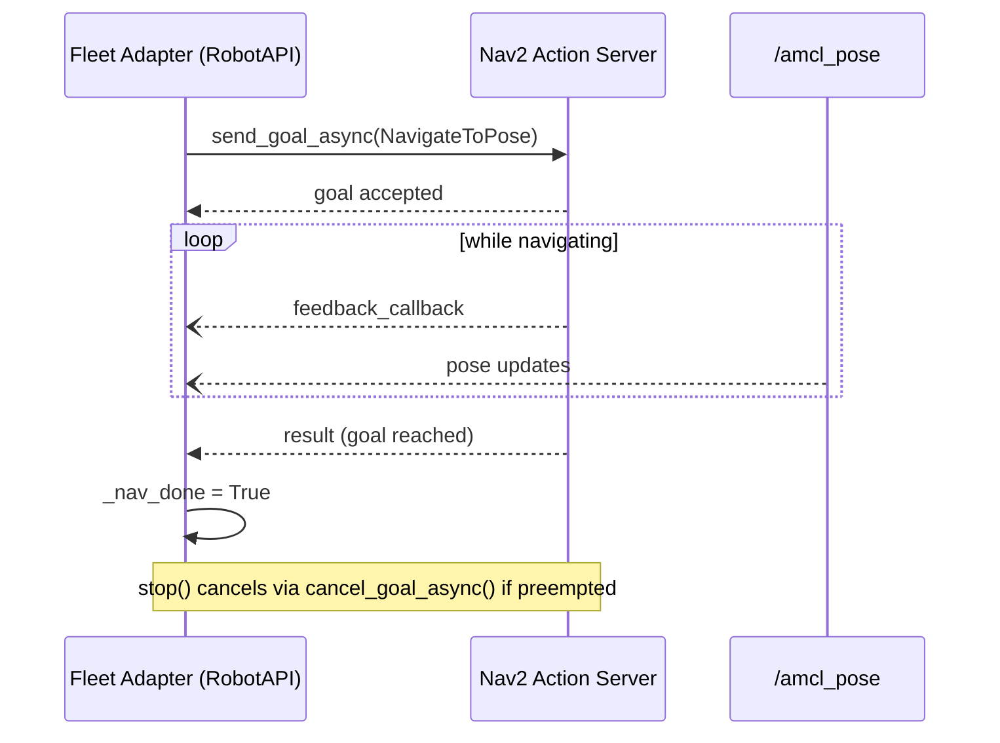

# Robot Fleet Management in ROS2 v2 — Unit 6: Custom Adapter step by step - Part 2

Unit 5 built a fleet adapter skeleton with stubbed-out movement. This unit fills in real navigation by connecting the adapter to the ROS 2 Navigation stack (Nav2), which is the most common target for robots that already run ROS 2 natively.

The sequence below shows the timing between the adapter, the Nav2 action server, and the AMCL pose feed that together implement `navigate()`, feedback, and cancellation.



## Why Nav2 integration is different from a generic robot API

If your robot already runs Nav2, you don't need to invent a custom motion protocol — you can have your `RobotAPI` implementation call Nav2's own action interface directly. This is the more "ROS 2-native" version of the pattern from Unit 5, where instead of wrapping a vendor SDK, you're wrapping `NavigateToPose`.

## Sending navigation goals via the Nav2 action interface

```python
import rclpy
from rclpy.action import ActionClient
from nav2_msgs.action import NavigateToPose

class MyRobotAPI(RobotAPI):
    def __init__(self, node: rclpy.node.Node):
        self.node = node
        self._nav_client = ActionClient(node, NavigateToPose, 'navigate_to_pose')
        self._goal_handle = None
        self._nav_done = True

    def navigate(self, robot_name: str, pose, map_name: str):
        goal = NavigateToPose.Goal()
        goal.pose.header.frame_id = 'map'
        goal.pose.pose.position.x = pose[0]
        goal.pose.pose.position.y = pose[1]
        # convert yaw (pose[2]) to quaternion for goal.pose.pose.orientation
        self._nav_done = False
        future = self._nav_client.send_goal_async(goal, feedback_callback=self._on_feedback)
        future.add_done_callback(self._on_goal_response)

    def navigation_completed(self, robot_name: str) -> bool:
        return self._nav_done

    def _on_goal_response(self, future):
        self._goal_handle = future.result()
        result_future = self._goal_handle.get_result_async()
        result_future.add_done_callback(lambda f: setattr(self, '_nav_done', True))
```

This is standard ROS 2 action-client code — nothing RMF-specific about it. The RMF-specific part is exposing `navigate()` and `navigation_completed()` as the interface RMF's fleet adapter expects.

## Handling cancellation and preemption

RMF may need to cancel an in-progress navigation goal — for example, if a higher-priority task interrupts it. Implement a `stop()` callback that cancels the outstanding Nav2 goal cleanly rather than leaving it dangling:

```python
    def stop(self, robot_name: str):
        if self._goal_handle is not None:
            self._goal_handle.cancel_goal_async()
```

Skipping this is a common source of "ghost" robots that RMF believes are idle but are actually still executing a stale Nav2 goal.

## Feeding real localization back to RMF

Your `position()` callback (from Unit 5) should now read from Nav2's AMCL pose topic or the `/tf` tree instead of returning a stub, so RMF's traffic scheduler is reasoning about the robot's true location:

```bash
ros2 topic echo /amcl_pose
```

Subscribe to this in your adapter node and cache the latest pose for `position()` to return.

## Try it yourself

Extend your Unit 5 skeleton so `navigate()` sends a real `NavigateToPose` goal to a Nav2 stack running in simulation, and `position()` reads from `/amcl_pose` instead of returning a hardcoded value. Dispatch a loop task via `rmf_demos_tasks` and confirm the robot actually drives between waypoints under Nav2's control while RMF's fleet state reflects its live position.
