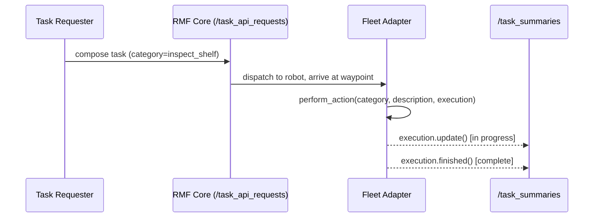

# Robot Fleet Management in ROS2 v2 — Unit 8: Custom Task

RMF ships with a handful of built-in task types (covered in Unit 10), but real deployments usually need something bespoke — "when the robot arrives at the loading dock, trigger this behavior." This unit covers one practical approach: location-triggered custom actions.

The sequence below shows how a composed task request flows from requester to adapter callback and back out through `/task_summaries`.



## The pattern: performable actions at waypoints

Rather than inventing a brand-new task type from scratch (a heavier lift involving RMF's task planning API), the simplest path to custom behavior is to define a **performable action** attached to a waypoint. When a robot's itinerary includes visiting that waypoint, RMF calls back into your fleet adapter once it arrives, and your adapter runs arbitrary code before reporting the action complete. Routing to the waypoint, negotiating traffic along the way, and marking the robot busy are all handled by the same core machinery from Units 5-6; only "what happens once we get there" is yours to write.

## Performable action vs. a brand-new task type

RMF gives you two levers for custom behavior, and it matters which one you reach for. Writing a wholly new task type means implementing your own Task/Phase/Activity classes against RMF's C++ task-planning API — real work, but it buys you a planner that understands your task's duration and resource cost the way it understands the four defaults from Unit 10. A performable action, by contrast, reuses an *existing* phase (arrive at waypoint, then perform an action) and only asks you to supply a rough duration estimate up front, via `unix_millis_action_duration_estimate`. That's almost always the better trade for one-off or site-specific behaviors: less code, faster to iterate, at the cost of a duration estimate you maintain by hand rather than one the planner learns.

## Declaring the action in your adapter

```python
class MyRobotAPI(RobotAPI):
    def perform_action(self, robot_name: str, category: str, description: dict,
                        execution):
        if category == "inspect_shelf":
            self._start_shelf_inspection(robot_name, description)
            # execution.update(...) as work progresses
            # execution.finished() when done, or execution.error(...) on failure
        else:
            execution.error(f"Unsupported action: {category}")

    def _start_shelf_inspection(self, robot_name, description):
        # e.g., trigger a camera capture routine on the robot
        ...
```

The `category` string is how you distinguish between different custom actions on the same robot, and `description` carries whatever parameters the task requester attached (e.g., which shelf to inspect).

One easy mistake: `perform_action` runs on the fleet adapter's ROS 2 executor thread, same as `battery_soc()` and your other callbacks. If `_start_shelf_inspection` blocks — a slow HTTP call, a synchronous sleep — you stall every other callback the adapter needs to service, including state updates for other robots. Kick long-running work onto its own thread and return from `perform_action` immediately:

```python
import threading

def _start_shelf_inspection(self, robot_name, description, execution):
    def worker():
        # slow camera/inspection routine happens off the executor thread
        ok = self._run_inspection_routine(robot_name, description["shelf_id"])
        if ok:
            execution.finished()
        else:
            execution.error("inspection routine failed")
    threading.Thread(target=worker, daemon=True).start()
```

## Wiring the action into a task request

A task requester (human operator, dispatcher script, or another system) references your custom action by category when composing a task:

```python
from rmf_task_msgs.msg import ApiRequest
import json

request = {
    "type": "robot_task_request",
    "robot": "tinyRobot1",
    "fleet": "tinyRobot",
    "request": {
        "category": "compose",
        "description": {
            "category": "inspect_shelf",
            "phases": [{
                "activity": {
                    "category": "perform_action",
                    "description": {
                        "unix_millis_action_duration_estimate": 60000,
                        "category": "inspect_shelf",
                        "description": {"shelf_id": "A12"}
                    }
                }
            }]
        }
    }
}
```

`unix_millis_action_duration_estimate` is what the task planner uses to reason about the robot's schedule — how long it will be occupied, and whether that leaves enough runway before the robot needs to recharge (Unit 11). Under-estimating it doesn't fail the action outright, but it makes the planner overly optimistic about when the robot will be free next; a generous estimate is safer than an exact one you can't guarantee.

RMF's task API is JSON over a ROS 2 topic (`/task_api_requests`), which is convenient — you can compose and send tasks from any language or even `ros2 topic pub` for quick testing, without linking against RMF's C++/Python libraries.

## Reporting progress and completion

Long-running custom actions should call `execution.update()` periodically so the task's progress is visible in `/task_summaries`, and must eventually call either `execution.finished()` or `execution.error()` — RMF will otherwise consider the robot permanently busy with that action and never assign it further work. This is the same failure mode as a stuck default task, just self-inflicted: an exception raised before either call is reached drops the robot out of the available pool with nothing in `/task_summaries` to explain why. Wrapping the worker body in a `try`/`except` that calls `execution.error(str(e))` on any exception is cheap insurance against that.

## Combining custom actions with default task phases

As Unit 10 covers, `perform_action` phases can sit alongside default phases (go-to, dock, etc.) inside the same composed task. You rarely need to choose one or the other for an entire job — "navigate to the charging bay, run a custom `pre_charge_check` action, then dock" is a single composed request mixing a default phase with a custom one, reporting into the same `/task_summaries` entry.

## Try it yourself

Define a custom action category `wait_and_beep` that, when triggered, pauses for five seconds (simulating some robot-side behavior) and then calls `execution.finished()`. Compose a task that sends a robot to a waypoint and then performs `wait_and_beep`, dispatch it, and confirm in `/task_summaries` that the task transitions through in-progress and completed states around your action.
