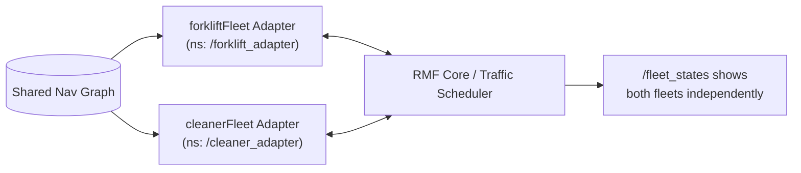

# Robot Fleet Management in ROS2 v2 — Unit 9: Multifleet with custom adapters

Unit 4 ran two fleets using the bundled demo adapters. This unit combines that with the custom adapter work from Units 5-6, running two *different, custom-built* fleet adapters — potentially for two entirely different robot platforms — side by side against the same RMF core.

The diagram below shows how each custom adapter gets its own namespace while still referencing the same shared navigation graph and negotiating through one traffic scheduler.



## Why this is harder than either piece alone

Each custom adapter you write in isolation only has to be internally consistent. Running two of them together against shared infrastructure surfaces integration bugs that don't show up in single-fleet testing:

- Namespace collisions if both adapters default to the same ROS 2 node name or topic prefix.
- Divergent navigation graph copies (the Unit 4 pitfall), now compounded by each adapter potentially loading the graph differently.
- Different action/service timeout assumptions — one robot's SDK might have a 30-second command timeout where another's has 5 seconds, and if your adapters don't account for that, RMF's negotiation retries can behave asymmetrically.

## Namespacing each adapter cleanly

Give each fleet adapter node and its config an explicit, distinct namespace and fleet name so nothing defaults into collision:

```bash
ros2 launch rmf_fleet_adapter fleet_adapter.launch.xml \
  config_file:=fleet_forklift_config.yaml \
  fleet_name:=forkliftFleet \
  __ns:=/forklift_adapter

ros2 launch rmf_fleet_adapter fleet_adapter.launch.xml \
  config_file:=fleet_cleaner_config.yaml \
  fleet_name:=cleanerFleet \
  __ns:=/cleaner_adapter
```

## Confirming both fleets negotiate correctly together

```bash
ros2 node list
ros2 topic echo /fleet_states
```

You should see both `forkliftFleet` and `cleanerFleet` represented independently in `/fleet_states`, each with correct per-robot data sourced from its own adapter's callbacks (from Units 5-6). Dispatch tasks that route a forklift robot and a cleaner robot through the same corridor and confirm negotiation resolves across the fleet boundary exactly as it did for the built-in demo fleets in Unit 4.

## Debugging cross-adapter issues

When something misbehaves in a multifleet setup, isolate before you integrate: bring up each custom adapter alone against RMF core first (as in Units 5-6) and confirm it behaves correctly solo. Only once both pass in isolation should you run them together — this turns "multifleet is broken" into either "adapter A has a bug" or "the two adapters interact badly," which is a much smaller debugging surface.

```bash
ros2 topic echo /fleet_states --once  # quick single-snapshot sanity check per fleet
```

## Try it yourself

Take two of your own custom adapters (or one custom adapter plus one of the bundled demo fleets from Unit 4) and run them concurrently against the same navigation graph, each in its own namespace. Dispatch overlapping loop tasks to both and confirm via `/fleet_states` and adapter logs that the traffic scheduler treats robots from both fleets as first-class participants in negotiation, not just robots within the same fleet.
