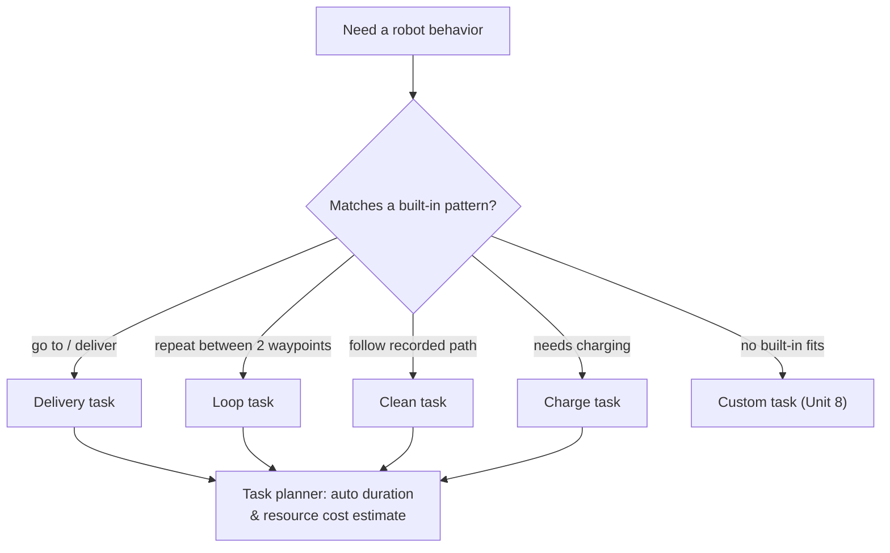

# Robot Fleet Management in ROS2 v2 — Unit 10: Default Tasks

Before reaching for custom tasks (Unit 8), it's worth knowing what RMF gives you out of the box. This unit surveys the built-in task types and when each is the right tool.

The flowchart below captures the decision: pick a built-in task type when its semantics already match your need, and fall back to a custom task only when none of the four do.



## The built-in task categories

RMF ships four common task patterns as first-class, pre-built task types, each expressible through the same JSON task-request format you saw in Unit 8:

- **Go-to / delivery** — move from a pickup waypoint to a dropoff waypoint, optionally with a payload handoff step at each end.
- **Loop** — repeatedly travel between two waypoints a fixed number of times (what you used for testing in Units 2-4).
- **Clean** — follow a pre-recorded cleaning path (typically authored via the traffic editor tool from Unit 15) across a zone.
- **Charge** — dock at a charging waypoint and remain there until charged or until reassigned.

Because they're common patterns, RMF's task planner and dispatcher already know how to estimate their duration and resource cost, which matters for task allocation (deciding *which* robot should do the job) — a benefit you don't get for free with fully custom tasks.

## Dispatching each type

The `rmf_demos_tasks` package wraps these as CLI tools, convenient for testing before you build your own task-issuing system:

```bash
# Delivery
ros2 run rmf_demos_tasks dispatch_delivery -p pantry -d lounge -pp coke -pd tray

# Loop
ros2 run rmf_demos_tasks dispatch_loop -s pantry -f lounge -n 3

# Clean
ros2 run rmf_demos_tasks dispatch_clean -c zone_a

# Patrol (repeated waypoint circuit, similar to loop but for arbitrary waypoint lists)
ros2 run rmf_demos_tasks dispatch_patrol -p "pantry,lounge,office" -n 2
```

## Composing default tasks in raw JSON

Under the hood, each CLI tool is building the same `compose` task JSON structure you saw for custom actions in Unit 8, just with different `category` and `phases` values. Understanding this equivalence matters because it means you can mix default task phases and custom action phases in a single task request — for example, "go to waypoint, perform a default docking activity, then run your custom `inspect_shelf` action."

## When to reach for a default task vs. a custom one

Use a default task whenever the built-in semantics already match what you need — they're better-tested, get duration estimates for free, and require no adapter-side code. Reach for a custom task (Unit 8) only when the robot needs to do something the four built-ins don't express, like a domain-specific inspection routine or triggering an external system mid-task.

## Try it yourself

Dispatch a delivery task and a clean task back to back to the same robot, then inspect `/task_summaries` to compare their reported state fields (progress, estimated duration, phase names). Note which fields are populated automatically for these default types that you had to manage manually for the custom `wait_and_beep` action in Unit 8.
