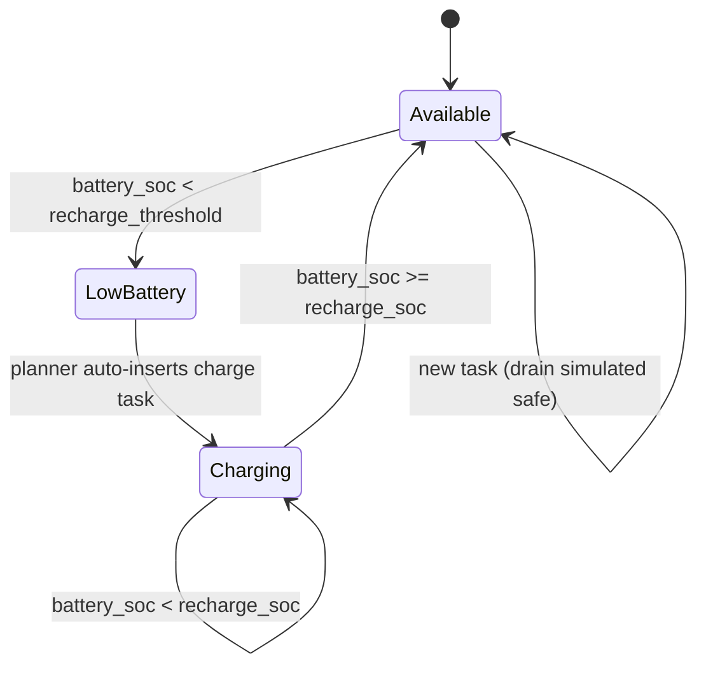

# Robot Fleet Management in ROS2 v2 — Unit 11: Battery Management

A fleet that never charges is a fleet that eventually stops. This unit covers how RMF tracks battery state and automatically inserts charging behavior into a robot's schedule.

The state diagram below shows how a robot moves between availability and charging based on the `recharge_threshold` and `recharge_soc` config values.



## How RMF learns about battery state

Your fleet adapter's `battery_soc()` callback (introduced in Unit 5) is the only source of truth RMF has about a robot's charge level — there's no separate battery-monitoring subsystem. Every fleet state update includes this value, and RMF's task planner factors it into two decisions: whether a robot is eligible to be assigned a new task, and whether a robot needs to be sent to recharge before its current commitments would drain it too far.

```python
def battery_soc(self, robot_name: str) -> float:
    return self._latest_battery_msg.percentage  # normalized 0.0-1.0
```

## Configuring battery thresholds

Fleet config typically exposes threshold parameters that drive this behavior:

```yaml
rmf_fleet:
  name: "tinyRobot"
  recharge_threshold: 0.2
  recharge_soc: 1.0
  account_for_battery_drain: true
```

- `recharge_threshold` — the state of charge below which the robot should stop accepting new tasks and head to a charger.
- `recharge_soc` — the charge level considered "fully charged," at which point the robot becomes available for new tasks again.
- `account_for_battery_drain` — whether the task planner should simulate expected battery drain when deciding if a robot can complete a prospective task without dropping below threshold, before even assigning it.

## The automatic charging task

When a robot's battery crosses `recharge_threshold`, RMF's task planner inserts an automatic charging task ahead of (or instead of) further task assignment — you don't need to author this yourself once thresholds are configured. This is one of the four default task types from Unit 10, just triggered by the planner rather than an external task request.

## Modeling drain rate accurately

`account_for_battery_drain` is only useful if your drain estimate is realistic. If your `battery_soc()` implementation just relays a raw hardware reading, RMF can react to real drain, but it cannot *predict* future drain for planning purposes unless your fleet config also specifies parameters like nominal power draw and battery capacity so the planner can simulate ahead:

```yaml
rmf_fleet:
  battery_system:
    voltage: 24.0
    capacity: 40.0        # amp-hours
    charging_current: 26.4
  mechanical_system:
    mass: 80.0             # kg
    friction_coefficient: 0.22
    ambient_power_draw: 20.0  # watts
```

These feed a physics-based drain model RMF uses when simulating whether an assignment is safe, distinct from the live `battery_soc()` readings used once a task is underway.

## Try it yourself

Set `recharge_threshold` artificially high (e.g., 0.8) on a test robot so it triggers quickly, then dispatch a loop task and watch `/task_summaries` and `/fleet_states` as the robot abandons the loop mid-way to recharge once its simulated or reported battery crosses that threshold. Reset the threshold to a realistic value afterward and confirm normal task completion resumes.
