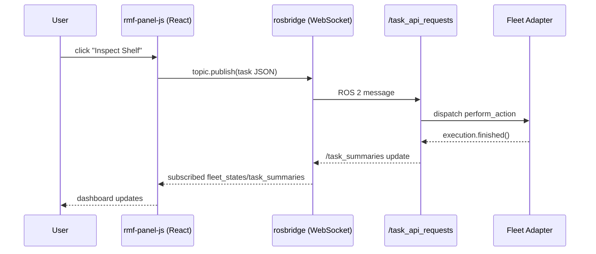

# Robot Fleet Management in ROS2 v2 — Unit 14: Custom rmf-panel-js

Unit 12 introduced `rmf-panel-js` as the default human touchpoint for RMF: an operator dispatches and monitors tasks by clicking through it instead of composing raw JSON on the command line. That stock panel, however, only ships forms for the task types RMF already knows about (Unit 10) — it has no idea your `inspect_shelf` custom action from Unit 8 exists until you teach it. This unit covers customizing the panel: adding your own task forms and dashboard views so operators get the same point-and-click experience for the tasks you built yourself, rather than falling back to `ros2 topic pub` every time someone needs to trigger one.

The sequence below shows the full loop this unit closes: a browser click travels over rosbridge to the ROS 2 task API and back to update the dashboard.



## What rmf-panel-js actually is

`rmf-panel-js` is a React web application that talks to RMF over `rosbridge` (a WebSocket-to-ROS-2 bridge), so a browser client can subscribe to topics like `/fleet_states` and publish to `/task_api_requests` without any native ROS 2 dependency in the browser itself. Understanding this bridge matters because it means customizing the panel is "ordinary React development plus a rosbridge client," not something requiring deep RMF internals knowledge.

Concretely, `rosbridge` (from the `rosbridge_suite` package) exposes a small JSON protocol over that WebSocket — a client sends envelopes shaped like `{"op": "subscribe", "topic": "/fleet_states"}` or `{"op": "publish", "topic": "/task_api_requests", "msg": {...}}`. The `roslibjs` library (imported as `ROSLIB` below) wraps that protocol so panel code works with ordinary JavaScript objects and callbacks instead of hand-building envelopes. Every custom form or widget you add is, underneath, just another `ROSLIB.Topic` layered onto the same connection the stock panel already opens.

## Getting rosbridge running

```bash
ros2 launch rosbridge_server rosbridge_websocket_launch.xml
```

This exposes a WebSocket endpoint (default `ws://localhost:9090`) that the panel's frontend connects to for both subscribing to state topics and publishing task requests. Run it in its own terminal alongside the RMF core and fleet adapter launches from earlier units — the panel's browser tab is just another client of the same topics your CLI tools (`ros2 topic echo`, `dispatch_loop`, and so on) have been using throughout the course. Whatever host and port you launch rosbridge on has to match the WebSocket URL your local panel build is configured to connect to, or the dashboard will simply sit disconnected with no fleet data.

## Adding a custom task form

The stock panel ships forms for the default task types from Unit 10. To add a form for your custom task from Unit 8 (e.g., `inspect_shelf`), you add a new form component that builds the same JSON task-request structure and publishes it over the rosbridge connection:

```javascript
import ROSLIB from 'roslib';

function requestInspectShelf(ros, robotName, fleetName, shelfId) {
  const topic = new ROSLIB.Topic({
    ros,
    name: '/task_api_requests',
    messageType: 'std_msgs/String',
  });

  const request = {
    type: 'robot_task_request',
    robot: robotName,
    fleet: fleetName,
    request: {
      category: 'compose',
      description: {
        category: 'inspect_shelf',
        phases: [{
          activity: {
            category: 'perform_action',
            description: {
              category: 'inspect_shelf',
              description: { shelf_id: shelfId },
            },
          },
        }],
      },
    },
  };

  topic.publish(new ROSLIB.Message({ data: JSON.stringify(request) }));
}
```

This is the same JSON shape from Unit 8, just constructed in JavaScript and sent over rosbridge instead of a native ROS 2 client. In practice you'd wrap this in a form component that collects `robotName`, `fleetName`, and `shelfId` from operator input (a dropdown of known robots, a text field for the shelf ID) and calls `requestInspectShelf` from the submit handler, rather than hardcoding those values.

## Subscribing to live fleet state in the UI

```javascript
const fleetStateTopic = new ROSLIB.Topic({
  ros,
  name: '/fleet_states',
  messageType: 'rmf_fleet_msgs/FleetState',
});

fleetStateTopic.subscribe((message) => {
  updateDashboard(message.robots);
});
```

Bind this to whatever visualization component you want — a table of robots and battery levels, or markers on a floor-plan overlay — using ordinary React state management. A minimal table binding, for instance, just maps each entry in `message.robots` to a row:

```javascript
function DashboardTable({ robots }) {
  return (
    <table>
      <thead>
        <tr><th>Robot</th><th>Battery</th><th>Task</th></tr>
      </thead>
      <tbody>
        {robots.map((r) => (
          <tr key={r.name}>
            <td>{r.name}</td>
            <td>{r.battery_percent}%</td>
            <td>{r.task_id || 'idle'}</td>
          </tr>
        ))}
      </tbody>
    </table>
  );
}
```

Each `fleet_states` message is published periodically by the fleet adapter, so `updateDashboard` fires repeatedly rather than once — keep whatever component consumes it cheap to re-render, or debounce updates, if you're driving something heavier like a live floor-plan overlay instead of a simple table.

## Try it yourself

Add a new button to a local build of `rmf-panel-js` that calls a function like `requestInspectShelf` above with a hardcoded shelf ID, and confirm clicking it produces a task visible in `/task_summaries` when your backend from Unit 8 is running. Then extend the dashboard subscription above into a small table showing robot name, battery percentage, and current task ID, and watch it update live as your fleet adapter processes the dispatched task. This closes the loop: browser click, rosbridge, RMF task API, fleet adapter action, and the result reflected back in the UI without ever touching a terminal.
