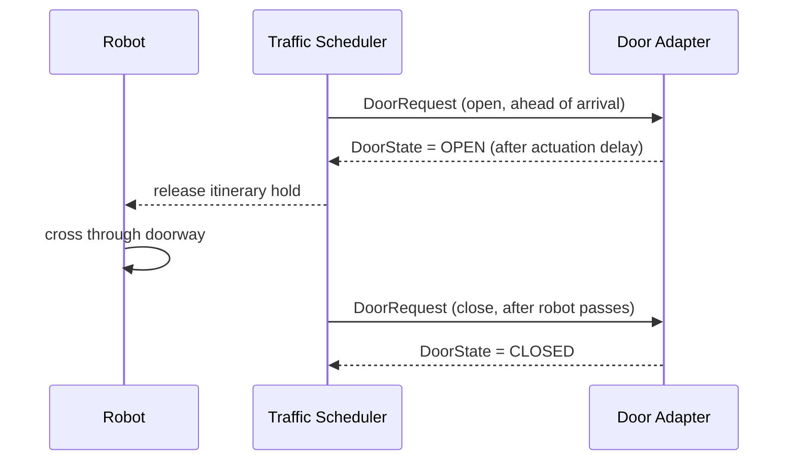

# Robot Fleet Management in ROS2 v2 — Unit 16: Doors

Unit 13 covered the door interface abstractly. This unit goes hands-on: placing an RMF-enabled door in the traffic editor from Unit 15 and connecting it to a working (simulated) door adapter.

The sequence below shows how the traffic scheduler requests and waits on a door around the robot's arrival, without the fleet adapter needing any door-specific logic.



## Placing a door in the traffic editor

Within `rmf_traffic_editor`, a door is drawn as a special edge between two vertices on a wall segment, tagged with a door type (single sliding, double sliding, single swing, double swing) and a name. This name is what your navigation graph and fleet adapters will reference — a robot's route that needs to cross this wall will include a lane that passes through it, and RMF automatically knows to request the door before the robot's itinerary reaches that lane.

## How RMF sequences door requests with robot motion

You don't manually code "open door before entering" logic into each fleet adapter — RMF's traffic scheduler already knows, from the building model, that a given lane passes through a named door, and it publishes a `DoorRequest` on the robot's behalf ahead of the robot's arrival, then holds the robot's itinerary at the door until `DoorState` reports it open. Your fleet adapter doesn't need special door-awareness at all for this default behavior; it's handled at the core level as long as the door is correctly modeled in the building file.

## Building a simulated door adapter

For a door that only exists in simulation (no real hardware to bridge to), the adapter just needs to accept `DoorRequest` and simulate a delay before reporting `DoorState` as open or closed:

```python
import rclpy
from rclpy.node import Node
from rmf_door_msgs.msg import DoorRequest, DoorState

class SimDoorAdapter(Node):
    def __init__(self):
        super().__init__('sim_door_adapter')
        self.state_pub = self.create_publisher(DoorState, 'door_states', 10)
        self.create_subscription(DoorRequest, 'adapter_door_requests', self.on_request, 10)
        self.door_name = 'main_entrance'
        self.mode = DoorState.MODE_CLOSED

    def on_request(self, msg: DoorRequest):
        if msg.door_name != self.door_name:
            return
        self.mode = DoorState.MODE_OPEN if msg.requested_mode.value == 2 else DoorState.MODE_CLOSED
        self.create_timer(1.0, self._publish_state)  # simulate actuation delay

    def _publish_state(self):
        state = DoorState()
        state.door_name = self.door_name
        state.current_mode.value = self.mode
        self.state_pub.publish(state)
```

## Verifying door behavior end to end

```bash
ros2 topic echo /door_states
ros2 topic pub /adapter_door_requests rmf_door_msgs/msg/DoorRequest \
  "{door_name: 'main_entrance', requested_mode: {value: 2}}"
```

Dispatch a task whose route crosses the door (from Unit 15's map) and watch `/door_states` transition to open just before the robot's reported position reaches the doorway in `/fleet_states`, then close again after it passes through — that sequencing is the traffic scheduler's door-holding logic working correctly.

## Try it yourself

Add a second door to your Unit 15 floor plan gating access to a small side room, wire up a second instance of the simulated door adapter for it, and dispatch a delivery task whose route requires passing through both doors in sequence. Confirm via `/door_states` that each door only opens as the robot's itinerary actually reaches it, not both simultaneously at task start.
