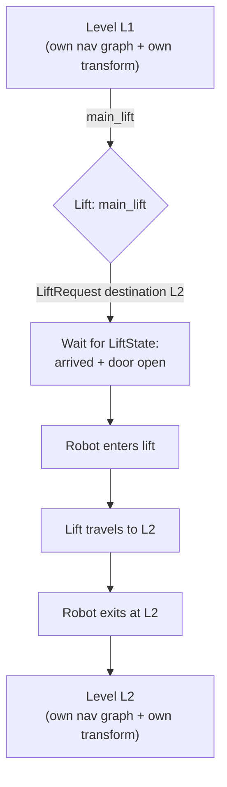

# Robot Fleet Management in ROS2 v2 — Unit 17: Multilevel Environments

This closing unit extends the single-floor building model from Units 15-16 to multiple floors connected by a lift, tying together nearly every mechanism covered in the course: navigation graphs, transforms, lifts as building systems, and task dispatch across levels.

The flowchart below traces a robot's journey across levels via the lift, and highlights that each level keeps its own navigation graph and its own Unit 7 coordinate transform.



## Modeling multiple levels in the traffic editor

`rmf_traffic_editor` supports multiple named levels within a single building file, each with its own floor plan image, walls, and navigation graph — conceptually, each level is a separate map (like the "L1" you saw referenced in fleet configs back in Unit 3), unified under one building model:

1. Add a new level (e.g., `L2`) in the traffic editor, importing its own floor plan reference image.
2. Trace walls and place navigation waypoints for L2, same as you did for L1 in Unit 15.
3. Each level's graph is independent — waypoint names only need to be unique within their level, not across the whole building.

## Placing a lift connecting levels

A lift is placed similarly to a door (Unit 16) but spans between named waypoints on two or more different levels, tagged with which levels it services and its door position on each:

```yaml
lifts:
  main_lift:
    levels: ["L1", "L2"]
    doors:
      L1: {door_name: "lift_door_l1"}
      L2: {door_name: "lift_door_l2"}
    reference_floor: "L1"
```

RMF treats a robot's itinerary crossing between levels via this lift the same way it treats a door crossing: it requests the lift to the correct floor, waits for `LiftState` to confirm arrival and door-open, then allows the robot to enter, request the destination floor, and exit — using the `rmf_lift_msgs` interface you inspected in Unit 13.

## Building a simulated lift adapter

The pattern mirrors Unit 16's simulated door adapter closely, just with floor state added:

```python
from rmf_lift_msgs.msg import LiftRequest, LiftState

class SimLiftAdapter(Node):
    def __init__(self):
        super().__init__('sim_lift_adapter')
        self.state_pub = self.create_publisher(LiftState, 'lift_states', 10)
        self.create_subscription(LiftRequest, 'adapter_lift_requests', self.on_request, 10)
        self.current_floor = 'L1'

    def on_request(self, msg: LiftRequest):
        self.current_floor = msg.destination_floor
        # simulate travel time before publishing updated LiftState
```

## Fleet adapter awareness across levels

Recall from Unit 7 that your custom adapter's transform between robot-native coordinates and RMF coordinates was scoped per level (`map_name: "L1"`). A multilevel deployment needs a separate transform for each level your robot operates on — a robot's own SLAM map is almost always per-floor too, so this is usually a natural extension: repeat the Unit 7 calibration procedure once per level and key your `reference_coordinates` config by level name.

## Try it yourself

Extend your Unit 15/16 building model with a second level and a lift connecting the two, complete with a simulated lift adapter. Dispatch a delivery task whose pickup waypoint is on L1 and dropoff waypoint is on L2, and confirm — via `/fleet_states`, `/lift_states`, and `/task_summaries` — that the robot correctly requests the lift, waits for it, changes floors, and completes the delivery on the new level.
