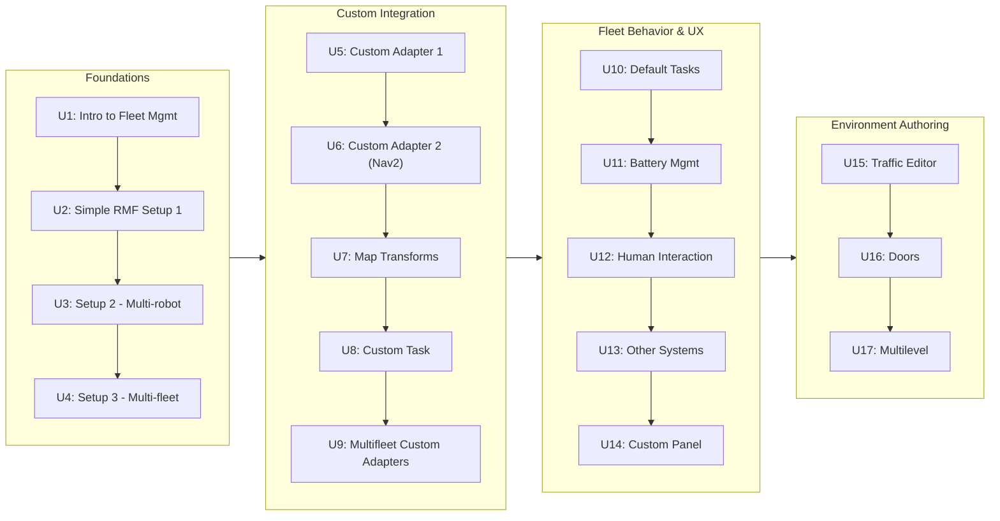

# Robot Fleet Management in ROS2 v2

Managing a single robot is a navigation and control problem; managing a fleet of heterogeneous robots sharing a building's doors, lifts, and corridors is a coordination problem, and this course is about that second problem using Open-RMF, ROS 2's fleet management framework. Starting from a minimal simulated deployment, the units progressively build toward multi-robot and multi-fleet traffic negotiation, custom fleet adapters that bridge RMF to your own robot's control stack (including a Nav2-based integration), custom and default task types, battery-aware scheduling, human and non-robot system interaction, a customizable web operator panel, and finally authoring your own multi-level building maps complete with doors and lifts.

The diagram below shows how the seventeen units build on each other in four progressive phases, from a minimal single-robot stack through custom integration, fleet behavior/UX, and finally authoring your own environments.

1. [Introduction to fleet management](01-introduction-to-fleet-management.md) — Understand what fleet management entails and why it is required.
2. [Simple RMF Setup - Part 1](02-simple-rmf-setup-part-1.md) — Learn how to set up a basic RMF-enabled system.
3. [Simple RMF Setup - Part 2](03-simple-rmf-setup-part-2.md) — Learn how to set up a basic RMF setup with two robots in the same fleet.
4. [Simple RMF Setup - Part 3](04-simple-rmf-setup-part-3.md) — Learn how to setup a basic RMF system with two different fleets.
5. [Custom Adapter step by step - Part 1](05-custom-adapter-step-by-step-part-1.md) — Learn how to create an RMF adapter for your own robot.
6. [Custom Adapter step by step - Part 2](06-custom-adapter-step-by-step-part-2.md) — Learn how to create an RMF adapter for your own robot that uses ROS2 navigation stack.
7. [RMF Map Transforms](07-rmf-map-transforms.md) — Learn how to adjust your RMF setup for translations between the RMF coordinates and the robot's location coordinates.
8. [Custom Task](08-custom-task.md) — Learn one method to create custom tasks for your robots triggered when arriving to certain locations.
9. [Multifleet with custom adapters](09-multifleet-with-custom-adapters.md) — Learn how to set up your custom adapters to have different robot fleets in the same systems.
10. [Default Tasks](10-default-tasks.md) — Learn about the default tasks defined in RMF.
11. [Battery Management](11-battery-management.md) — Learn how RMF manages the battery levels of your robot fleet.
12. [Human Interaction with RMF](12-human-interaction-with-rmf.md) — Learn how to integrate human-operated systems in RMF.
13. [Interaction With Other Systems](13-interaction-with-other-systems.md) — Learn how to integrate non-robot fleet systems in RMF, like robot arms.
14. [Custom rmf-panel-js](14-custom-rmf-panel-js.md) — Learn how to create your own web interface for asking tasks to RMF.
15. [RMF Traffic Editor](15-rmf-traffic-editor.md) — Learn about the RMF tool for map creation, create gazebo simulations based on that and add RMF-ready robots to the simulation.
16. [Doors](16-doors.md) — Learn how to add RMF-enabled doors with the traffic editor tool.
17. [Multilevel Environments](17-multilevel-environments.md) — Learn how to create maps with multiple floors compatible with RMF with the traffic editor tool.
