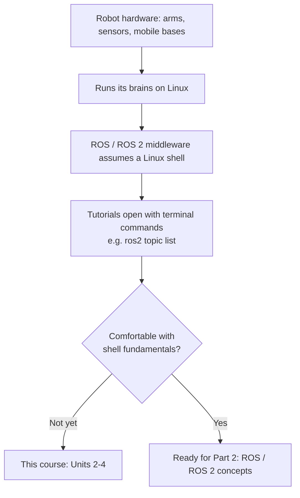

# Robotics Introduction For High Schoolers Part 1 — Unit 1: Introduction

This unit is a preview: it explains why a robotics course starts with Linux instead of robots, and lays out the map for the three units that follow.

The flowchart below traces the reasoning from "robots run on Linux" through to why this course starts with the shell instead of ROS:



## Why robots and Linux go together
Almost every serious robot you'll encounter — from a university research arm to a warehouse mobile robot — runs its brains on Linux. The dominant robotics middleware, ROS (Robot Operating System) and its successor ROS 2, is developed and tested primarily on Linux, and most of its tooling, drivers, and community tutorials assume a Linux shell. That doesn't mean robots can't touch Windows or macOS at all, but the moment you SSH into an onboard computer, flash firmware, or debug why a sensor driver won't start, you are almost always typing into a Linux terminal. Learning the shell first means every later robotics unit can focus on robotics concepts instead of fighting the operating system.

## What "Linux" actually means here
Linux itself is just a kernel; what you interact with day to day is a distribution (Ubuntu, Debian, and similar) plus a shell — a program that reads the commands you type and asks the operating system to carry them out. You don't need to memorize kernel internals. You need to become fast and confident typing commands, reading their output, and combining them, the same way you're already fast and confident writing code in an editor.

## Getting a Linux shell to practice on
You have several reasonable options, and the course doesn't require any specific one:

```bash
# Option A: a full Ubuntu install or virtual machine
# Option B: WSL (Windows Subsystem for Linux) if you're on Windows
wsl --install

# Option C: a cloud terminal / container you can reach over SSH
# Option D: a Raspberry Pi running Raspberry Pi OS (Debian-based)
```

Any of these gets you a real `bash` prompt, which is all this course needs. If you can run `echo "hello"` and see `hello` printed back, you're ready for Unit 2.

## How this course fits into the bigger picture
"Robotics Introduction For High Schoolers" comes in multiple parts, and this first part is deliberately not about robots at all — it's about the operating system every later part assumes you already trust. Part 2 and beyond will introduce ROS/ROS 2 concepts like nodes, topics, and simulators, and every one of those tutorials will open with a terminal command. If a command like `source /opt/ros/<distro>/setup.bash` or `ros2 topic list` looks like gibberish later on, it almost always traces back to a shell fundamental that this course covers first — which is exactly why it comes before anything with wheels or motors.

## Roadmap for this course
- **Unit 2 — Linux Essentials:** moving around the filesystem, creating and inspecting files, and making your first edits from the shell.
- **Unit 3 — Advanced Utilities I:** who is allowed to do what to a file (permissions), and how to turn a list of commands into a reusable bash script.
- **Unit 4 — Advanced Utilities II:** seeing and controlling running programs (processes), and reaching another computer's shell over the network with SSH — the exact skill you'll use to talk to a real robot's onboard computer.

## Try it yourself
Get a `bash` prompt running by whatever method suits your setup, then run `whoami`, `pwd`, and `date` and note what each one prints. Keep that terminal open — Unit 2 starts using it immediately.
