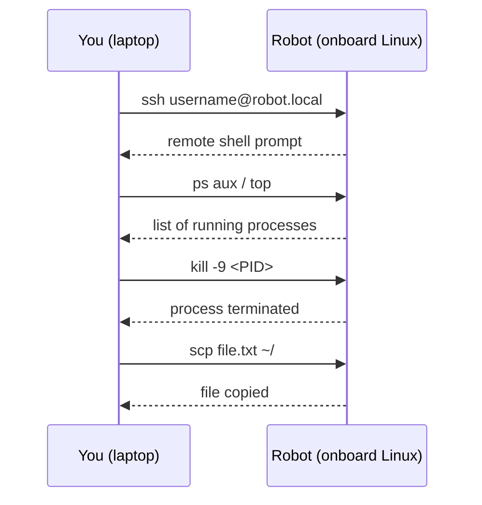

# Robotics Introduction For High Schoolers Part 1 — Unit 4: Advanced Utilities II

The final unit of this course covers two skills you'll use on almost every real robot: seeing and controlling the programs running on a machine, and reaching a robot's computer remotely over SSH instead of plugging in a keyboard and monitor.

The sequence diagram below shows how these two skills combine in practice — you open an SSH session to the robot, then inspect and manage its processes over that same connection:



## Managing processes
A robot's software stack is usually dozens of processes running at once — one per sensor driver, one per control loop, one per logging tool. Linux gives you simple ways to see and manage all of them.

```bash
ps aux                 # snapshot of every process running right now
ps aux | grep python    # narrow it down to processes matching "python"
top                      # live, updating view of CPU/memory usage per process (q to quit)

sleep 300 &               # start a long-running command in the background
jobs                        # list background jobs of the current shell
kill %1                      # stop background job 1 (or: kill <PID> using the process ID)
kill -9 <PID>                  # force-kill a process that won't stop cleanly
```

Every process has a PID (process ID). `kill` actually just *sends a signal* — by default a polite "please terminate" (`SIGTERM`) that a well-behaved program can catch and clean up after; `kill -9` sends `SIGKILL`, which the OS enforces immediately with no chance for cleanup. On a real robot, `SIGKILL`-ing a motor controller mid-motion is the kind of thing you only do when you must — it skips any "stop the motors safely" shutdown code.

## Connecting to a remote computer with SSH
Robots almost never have a monitor and keyboard attached. Instead you SSH (Secure Shell) into their onboard computer from your laptop, over the network, and get a full terminal exactly as if you were sitting in front of it.

```bash
ssh username@192.168.1.42        # connect to a machine at that IP address
ssh username@robot.local          # or by hostname, if mDNS/Avahi resolves it

scp report.txt username@robot.local:~/           # copy a file TO the remote machine
scp username@robot.local:~/data.csv .              # copy a file FROM the remote machine

ssh-keygen -t ed25519                                # generate a key pair, once
ssh-copy-id username@robot.local                      # install your public key on the remote
```

Once your public key is installed on the remote machine, you can SSH in without typing a password every time — this is standard practice for robots you connect to often, and essential for scripts that need to SSH in automatically (for example, a deploy script that copies new code onto the robot and restarts its software).

## Try it yourself
If you have access to a second Linux machine or a Raspberry Pi (even one on the same Wi-Fi network as your laptop), SSH into it, use `ps aux | grep ssh` on the remote side to find the process handling your own connection, then `scp` a small file from your laptop to the remote machine and back to confirm both directions work. If you don't have a second machine handy, run `ssh localhost` to SSH into your own computer and practice the same commands.
