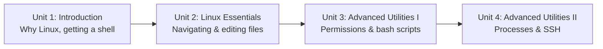

# Robotics Introduction For High Schoolers Part 1

Robots — especially anything built with ROS or ROS 2 — are almost always run and developed from a Linux shell, so this first part of the high schoolers series builds that foundation before any robotics-specific software shows up. Starting from a course preview, it walks through navigating and editing files at the command line, then levels up into permissions, bash scripting, environment variables, process management, and SSH — the exact toolkit you'll rely on the moment you start controlling a real or simulated robot from a terminal.

The diagram below shows how each unit builds directly on the skills learned in the one before it:

1. [Introduction](01-introduction.md) — Why robotics runs on Linux, how to get a shell to practice on, and the roadmap for this course.
2. [Linux Essentials](02-linux-essentials.md) — Navigating the filesystem, creating and inspecting files, and editing text from the terminal with vi/nano.
3. [Advanced Utilities I](03-advanced-utilities-i.md) — File permissions, writing bash scripts, and environment variables.
4. [Advanced Utilities II](04-advanced-utilities-ii.md) — Managing running processes and connecting to a remote computer with SSH.
